# 1.1 为什么选这门课

为什么选这门课，对你有什么好处?如今高性能计算无处不在。

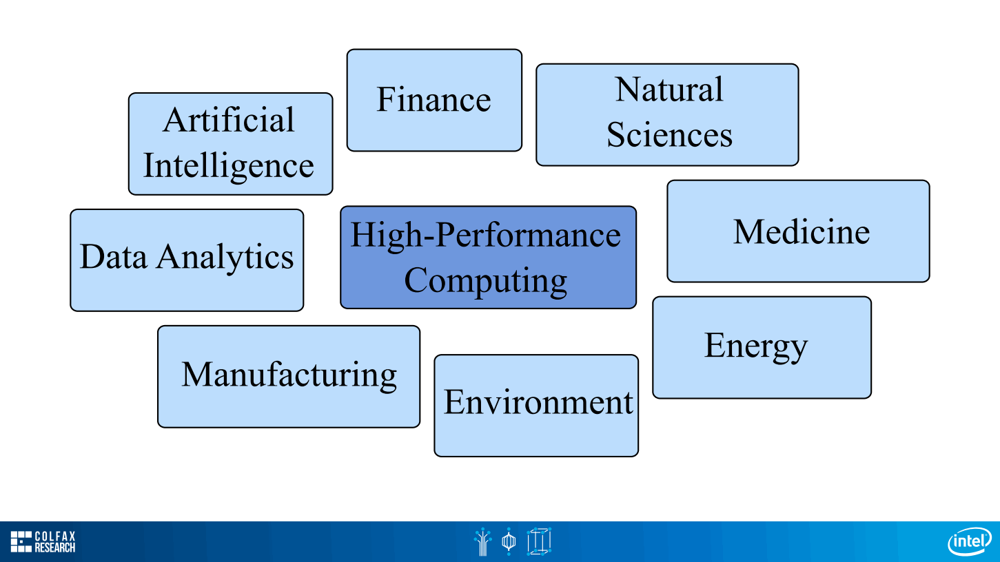
这张幻灯片概括了最重要的领域。更具体地说，我将只列出每个这些领域中的一个应用程序。
- 高性能计算(HPC)被用于医学的高保真成像，
- 在能源领域的油藏模拟，
- 在环境研究中预测气候和天气，
- 在制造业中被用于优化新汽车和飞机的燃油效率。
- HPC被用于数据分析，使营销更智能，并使其自动化。
- 在人工智能中，HPC允许你和你的智能手机通话，让它做有用的事情。
- 在金融应用中，HPC用于风险分析，
- 例如在自然科学中，用于发明新材料。

所有这些原则的共同点是对性能的需求。**性能对于不同的用户意味着不同的东西**。

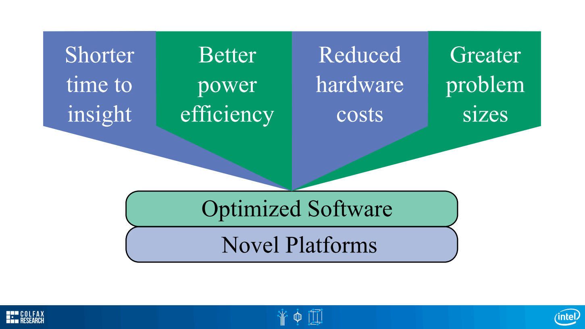
- 有时候你想要的是更短的时间去洞察，更快地解决你的问题。例如，通过财务风险分析，您通常希望比竞争对手更快地触发一笔好交易。
- 有时性能意味着更好的电力效率，而性能允许您用更少的电力完成相同的工作。这适用于最大的数据中心，也适用于由电池供电的最小的计算设备，如智能手机。
- 为了降低硬件成本，性能可能是必要的。所以你可以用较少的计算系统投资来做同样的工作。想想自动驾驶汽车。它们需要以具有竞争力的成本搭载大量计算机。
- 最后，好的表现可以让你解决更大的问题，获得更好的科学洞察力。例如，如果您使用蒙特卡罗模拟来预测放射治疗策略，那么在允许的时间范围内运行更多的统计数据可以让您更准确地预测该患者的风险和好处。

当然，每一代计算机的架构都会变得更好更快。但是，我们将在本课程中看到，从这些新平台获得更多性能的绝对先决条件是优化软件。解决现实世界问题的软件必须了解新体系结构的新特性。特别是，它必须能够处理并行性。

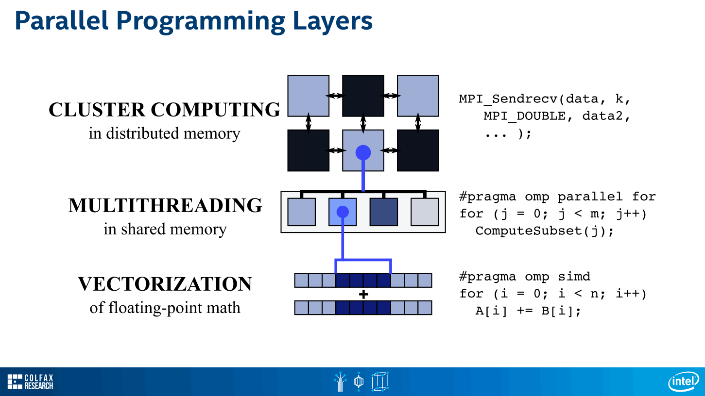

现代体系结构中存在多层并行性，
- 从顶层看，**并行性的最高层次**是**分布式内存系统**。如果您将多台计算机连接到一个网络中，就会得到一个**计算集群**，而计算集群从计算的早期就已经存在了。集群中的计算机通常称为**计算节点**，但是您的应用程序不会使用集群中的所有计算节点，除非您使用一个用于**分布式计算的框架**(如MPI)来教它这样做。
- 大约十年前，处理器架构发生了变化，现在每个**计算节点都有多个独立的处理器，称为core**。这是**并行的第二层**。同样，如果您想教您的程序使用多个核心，您必须在共享内存中使用一个用于**并行计算的框架**，比如OpenMP。
- 最后，近年来核心本身也在进化。所以现在他们可以同时在多个数据元素上运行指令。这种功能通常实现为短向量支持，这是**另一层并行性**。如果您想让您的软件处理这种并行性，您需要以某种方式构造代码，并且**通常需要与编译器交互来实现向量化**。

在计算应用程序中处理并行性的技术通常不是计算和计算机编程标准课程的一部分。这就是为什么我们要教这门课。在下一集视频中，我们将讨论计算机是如何变得越来越快的，以及为什么作为程序员的你需要了解它。

# 1.2 How Computers Get Faster
现在的计算机是如何变得越来越快的?作为一个程序员，这对你来说意味着什么?从根本上说，计算机的运行速度越来越快，因为每一代新一代的计算机都使用了更好的晶体管技术，而晶体管是计算机的基本组成部分。这张图显示了CPU芯片上使用的晶体管数量随时间的变化趋势。

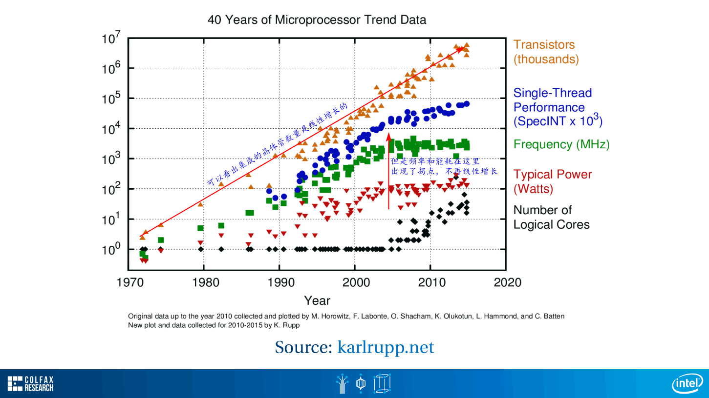

正如你所看到的，这一趋势已经惊人地线性增长了近50年。你可能知道这个趋势是摩尔定律。但是图中显示的其他趋势，具体来说，时钟速度和功率在大约十年前就出现了断点。正如你所看到的，时钟频率不再增加，典型的功率也经历了一个plateau。为什么会发生这种情况，以及它对程序员的意义是本视频的主题。

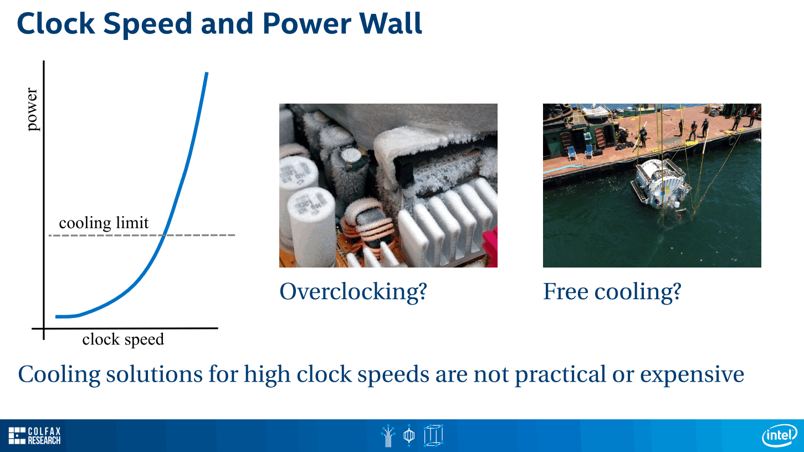
提高时钟速度是很好的。作为程序员，您不需要做任何事情，如果您的新处理器具有更高的时钟速度，您的应用程序自然会计算得更快。然而，你的时钟速度有多快是有限制的。因为随着时钟速度的提高，你必须使用更多的能量。在某种程度上，你达到了**传统冷却方案的容量极限**。风扇无法有效地冷却一个使用功率超过150瓦的处理器。当然，你可以稍微超过这个时钟的速度，例如，用一些奇特的冷却方案，如液氮冷却。或者，你可以考虑在不需要从数据中心提取热量的地方进行免费冷却。这是微软项目Natick的目标之一，Natick是一个沉浸在海洋中的数据中心。然而，电源墙在这里，时钟速度不能再增长。但是处理器必须更快。你不能提高时钟速度，但你有更多的晶体管可以使用。你怎么处理它们?

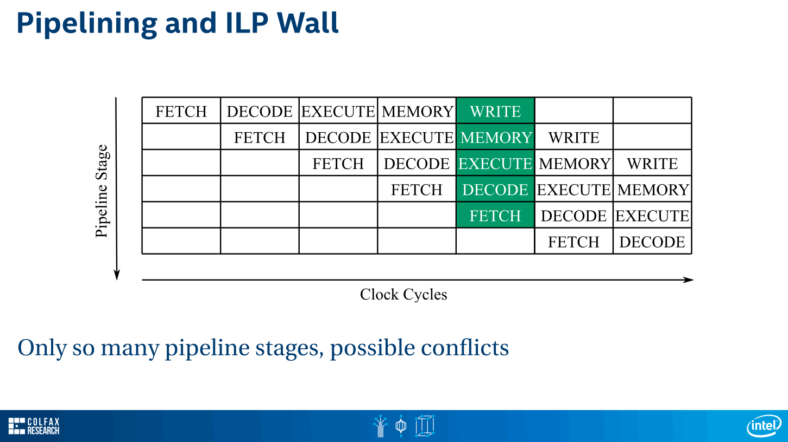

当然，您可以使您的核心更智能。您可以将指令分解为多个阶段并创建流水线。其中**多个指令将同时运行**，**使用流水线的不同阶段使用不同的指令**。这种技术是伟大的，它存在于现代流程体系结构中。但是，因为您只能设计这么多的流水线阶段，所以这种技术有其局限性。


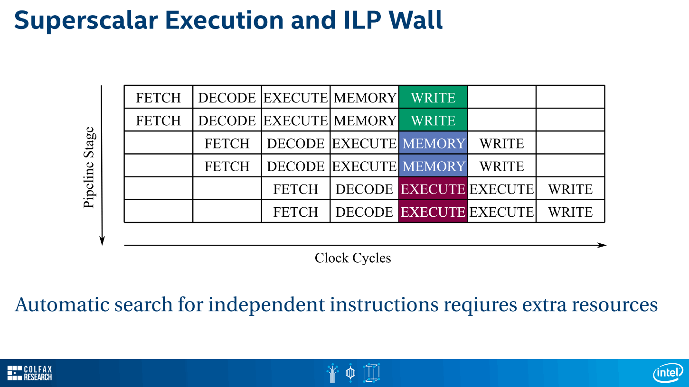

另一种有效利用额外晶体管的方法是超量执行。使用超标量执行，您可以**同时运行多个指令，即使它们使用相同的流水线阶段**。您可以通过复制负责运行相应流水线阶段的单元来实现这一点。这项技术也很棒，因为它使您的应用程序自动地更快。但它也有其局限性。因为自动搜索独立的指令，需要额外的资源。

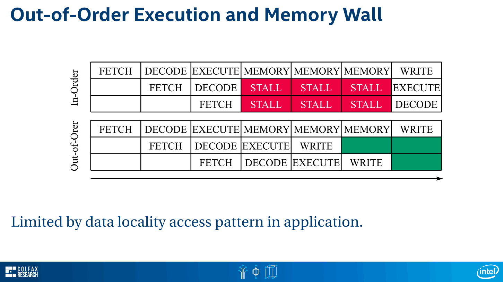

另一种通过使用更多晶体管来加速应用程序的方法是无序执行。无序执行允许处理器自动更改执行指令的顺序，以屏蔽长延时指令。例如，当一条指令使用内存时，其他指令可能会跳出来执行流水线的其他阶段，而不是停止。这将释放一些时钟周期，并最终使响应更快。同样，大规模重新排序是困难的，因此这种技术有其局限性。

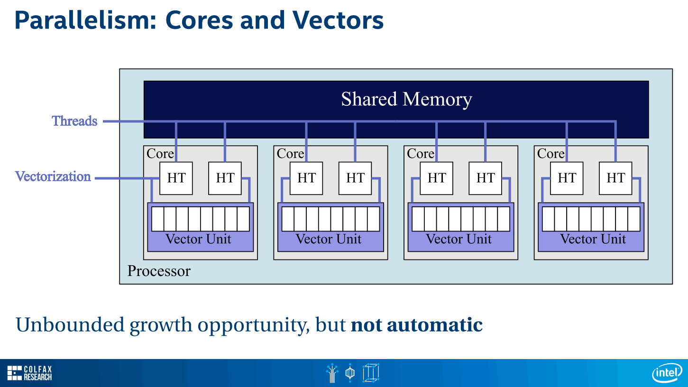

但是处理器必须更快，这是怎么发生的呢?在过去的十年里，处理器性能的提高很大程度上是由于**并行性**。在Intel架构中，并行性有两种形式，**多核和向量指令支持**。今天在Intel处理器中的多核可以在**不同的数据集上运行独立的指令流**。他们也有机会共享系统内存中的数据。向量单元更primitive一些。每个**核心**都被允许在**一个向量单元中多个数据元素上运行一个指令流**。这是另一种形式的并行，称为**数据并行**。到目前为止，这种方法还没有达到极限。然而，这不是自动的。处理器**不会自动地跨多个核心并行化**应用程序。处理器不会使用这些操作，除非你的应用程序已经准备好了。因此，作为程序员，**您有责任让应用程序意识到这两层并行性**。

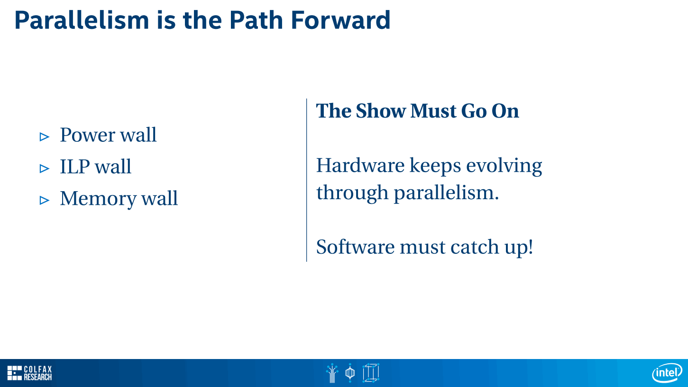

总之，**处理器的速度越来越快不是因为时钟速度的提高，也不是因为处理器变得越来越智能，而是因为并行性**。随着硬件的发展，软件必须迎头赶上。希望本课程将为您提供足够的工具，使您的应用程序能够在您的领域中使用多线程和向量化。

# 1.3 Intel Architecture

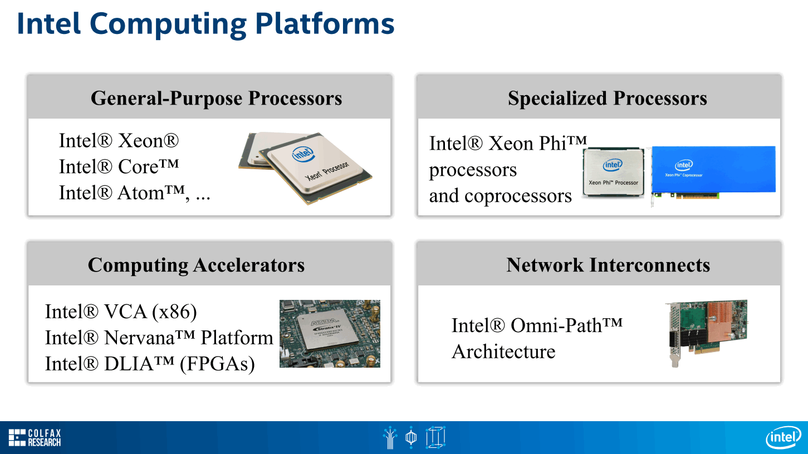

英特尔生产各种处理器，您可能熟悉消费级处理器，如英特尔Core和英特尔Atom。我将向您介绍英特尔Xeon品牌的企业级通用处理器。除此之外，英特尔还生产专门用于计算应用的英特尔Xeon Phi协处理器。在本课程中，您可以远程访问这些平台进行练习和测试作业。最后，为了让多个处理器在一个应用程序上协同工作，Intel制造了自己的高性能网络互连，比如Intel Omni-Path。另外，您可能有兴趣了解英特尔正在开发基于FPGA的可视化计算加速器、机器学习设备和深度学习推理设备。

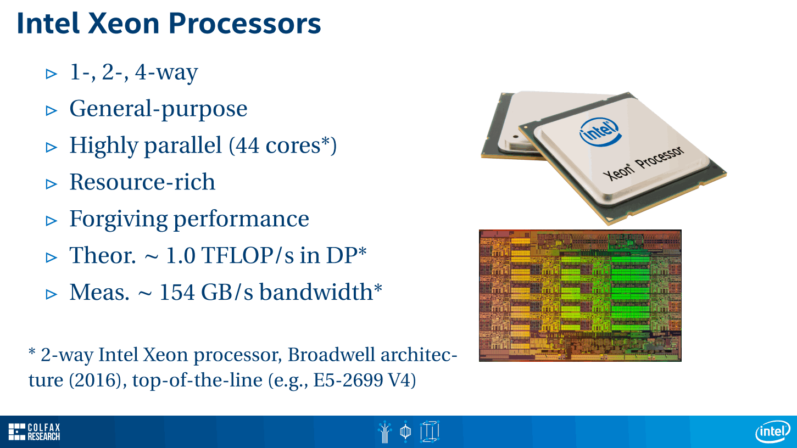

传统处理器，像Xeons这样通用的、高度并行的CPUs。您可以发现Xeon是作为one-way、two-way或four-way CPU存在，这意味着您将在同一个平台上安装两个或四个CPU芯片，从而使内核数量增加一倍。Xeons资源丰富，这意味着它们具有高时钟速度、大缓存和智能内核，这使得Xeon能够有好的兼容性。即使您的应用程序没有进行高度优化，它也可能在Xeon上运行得很好。理论上，Xeon two-way的性能峰值为每秒1TOPS双重精度浮点运算(teraflop / s)左右。该值通过融合的乘加运算评估。内存带宽，即Xeon从内存中读取数据的速度，大约是每秒150G。


英特尔Xeon Phi协处理器(Intel Xeon Phi协处理器)于2012年首次推出，当时只能作为协处理器使用。这意味着它是一个PCI Express插件卡。它需要一个主机处理器，通常是一个Xeon，然后您将在那台计算机的PCI Express总线上安装一个或多个Xeon Phi协处理器。

Xeon Phi协处理器是专门用于计算应用的。这是因为在第一代Xeon Phi协处理器(Xeon Phi协处理器)上的61个核高度并行，而且计算上是平衡的。它使用较低的时钟速度、更简单的内核、更小的缓存，但作为回报，它有更多的浮点处理能力。当然也有陷阱。这使得Xeon Phi协处理器比Xeon更难兼容，这意味着如果应用程序没有充分优化以利用其功能，那么它很可能不会像Xeon那么好。第一代Xeon Phi协处理器的理论峰值性能是1.2TFLOP双精度浮点运算，同样通过乘加运算估计。并不比Broadwell的数字大多少，但请记住这是2012年的数字。因此在上一张幻灯片中展示的Broadwell之前的四年，Xeon Phi协处理器运行速度更快，只要你知道如何优化你的应用程序，你就能获得这种性能。内存带宽也是如此。

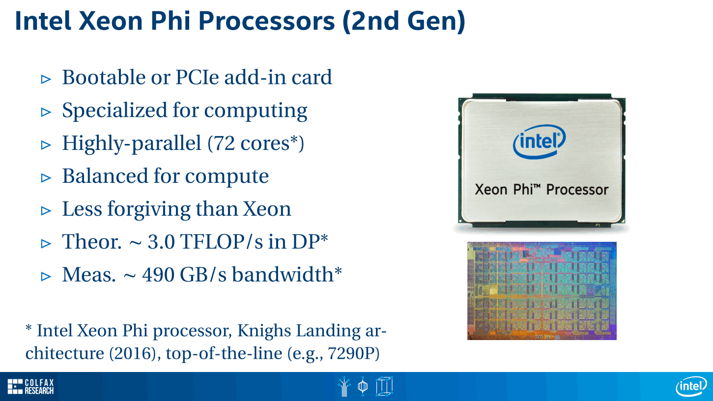

2016年，Xeon Phi协处理器经历了一次重大的更新。第二代Xeon Phi协处理器可用作bootable CPU。所以可以作为传统的没有PCI的CPU，还可以作为协处理器安装在PCI Express总线中。

这个设备也是专门用于计算的，因为它是高度并行的，有更小的缓存，更简单的核心和更低的时钟速度。它的兼容度不如Xeon。因此，如果应用程序没有进行高度优化，它在Xeon Phi协处理器上的性能可能会比在Xeon上差。但作为回报，Xeon Phi协处理器的理论峰值性能是Xeon的三倍。内存带宽也是如此。

在这门课中，你们将接触到Xeon Phi协处理器。但是我们将要学习的编程技术也可应用到传统的CPU上无论是Xeon还是Intel Core，甚至是某些情况下的Intel Atom。这是因为我们将依赖于称为现代代码的实践，它允许一个代码库用于所有平台。在下一个视频中，我们将讨论这些现代代码实践。

# 1.4 Modern Code

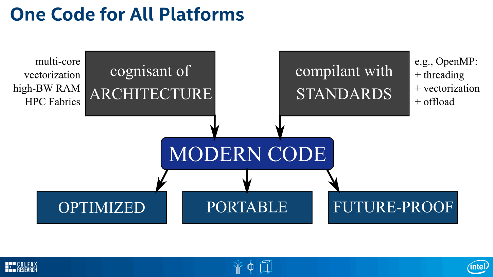

您如何使用这种处理器进行编程，使您的程序在未来几年不会过时?现代代码是一组实践，
- 允许您以适合现代处理器的**高度优化**的方式设计计算应用程序。
- 而且可以**移植**到各种现代处理器上。
- 未来证明意味着准备好利用即将到来的几代处理器。

因此，为了满足这些要求，现代代码应该认识底层计算机体系结构。同时符合标准。

通常，代码现代化出现在接受较旧应用程序的上下文中，我们可以将其称为Legacy应用程序。要优化Legacy应用程序的性能，必须教会它使用多核、向量化。以及其他在开发这个应用程序时并不重要的特性。但与此同时，您不希望将应用程序专门化到在一个处理器上让其运行良好但无法扩展到未来的处理器。为了避免专门化，您必须依赖于高级框架，比如OpenMP。例如，OpenMP可以通过伪指令设置线程、向量化和offload。

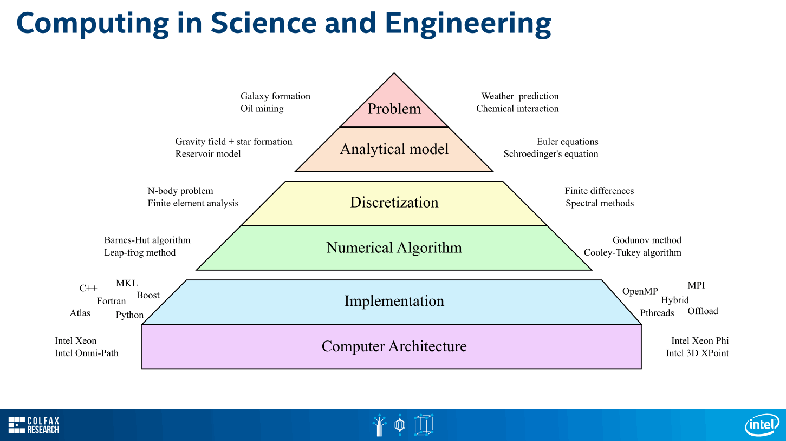

因此，性能优化和代码现代化是同步进行的。理解这个讨论的范围是很重要的。当你在你的领域解决一个现实世界的**问题**时，你可能正在做一些特定于你的领域的决定。比如用**分析**模型描述问题和**离散化**问题的决策。而与**数值算法**选择相关的决策可能是计算机科学的课题。当您使用特定的数值算法时，代码现代化变得非常重要。并实现它尽可能接近计算机架构，如C或c++或Fortran代码。我们会讲到性能优化的实现级别。

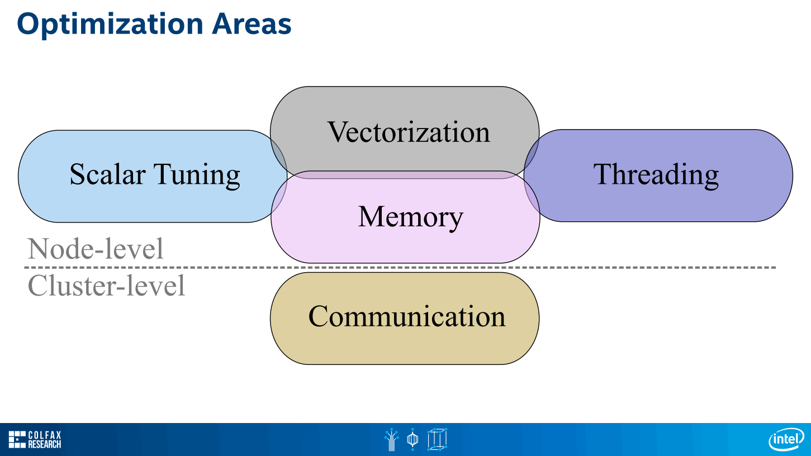

性能优化可能归结为五个Area。**Scalar Tuning, Vectorization, Threading, Memory access, and Communication**.这些优化区域对应于现代处理器的基本构件。在集群应用的情况下则为，管道、向量处理单元、核心、缓存、内存和介质。

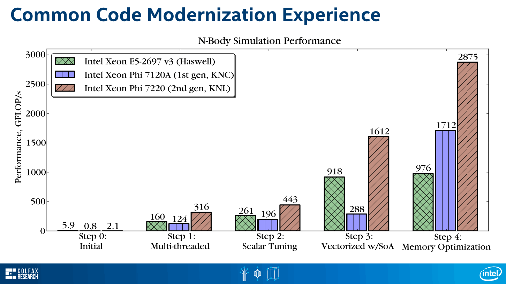

在本课程中，我们将针对这些优化领域中的每一个提出有针对性的练习。您还将看到如何使能Legacy应用程序来支持这些特性，同时又不使它们对于特定平台过于专门化。代码现代化的典型结果显示在这个块中。这里我们做了一个教育练习，一个直接的N-Body模拟。

最初使用Legacy实践将其实现为Legacy应用程序。然后通过一些性能优化，我们实现了所谓的现代代码。对于这个应用程序的每个性能优化步骤，我们都在三个平台上对这个应用程序进行基准测试。高端Xeon，第一代Xeon Phi协处理器，和第二代Xeon Phi协处理器。对于旧平台上的每一个优化步骤，我们都使用相同的代码。所以你可以从这些数字中观察到，首先，这些Legacy代码，这些Legacy代码在专门的平台上没有很好地执行。它的表现比Xeon还要差。通过性能优化，第二栏是所有平台上的性能都在增长。在优化的最后阶段，我们观察到Xeon Phi协处理器的性能优于Xeon。第二代Xeon Phi协处理器的性能优于第一代，这证明了该代码的可移植性和未来的可用性。本课程将介绍这些现代化步骤中使用的基本方法。我将在下个视频中概述课程路线图。

# 1.5 What You Are Going To Learn
本课程有五堂课讨论并行编程和现代代码实践的各个方面。

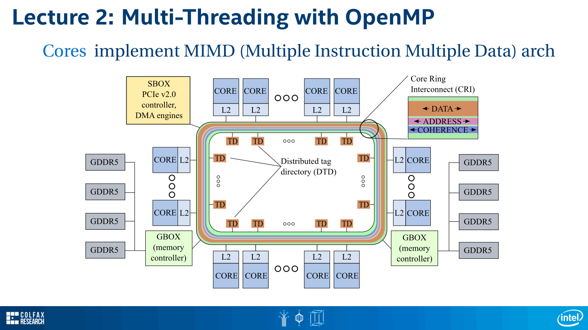

在第2讲中，我们将讨论向量指令支持。以及如何在英特尔编译器的编译器伪指令的帮助下利用它。

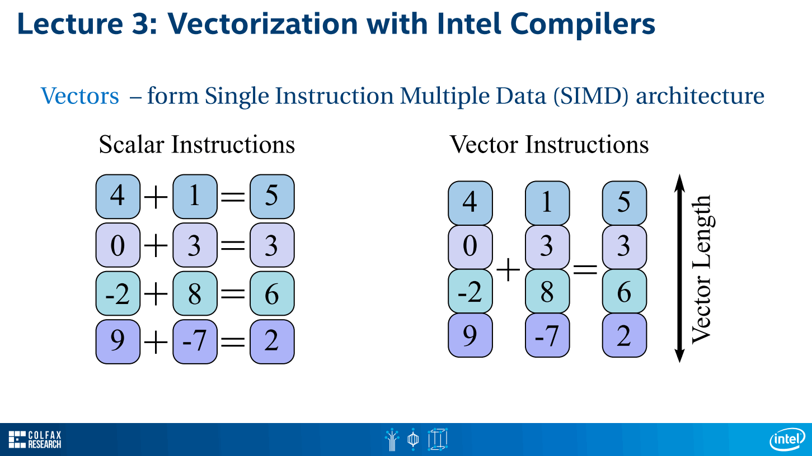

在第3讲中，我们将讨论并行的另一层，即多核架构。以及如何在共享内存并行框架OpenMP的软件线程的帮助下使用多核。

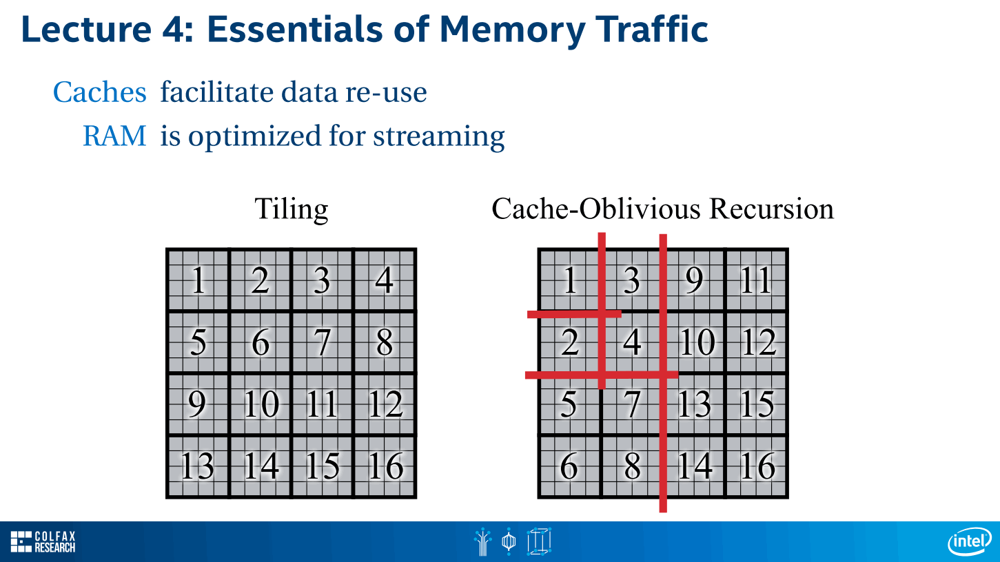

在第4讲中，我们将讨论优化memory traffic。这很重要，因为有了向量化和多线程支持，代码的数学运算吞吐量可能会变得非常高，以至于达到内存traffic的极限。

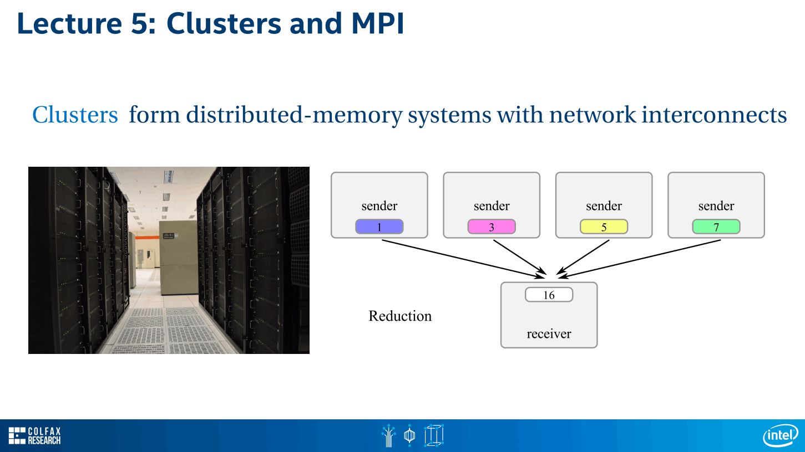

最后，在第5讲中，我们将讨论在一个很好的分布式内存编程框架（message passing interface MPI）中如何为现代处理器集群编写程序。

# 1.6 Remote Access
## 远程服务工作原理

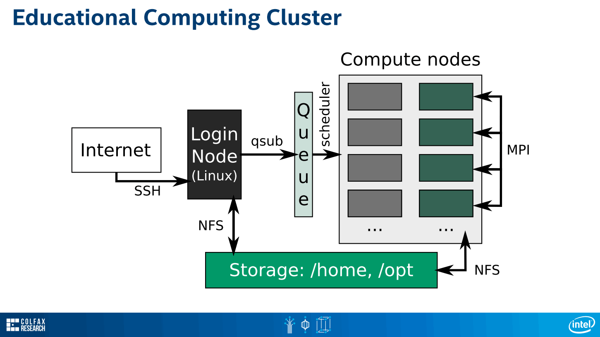

在这个课程中，你可以实践你的新技能。我们提供了一个专门为此目的设计的计算集群和一组您可以进行实验的练习。我将解释如何访问集群以及编译和运行应用程序的过程。您将使用安全shell协议SSH从本地计算机连接到集群，当您登录时，您将发现自己在一个登录节点上。将包含你的文件。它有编译器，这是你要编辑代码和编译的地方。要运行你的应用程序，你需要通过一个队列，有一个资源管理器来管理这个队列。我们需要学习如何使用实用程序qsub将作业发送到队列。调度程序通常会将您的应用程序放在使用Intel Xeon Phi协处理器的一个可用计算节点上。这些计算节点与登录节点共享主目录，因此无论您是在作业内部还是在登录节点上，您的文件看起来都是一样的。


## 运行方式
```bash
# Login
ssh colfax
# Transferring Files
## copy local files to your login node like this:
scp /path/to/local/file colfax:/path/to/remote/directory/
## copy files from your login node back to your home computer like this:
scp colfax:/path/to/remote/file /path/to/local/directory/
# 编译
[u25693@c008 ~]$ icpc -o hello hello.cc
# 运行，但这里并不是运行在高性能node上
[u25693@c008 ~]$ ./hello
Hello world! I am running on host c008 with 2 logical CPUs.
# 需要通过queue，使用qsub工具，这工具是用来管理资源的，允许你提交job
# 运行方式，echo ./hello | qsub
[u25693@c008 ~]$ echo ./hello | qsub
80929.c008
# 可以使用qstat查看job的状态
- Q：queued and waiting for other jobs to finished
- R: Job is running
- E: either error or the job is terminated
```

## 编译后分析

Intel® Xeon Phi™ Processor 7210 有64个cores, 4-way意思就是一个板子上放了4个相同的7210，类似下面的图

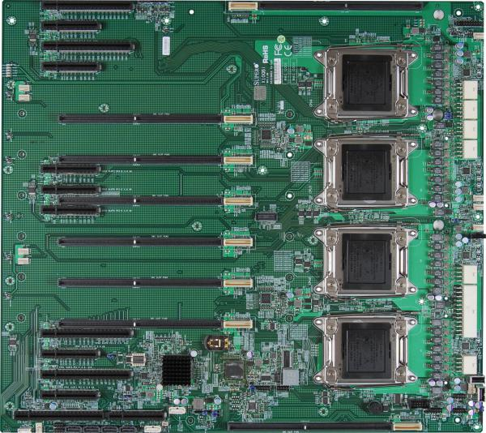

```bash
[u25693@c008 ~]$ qstat #查看当前job的状态
Job ID                    Name             User            Time Use S Queue
------------------------- ---------------- --------------- -------- - -----
80929.c008                 STDIN            u25693                 0 Q batch 
80931.c008                 STDIN            u25693                 0 Q batch 

# 执行完之后，会生成两个文件o/e
[u25693@c008 ~]$ ls -l
total 40
-rw-------. 1 u25693 u25693     0 Mar 31 00:32 STDIN.e80929
-rw-------. 1 u25693 u25693     0 Mar 31 00:32 STDIN.e80931
-rw-------. 1 u25693 u25693   692 Mar 31 00:32 STDIN.o80929
-rw-------. 1 u25693 u25693   692 Mar 31 00:32 STDIN.o80931
-rwxrwxr-x. 1 u25693 u25693 22718 Mar 31 00:21 hello
-rw-rw-r--. 1 u25693 u25693   249 Mar 31 00:21 hello.cc
drwxr-xr-x. 3 u25693 u25693  4096 Mar 31 00:20 intel

# 查看输出结果
[u25693@c008 ~]$ cat STDIN.o80929

########################################################################
# Colfax Cluster - https://colfaxresearch.com/
#      Date:           Sun Mar 31 00:32:54 PDT 2019
#    Job ID:           80929.c008
#      User:           u25693
# Resources:           neednodes=1:xeonphi,nodes=1:xeonphi,walltime=00:02:00
########################################################################

Hello world! I am running on host c008-n003 with 256 logical CPUs.

########################################################################
# Colfax Cluster
# End of output for job 80929.c008
# Date: Sun Mar 31 00:32:55 PDT 2019
########################################################################
```

当编译更复杂的系统时，应该使用jobfile

```bash
# 我们创建一个工程目录，把刚才的hello程序放入该目录中
[u25693@c008 ~]$ mkdir myproject
[u25693@c008 ~]$ mv hello* myproject/
[u25693@c008 ~]$ cd myproject/
[u25693@c008 myproject]$ ls
hello  hello.cc

# 执行刚才的命令
[u25693@c008 myproject]$ echo ./hello | qsub
80941.c008
[u25693@c008 myproject]$ cat STDIN.e80941
/var/spool/torque/mom_priv/jobs/80941.c008.SC: line 3: ./hello: No such file or directory
[u25693@c008 myproject]$ cat STDIN.o80941

########################################################################
# Colfax Cluster - https://colfaxresearch.com/
#      Date:           Sun Mar 31 01:16:27 PDT 2019
#    Job ID:           80941.c008
#      User:           u25693
# Resources:           neednodes=1:xeonphi,nodes=1:xeonphi,walltime=00:02:00
########################################################################


########################################################################
# Colfax Cluster
# End of output for job 80941.c008
# Date: Sun Mar 31 01:16:28 PDT 2019
########################################################################
# 可以看到输出了错误，提示找不到hello执行文件。默认情况下job从home目录启动


# 当然可以这样执行
[u25693@c008 myproject]$ echo "cd myproject; ./hello" | qsub
80944.c008
# 输出
[u25693@c008 myproject]$ cat STDIN.e80944
[u25693@c008 myproject]$ cat STDIN.o80944

########################################################################
# Colfax Cluster - https://colfaxresearch.com/
#      Date:           Sun Mar 31 01:16:43 PDT 2019
#    Job ID:           80944.c008
#      User:           u25693
# Resources:           neednodes=1:xeonphi,nodes=1:xeonphi,walltime=00:02:00
########################################################################

Hello world! I am running on host c008-n004 with 256 logical CPUs.

########################################################################
# Colfax Cluster
# End of output for job 80944.c008
# Date: Sun Mar 31 01:16:44 PDT 2019
########################################################################


# 其实我们可以创建一个jobfile，在这个jobfile中写上要执行的命令。
[u25693@c008 myproject]$ cat jobfile
cd $PBS_O_WORKDIR

./hello

# 设置环境变量
[u25693@c008 myproject]$ PBS_O_WORKDIR=~/myproject
[u25693@c008 myproject]$ echo $PBS_O_WORKDIR
/home/u25693/myproject

# 执行
[u25693@c008 myproject]$ qsub jobfile
80946.c008

# 查看输出
[u25693@c008 myproject]$ cat jobfile.e80946
[u25693@c008 myproject]$ cat jobfile.o80946

########################################################################
# Colfax Cluster - https://colfaxresearch.com/
#      Date:           Sun Mar 31 01:18:22 PDT 2019
#    Job ID:           80946.c008
#      User:           u25693
# Resources:           neednodes=1:xeonphi,nodes=1:xeonphi,walltime=00:02:00
########################################################################

Hello world! I am running on host c008-n002 with 256 logical CPUs.

########################################################################
# Colfax Cluster
# End of output for job 80946.c008
# Date: Sun Mar 31 01:18:23 PDT 2019
########################################################################
```

- 另外也可以在jobfile中设置一些参数
```bash
[u25693@c008 myproject]$ cat myjob
#PBS -l walltime=0:03:00  # the maximum allowed time for this particular project.
#PBS -N otherjob  # 更改了名字
#PBS -l nodes=4   # request that the number of nodes allocated for this job is not one, but four


cd $PBS_O_WORKDIR
cat $PBS_NODEFILE

./hello

[u25693@c008 myproject]$ qsub myjob
80950.c008
[u25693@c008 myproject]$ qstat
Job ID                    Name             User            Time Use S Queue
------------------------- ---------------- --------------- -------- - -----
80950.c008                 otherjob         u25693                 0 Q batch 

[u25693@c008 week2]$ cat ../myproject/otherjob.e80950
[u25693@c008 week2]$ cat ../myproject/otherjob.o80950

########################################################################
# Colfax Cluster - https://colfaxresearch.com/
#      Date:           Sun Mar 31 01:58:21 PDT 2019
#    Job ID:           80950.c008
#      User:           u25693
# Resources:           neednodes=4,nodes=4,walltime=00:03:00
########################################################################
# 可以看到这里使用了4个nodes
c008-n001
c008-n002
c008-n003
c008-n004
Hello world! I am running on host c008-n001 with 256 logical CPUs.

########################################################################
# Colfax Cluster
# End of output for job 80950.c008
# Date: Sun Mar 31 01:58:22 PDT 2019
########################################################################

``` 
