# 2.1 Vector Operations
第二周的主题是在Intel处理器的每个核心中都存在的并行性——向量指令的支持。

向量指令是SIMD并行的一种实现。SIMD代表单指令多数据。顾名思义，它是处理器应用单个算术运算的能力，或同时向多个数据元素发送单个字符串指令。

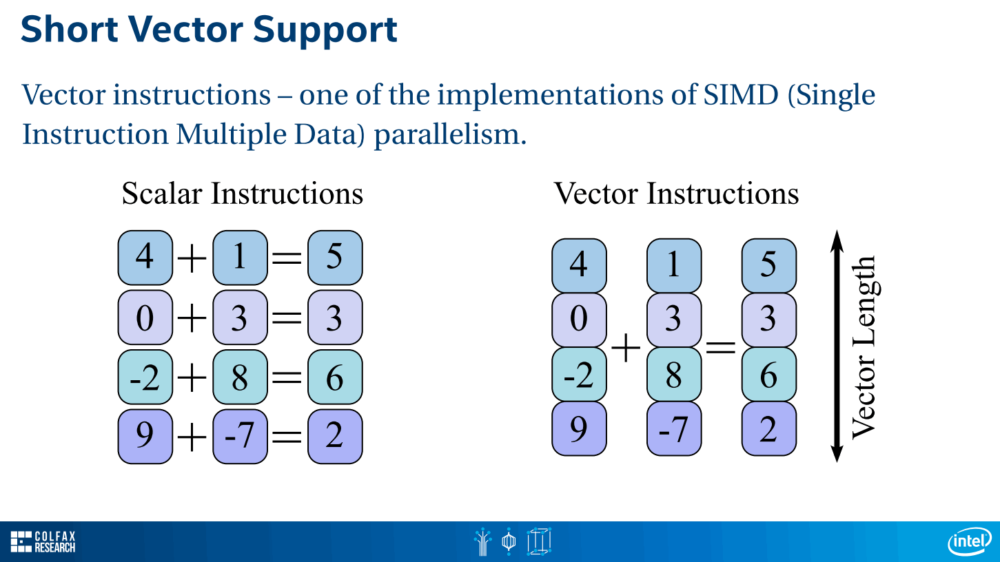

例如，如果您的任务是将一个元素一个元素地加到数组中，并且加法操作的成本大约是一个周期。假设这是吞吐量，每个循环有一条指令。然后将100个元素相加，在标量处理器中需要100个周期。按照约定，如果您有一个向量处理器，那么由于硬件上的并行性，您可以将不是1而是2、4、8或16个元素加载到向量寄存器中。并且只调用一个加法操作，该操作将同时应用于所有这些元素。其思想是，这个向量指令的吞吐量和延迟可以与对应标量指令的吞吐量和延迟相同，您只需调用更少指令。同样的100个元素将在25个循环中处理。这就是向量化。它是你的软件的能力，一次对多个数据元素发出一个单一的指令从而更快完成算术处理。

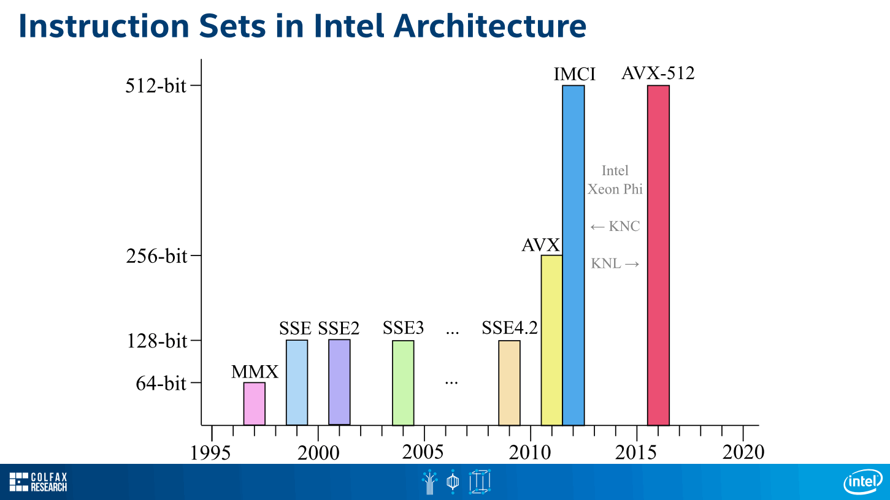

如果你还没有意识到向量化，你可能有一个很好的托辞，这个图表解释了为什么会这样。它显示了在Intel体系结构中引入支持的指令集的时间。它还显示了这些数据集中向量寄存器的宽度。

正如您所看到的，英特尔架构中第一次出现向量化是在20世纪90年代末，当时使用了MMX指令。MMX代表多媒体扩展。这就是这些指令的全部用处，处理多媒体，它们有64位寄存器，它们只支持整数运算对科学计算不是很重要。如果你做科学计算，在21世纪初随着SSE的引入，事情会变得有趣，流式SIMD扩展及其各种模块。以SSE2为例，浮点数和向量宽度增加到128位。我们来算一下。如果你有一个128位的向量，你能放入多少个浮点数?每个数字32位，4。所以4是应用程序的潜在速度，多亏了向量化。但这是单精度的。许多科学计算是在双精度下完成的。预测的速度是2。对于许多人来说，2的速度可能不足以激励他们对应用程序进行现代化、利用或向量化。所以，你可能有一个很好的借口不知道向量化是什么，因为它直到最近才变得重要。随着AVX指令的引入，情况发生了变化，在英特尔的Sandy Bridge架构中，因为向量宽度增加到了256位。AVX标志着先进的向量扩展，他们也支持单精度和双精度浮点数学。现在，单精度下的潜在速度是8倍，双精度下的是4倍。但是对于Xeon Phi协处理器，向量化是很难忽略的。这是因为512位向量的潜在速度在单精度下为16，在双精度下为8。正如英特尔的一位工程师所说，如果你不使用向量化，你可能要为你所使用的处理器支付16倍的费用。在代码中进行向量化是很好的。现在我们来看看，教你的软件如何使用向量指令。

# 2.2 Vectorizing Your Code


我这周的目标是向您展示如何使用编译器让向量化进入到你的代码中。但在此之前，我想向您展示另一种方法，显式向量化，它将允许您研究编译器向量化代码时的幕后秘密。

当您像前面的示例那样逐元素加两个数组时，实际上将调用四条指令。
- 一条指令将操作数A装入向量寄存器。因此，您将获取数组A的一个片段，并将其从缓存或主内存加载到Core上的向量寄存器中。
- 之后，您可能必须以同样的方式加载第二个操作数。
- 只有第三条指令是加法。加法结构将应用于这两个向量寄存器，结果也将存储在一个向量寄存器中。
- 最后，要将数据返回到内存中，必须调用存储指令。


事实上，这也是标量计算的工作流。无论在编译器的帮助下使用自动向量化，还是显式向量化，都将应用此过程。使用自动向量化，这是我们在后面的课程中要学习的，你将使用循环，然后编译器将这个循环分割成块。并使用这些块将A和B的多个值加载到向量寄存器并运行向量指令。如果你想自己做，你可以写汇编。编写汇编不是最令人愉快的任务，所以有一个折衷方案。你可以用intrinsic函数。和汇编一样，intrinsic函数可以直接访问处理器指令，但它们在代码中保留了C或c++索引。在本例中，我要做的是将数组A中的数据加载到512位向量寄存器中。我把这些数据看成是一个包含了双精度数字的向量。我对B也做同样的操作，只有第三个操作是向量指令把这两个向量相加。然后，第四步是将结果存储回内存。

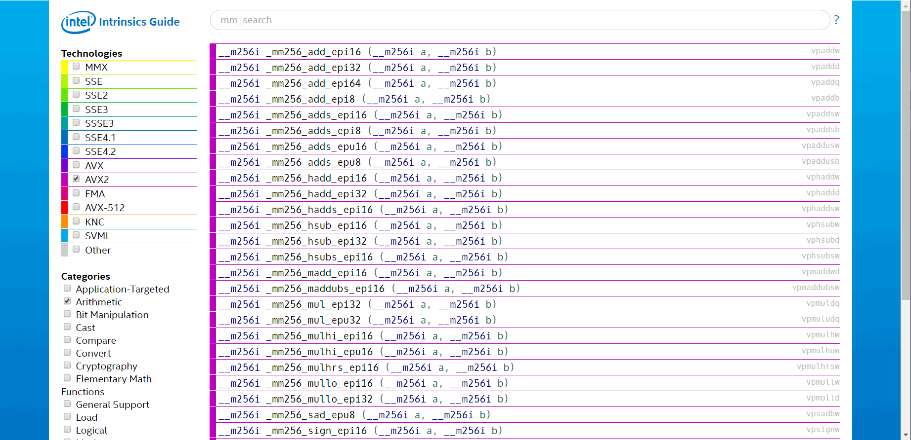

这就是它的样子，如果你真的想在你的应用程序中使用这个方法，你怎么找到所有可能的函数，所有可能的内部函数以及它们的语法?有一个非常有用的工具，Intel Intrinsics Guide。这是一个互动网页。你可以通过点击我幻灯片中的链接来使用这个网页。在页面上，你可以选择，你想要使用的指令集。例如，我们选择AVX-512。你还可以选择你想要显示的函数类别。

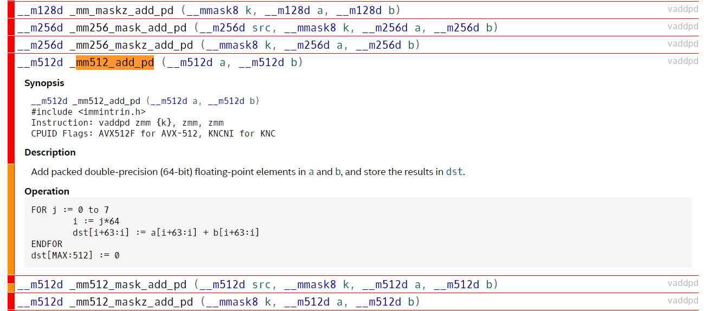

例如，让我们选择算术函数。你可以看到有很多函数。相同功能的许多版本。你能理解的。如果你理解了这些函数名形成的原理。例如，让我们向下滚动到加法操作。下面是双精度数的基本加法运算。它的前缀表示它使用512位向量寄存器，然后是名称，然后是向量中元素的类型。pd表示填充的双精度数，ps表示填充的单精度数，对于不同长度的整数也有epi后缀。如果您单击该函数，您将看到描述和语法，以及解释该函数正在做什么的代码。除了数据类型之外，有些函数还具有前缀掩码。掩码意味着函数接受一个附加的参数，控制哪个向量路径存储到输出中，以及想要保存哪个到输出中。这被称为位掩码，原则上它允许你访问条件向量计算，这意味着你实际上要对整个向量进行计算，但你只会节省一部分向量长度。

使用Intel iIntrinsics指南，您可以找出您可以使用的功能，并向量化您的代码。但是您需要了解，**通过使用intrinsics，您将使您的代码很难移植到未来的处理器体系结构**。此外，当您考虑性能优化时，您将需要考虑诸如数据对齐、循环剥离、剩余循环、指针别名、使用反寄存器文件、执行正确的过程以从先验函数获得正确的精度等问题。所以你的内部函数代码可能会变得非常非常复杂。您可以通过**允许编译器为您向量化标量代码**来避免这种复杂性。在下个视频中，我会告诉你们怎么做。

# 2.3 Automatic Vectorization
# 2.3.1 Automatic Vectorization

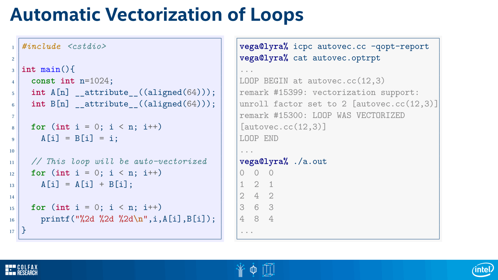

让我们看看自动向量化如何在代码中工作。自动向量化是**编译器的一种功能**，它允许编译器**将标量代码转换为向量指令**。所以向量化编译器会寻找具有并行性的循环，它会尝试将多个标量迭代合并到向量迭代中。使用Intel编译器，自动向量化在默认优化级别上是启用的，因此您不需要为自动向量化做任何事情。这意味着您的代码可能已经在不知道的情况下向量化了。如果想查看编译器对代码做了什么，请使用参数`-qopt-report`。它将告诉编译器生成一个扩展名为.optrpt的文本文件。在这个文本文件中，您将找到blocks: `loop begin / loop en`d，描述编译器对循环和函数做了什么。有两个数字需要注意，第一个参数12是行号。第二个参数是列号。12是行，3是列。从这个位置开始的语句是向量化的。所以，它意味着编译器能够将这个循环转换成向量指令。

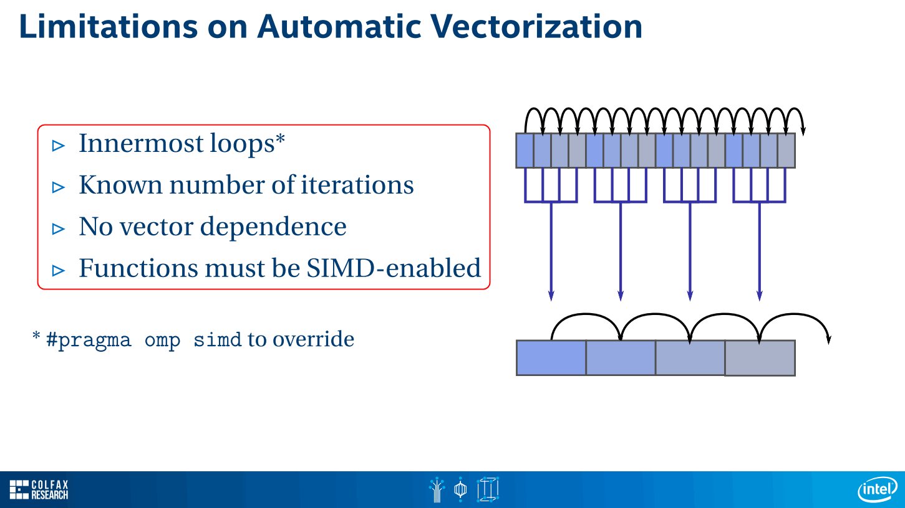

当编译器寻找要向量化的循环时，它只会尝试向量化最里面的循环。所以**如果你有多层循环嵌套，它只会看最里面的循环**，它会尝试**把多个标量迭代合并成一个向量迭代**。您可以使用`pragma omp simd`覆盖此行为，我们稍后将对此进行讨论。当您开始循环时，**必须知道循环中的迭代次数**。如果您在编译时知道它，这是理想的，但是即使您在运行时知道它，这仍然是很好的。For循环将被向量化只要它们没有初始出口。但是如果你有while循环，它们是不可能的，因为你不知道while循环什么时候结束。编译器将尝试检查循环中的向量依赖关系，**如果检测到向量依赖关系，则向量化将失败**。我们待会再谈。如果在循环中有函数调用，这些函数必须`SIMD-Enabled`，稍后我们将讨论`SIMD-Enabled`的函数。

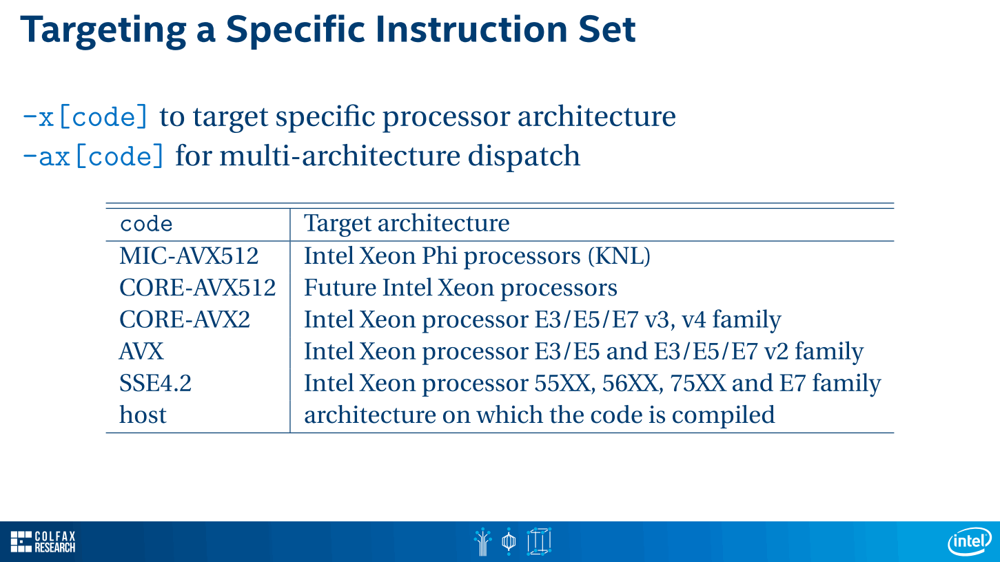

自动向量化的美妙之处在于，您不需要针对特定的体系结构编写代码。只需更改一个编译器参数-X，然后更改代码名，就可以为多个体系结构重新编译单个代码。例如，如果您想为在Intel Xeon Phi协处理器中找到的向量指令编译代码，请使用`-XMIC-AVX512`。还可以使用`-Xhost`，它的目标体系结构与编译节点上的相同。你在某台电脑上编译，你会用`-Xhost`指向同一台电脑。如果您想要针对多个体系结构并实现一个名为分派的运行时，请使用ax[code]。

尽管在前面，我只演示了一个自动向量化的基本例子a + b，事实上，自动向量化循环可能相当复杂。下面是一个嵌入式模拟的片段。

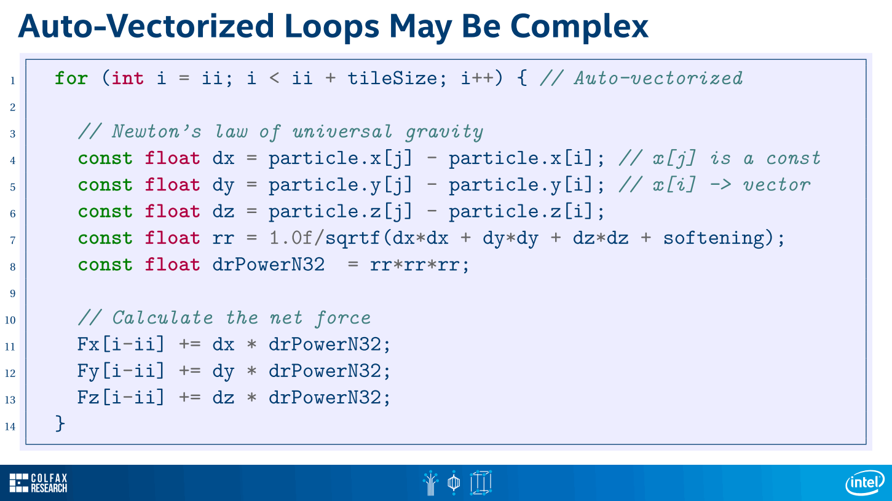

在这个模拟中，我们有n个粒子通过牛顿万有引力定律相互作用，这个相互作用的力有一个复杂的表达式。编译器将能够识别这个循环，它将把i的不同值的迭代合并到一个向量迭代中。要做到这一点，它必须认识到这与i无关，因此这个标量将被转换成一个向量，其中每个向量Lane包含相同的值x[j]，但x[i]是不同的。它将被转换成一个向量，它有x[i]， x[i] + 1，等等，直到x[i] + 15，然后这个减法可以用向量指令来执行。接下来，它将使用这些表达式来计算超越函数，平方根，并继续剩下的计算。

自动向量化是一种强大而灵活的工具。它允许您为多个计算机体系结构编写单个代码。要为不同的体系结构编译，只需更改编译器参数。请继续观看，以了解必须使用哪些控件来引导自动向量化。

## 2.3.2 Will This Vectorize?
- 代码
```c++
dongkesi@DESKTOP-CL29DN1:~$ cat worker.cc -n
     1  double MyFunction(int n) {
     2          double A[n], B[n];
     3          A[0:n] = B[0:n] = 1.0;
     4          return A[2];
     5  }
```

- 编译，查看报告

```bash
# 编译
[u25693@c008 week2]$ icpc -S -qopt-report worker.cc
icpc: remark #10397: optimization reports are generated in *.optrpt files in the output location

[u25693@c008 week2]$ ls
worker.cc  worker.optrpt  worker.s
```

- 优化后的报告

```bash
[u25693@c008 week2]$ cat worker.optrpt
Intel(R) Advisor can now assist with vectorization and show optimization
  report messages with your source code.
See "https://software.intel.com/en-us/intel-advisor-xe" for details.


    Report from: Interprocedural optimizations [ipo]

INLINING OPTION VALUES:
  -inline-factor: 100
  -inline-min-size: 30
  -inline-max-size: 230
  -inline-max-total-size: 2000
  -inline-max-per-routine: 10000
  -inline-max-per-compile: 500000


Begin optimization report for: MyFunction(int)

    Report from: Interprocedural optimizations [ipo]

INLINE REPORT: (MyFunction(int)) [1] worker.cc(1,26)


    Report from: Loop nest, Vector & Auto-parallelization optimizations [loop, vec, par]

# 可以看到这里显示第三行被向量化了
LOOP BEGIN at worker.cc(3,15)
   remark #15300: LOOP WAS VECTORIZED
LOOP END

# 同时这里有一个remainder loop指示没有向量化。这个是有必要的，比如array的大小不是向量长度的整数倍
LOOP BEGIN at worker.cc(3,15)
<Remainder loop for vectorization>
   remark #15335: remainder loop was not vectorized: vectorization possible but seems inefficient. Use vector always directive or -vec-threshold0 to override
LOOP END

    Report from: Code generation optimizations [cg]

worker.cc(1,26):remark #34051: REGISTER ALLOCATION : [_Z10MyFunctioni] worker.cc:1

    Hardware registers
        Reserved     :    2[ rsp rip]
        Available    :   39[ rax rdx rcx rbx rbp rsi rdi r8-r15 mm0-mm7 zmm0-zmm15]
        Callee-save  :    6[ rbx rbp r12-r15]
        Assigned     :   10[ rax rdx rcx rsi rdi r8-r11 zmm0]

    Routine temporaries
        Total         :      32
            Global    :      21
            Local     :      11
        Regenerable   :       3
        Spilled       :       0

    Routine stack
        Variables     :       0 bytes*
            Reads     :       0 [0.00e+00 ~ 0.0%]
            Writes    :       0 [0.00e+00 ~ 0.0%]
        Spills        :       0 bytes*
            Reads     :       0 [0.00e+00 ~ 0.0%]
            Writes    :       0 [0.00e+00 ~ 0.0%]

    Notes

        *Non-overlapping variables and spills may share stack space,
         so the total stack size might be less than this.


===========================================================================
[u25693@c008 week2]$
```

- 查看汇编输出文件

```asm
# 在汇编中可以看到实际发生了什么
[u25693@c008 week2]$ cat worker.s
# mark_description "Intel(R) C++ Intel(R) 64 Compiler for applications running on Intel(R) 64, Version 17.0.2.174 Build 20170213";
# mark_description "";
# mark_description "-S -qopt-report";
        .file "worker.cc"
        .text
..TXTST0:
# -- Begin  _Z10MyFunctioni
        .text
# mark_begin;
       .align    16,0x90
        .globl _Z10MyFunctioni
# --- MyFunction(int)
_Z10MyFunctioni:
# parameter 1: %edi
..B1.1:                         # Preds ..B1.0
                                # Execution count [1.00e+00]
        .cfi_startproc
        .cfi_personality 0x3,__gxx_personality_v0
        .cfi_lsda 0xb, _Z10MyFunctioni$$LSDA
..___tag_value__Z10MyFunctioni.1:
..L2:
                                                          #1.26
        pushq     %rbp                                          #1.26
        .cfi_def_cfa_offset 16
        movq      %rsp, %rbp                                    #1.26
        .cfi_def_cfa 6, 16
        .cfi_offset 6, -16
        movslq    %edi, %r9                                     #1.26
        lea       (,%r9,8), %rcx                                #2.9
        movq      %rcx, %rax                                    #2.9
        addq      $15, %rax                                     #2.9
        andq      $-16, %rax                                    #2.9
        subq      %rax, %rsp                                    #2.9
        movq      %rsp, %rax                                    #2.9
                                # LOE rax rcx rbx r9 r12 r13 r14 r15
..B1.18:                        # Preds ..B1.1
                                # Execution count [1.00e+00]
        movq      %rax, %rsi                                    #2.9
                                # LOE rcx rbx rsi r9 r12 r13 r14 r15
..B1.2:                         # Preds ..B1.18
                                # Execution count [1.00e+00]
        movq      %rcx, %rax                                    #2.15
        addq      $15, %rax                                     #2.15
        andq      $-16, %rax                                    #2.15
        subq      %rax, %rsp                                    #2.15
        movq      %rsp, %rax                                    #2.15
                                # LOE rax rcx rbx rsi r9 r12 r13 r14 r15
..B1.3:                         # Preds ..B1.2
                                # Execution count [1.00e+00]
        testq     %r9, %r9                                      #3.15
        jle       ..B1.12       # Prob 50%                      #3.15
                                # LOE rax rcx rbx rsi r9 r12 r13 r14 r15
..B1.4:                         # Preds ..B1.3
                                # Execution count [1.00e+00]
        cmpq      $8, %r9                                       #3.15
        jl        ..B1.15       # Prob 10%                      #3.15
                                # LOE rax rcx rbx rsi r9 r12 r13 r14 r15
..B1.5:                         # Preds ..B1.4
                                # Execution count [1.00e+00]
        movq      %r9, %r8                                      #3.15
        xorl      %edi, %edi                                    #3.15
        movups    .L_2il0floatpacket.0(%rip), %xmm0             #3.15
        andq      $-8, %r8                                      #3.15
                                # LOE rax rcx rbx rsi rdi r8 r9 r12 r13 r14 r15 xmm0
..B1.6:                         # Preds ..B1.6 ..B1.5
                                # Execution count [1.00e+01]
        movups    %xmm0, (%rax,%rdi,8)                          #3.15
        movups    %xmm0, (%rsi,%rdi,8)                          #3.6
        movups    %xmm0, 16(%rax,%rdi,8)                        #3.15
        movups    %xmm0, 16(%rsi,%rdi,8)                        #3.6
        movups    %xmm0, 32(%rax,%rdi,8)                        #3.15
        movups    %xmm0, 32(%rsi,%rdi,8)                        #3.6
        movups    %xmm0, 48(%rax,%rdi,8)                        #3.15
        movups    %xmm0, 48(%rsi,%rdi,8)                        #3.6
        # XMM寄存器是128bits长- 这里是一个旧的SSE指令，为了生成XEON phi code，需要添加编译指令-xMIC-AVX512
        addq      $8, %rdi                                      #3.15
        cmpq      %r8, %rdi                                     #3.15
        jb        ..B1.6        # Prob 90%                      #3.15
                                # LOE rax rcx rbx rsi rdi r8 r9 r12 r13 r14 r15 xmm0
..B1.8:                         # Preds ..B1.6 ..B1.15
                                # Execution count [1.00e+00]
        xorl      %edi, %edi                                    #3.15
        lea       1(%r8), %r10                                  #3.15
        cmpq      %r9, %r10                                     #3.15
        ja        ..B1.12       # Prob 0%                       #3.15
                                # LOE rax rcx rbx rsi rdi r8 r9 r12 r13 r14 r15
..B1.9:                         # Preds ..B1.8
                                # Execution count [1.00e+00]
        movq      $0x3ff0000000000000, %r10                     #3.15
        lea       (%rax,%r8,8), %rdx                            #3.15
        subq      %r8, %r9                                      #3.15
        lea       (%rsi,%r8,8), %r11                            #3.6
                                # LOE rax rdx rcx rbx rsi rdi r9 r10 r11 r12 r13 r14 r15
..B1.10:                        # Preds ..B1.10 ..B1.9
                                # Execution count [1.00e+01]
        movq      %r10, (%rdx,%rdi,8)                           #3.15
        movq      %r10, (%r11,%rdi,8)                           #3.6
        incq      %rdi                                          #3.15
        cmpq      %r9, %rdi                                     #3.15
        jb        ..B1.10       # Prob 90%                      #3.15
                                # LOE rax rdx rcx rbx rsi rdi r9 r10 r11 r12 r13 r14 r15
..B1.12:                        # Preds ..B1.10 ..B1.3 ..B1.8
                                # Execution count [1.00e+00]
        movq      %rax, %rdx                                    #4.9
        movq      %rcx, %rax                                    #4.9
        movsd     16(%rsi), %xmm0                               #4.9
        addq      $15, %rax                                     #4.9
        andq      $-16, %rax                                    #4.9
        addq      %rax, %rsp                                    #4.9
                                # LOE rcx rbx rsi r12 r13 r14 r15 xmm0
..B1.13:                        # Preds ..B1.12
                                # Execution count [1.00e+00]
        movq      %rsi, %rdx                                    #4.9
        movq      %rcx, %rax                                    #4.9
        addq      $15, %rax                                     #4.9
        andq      $-16, %rax                                    #4.9
        addq      %rax, %rsp                                    #4.9
                                # LOE rbx r12 r13 r14 r15 xmm0
..B1.14:                        # Preds ..B1.13
                                # Execution count [1.00e+00]
        movq      %rbp, %rsp                                    #4.2
        popq      %rbp                                          #4.2
        .cfi_restore 6
        ret                                                     #4.2
        .cfi_offset 6, -16
                                # LOE
..B1.15:                        # Preds ..B1.4
                                # Execution count [1.00e-01]: Infreq
        xorl      %r8d, %r8d                                    #3.15
        jmp       ..B1.8        # Prob 100%                     #3.15
        .align    16,0x90
                                # LOE rax rcx rbx rsi r8 r9 r12 r13 r14 r15
        .cfi_endproc
# mark_end;
        .type   _Z10MyFunctioni,@function
        .size   _Z10MyFunctioni,.-_Z10MyFunctioni
        .section .gcc_except_table, "a"
        .align 4
_Z10MyFunctioni$$LSDA:
        .byte   255
        .byte   0
        .uleb128        ..___tag_value__Z10MyFunctioni.12 - ..___tag_value__Z10MyFunctioni.11
..___tag_value__Z10MyFunctioni.11:
        .byte   1
        .uleb128        ..___tag_value__Z10MyFunctioni.10 - ..___tag_value__Z10MyFunctioni.9
..___tag_value__Z10MyFunctioni.9:
..___tag_value__Z10MyFunctioni.10:
        .long   0x00000000,0x00000000
..___tag_value__Z10MyFunctioni.12:
        .data
# -- End  _Z10MyFunctioni
        .section .rodata, "a"
        .align 16
        .align 16
.L_2il0floatpacket.0:
        .long   0x00000000,0x3ff00000,0x00000000,0x3ff00000
        .type   .L_2il0floatpacket.0,@object
        .size   .L_2il0floatpacket.0,16
        .align 8
.L_2il0floatpacket.1:
        .long   0x00000000,0x3ff00000
        .type   .L_2il0floatpacket.1,@object
        .size   .L_2il0floatpacket.1,8
        .data
        .section .note.GNU-stack, ""
// -- Begin DWARF2 SEGMENT .eh_frame
        .section .eh_frame,"a",@progbits
.eh_frame_seg:
        .align 8
# End
[u25693@c008 week2]$
```

- 修改编译指令

```asm
[u25693@c008 week2]$ icpc -S -qopt-report  -xMIC-AVX512 worker.cc
icpc: remark #10397: optimization reports are generated in *.optrpt files in the output location
[u25693@c008 week2]$ cat worker.s
# mark_description "Intel(R) C++ Intel(R) 64 Compiler for applications running on Intel(R) 64, Version 17.0.2.174 Build 20170213";
# mark_description "";
# mark_description "-S -qopt-report -xMIC-AVX512";
        .file "worker.cc"
        .text
..TXTST0:
# -- Begin  _Z10MyFunctioni
        .text
# mark_begin;
# Threads 2
        .align    16,0x90
        .globl _Z10MyFunctioni
# --- MyFunction(int)
_Z10MyFunctioni:
# parameter 1: %edi
..B1.1:                         # Preds ..B1.0
                                # Execution count [1.00e+00]
        .cfi_startproc
        .cfi_personality 0x3,__gxx_personality_v0
        .cfi_lsda 0xb, _Z10MyFunctioni$$LSDA
..___tag_value__Z10MyFunctioni.1:
..L2:
                                                          #1.26
        pushq     %rbx                                          #1.26
        .cfi_def_cfa_offset 16
        movq      %rsp, %rbx                                    #1.26
        .cfi_def_cfa 3, 16
        .cfi_offset 3, -16
        andq      $-64, %rsp                                    #1.26
        pushq     %rbp                                          #1.26
        pushq     %rbp                                          #1.26
        movq      8(%rbx), %rbp                                 #1.26
        movq      %rbp, 8(%rsp)                                 #1.26
        movq      %rsp, %rbp                                    #1.26
        .cfi_escape 0x10, 0x06, 0x02, 0x76, 0x00
        subq      $48, %rsp                                     #1.26 c1
        movslq    %edi, %rdi                                    #1.26 c1
        lea       (,%rdi,8), %rcx                               #2.9 c3
        movq      %rcx, %rax                                    #2.9 c5
        addq      $63, %rax                                     #2.9 c7
        andq      $-64, %rax                                    #2.9
        subq      %rax, %rsp                                    #2.9
        movq      %rsp, %rax                                    #2.9
                                # LOE rax rcx rdi r12 r13 r14 r15
..B1.18:                        # Preds ..B1.1
                                # Execution count [1.00e+00]
        movq      %rax, %rsi                                    #2.9 c1
                                # LOE rcx rsi rdi r12 r13 r14 r15
..B1.2:                         # Preds ..B1.18
                                # Execution count [1.00e+00]
        movq      %rcx, %rax                                    #2.15 c1
        addq      $63, %rax                                     #2.15 c3
        andq      $-64, %rax                                    #2.15
        subq      %rax, %rsp                                    #2.15
        movq      %rsp, %rax                                    #2.15
                                # LOE rax rcx rsi rdi r12 r13 r14 r15
..B1.3:                         # Preds ..B1.2
                                # Execution count [1.00e+00]
        testq     %rdi, %rdi                                    #3.15 c1
        jle       ..B1.12       # Prob 50%                      #3.15 c3
                                # LOE rax rcx rsi rdi r12 r13 r14 r15
..B1.4:                         # Preds ..B1.3
                                # Execution count [1.00e+00]
        cmpq      $16, %rdi                                     #3.15 c1
        jl        ..B1.15       # Prob 10%                      #3.15 c3
                                # LOE rax rcx rsi rdi r12 r13 r14 r15
..B1.5:                         # Preds ..B1.4
                                # Execution count [1.00e+00]
        movq      %rdi, %r9                                     #3.15 c1
        xorl      %r8d, %r8d                                    #3.15 c1
        vmovups   .L_2il0floatpacket.0(%rip), %zmm0             #3.15 c1
        andq      $-16, %r9                                     #3.15 c3
                                # LOE rax rcx rsi rdi r8 r9 r12 r13 r14 r15 zmm0
..B1.6:                         # Preds ..B1.6 ..B1.5
                                # Execution count [1.00e+01]
        # 这里ZMM寄存器是512bits长 - AVX-512
        vmovupd   %zmm0, (%rax,%r8,8)                           #3.15 c1
        vmovupd   %zmm0, (%rsi,%r8,8)                           #3.6 c1
        vmovupd   %zmm0, 64(%rax,%r8,8)                         #3.15 c7 stall 2
        vmovupd   %zmm0, 64(%rsi,%r8,8)                         #3.6 c7
        addq      $16, %r8                                      #3.15 c7
        cmpq      %r9, %r8                                      #3.15 c9
        jb        ..B1.6        # Prob 90%                      #3.15 c11
                                # LOE rax rcx rsi rdi r8 r9 r12 r13 r14 r15 zmm0
..B1.8:                         # Preds ..B1.6 ..B1.15
                                # Execution count [1.00e+00]
        lea       1(%r9), %r8                                   #3.15 c1
        cmpq      %rdi, %r8                                     #3.15 c3
        ja        ..B1.12       # Prob 50%                      #3.15 c5
                                # LOE rax rcx rsi rdi r9 r12 r13 r14 r15
..B1.9:                         # Preds ..B1.8
                                # Execution count [1.00e+00]
        subq      %r9, %rdi                                     #3.15 c1
        vpbroadcastq .L_2il0floatpacket.1(%rip), %zmm3          #3.15 c1
        vmovdqu32 .L_2il0floatpacket.2(%rip), %zmm2             #3.15 c1
        xorl      %r11d, %r11d                                  #3.15 c1
        xorl      %r8d, %r8d                                    #3.15 c3
        vmovups   .L_2il0floatpacket.0(%rip), %zmm1             #3.15 c7 stall 1
        vpbroadcastq %rdi, %zmm0                                #3.15 c7
        lea       (%rax,%r9,8), %r10                            #3.15 c13 stall 2
        lea       (%rsi,%r9,8), %r9                             #3.6 c13
                                # LOE rax rcx rsi rdi r8 r9 r10 r11 r12 r13 r14 r15 zmm0 zmm1 zmm2 zmm3
..B1.10:                        # Preds ..B1.10 ..B1.9
                                # Execution count [1.00e+01]
        vpcmpgtq  %zmm2, %zmm0, %k1                             #3.15 c1
        vmovupd   %zmm1, (%r8,%r10){%k1}                        #3.15 c3
        addq      $8, %r11                                      #3.15 c3
        vmovupd   %zmm1, (%r8,%r9){%k1}                         #3.6 c3
        addq      $64, %r8                                      #3.15 c3
        vpaddq    %zmm3, %zmm2, %zmm2                           #3.15 c3
        cmpq      %rdi, %r11                                    #3.15 c5
        jb        ..B1.10       # Prob 90%                      #3.15 c7
                                # LOE rax rcx rsi rdi r8 r9 r10 r11 r12 r13 r14 r15 zmm0 zmm1 zmm2 zmm3
..B1.12:                        # Preds ..B1.10 ..B1.3 ..B1.8
                                # Execution count [1.00e+00]
        movq      %rax, %rdx                                    #4.9 c1
        movq      %rcx, %rax                                    #4.9 c1
        vmovsd    16(%rsi), %xmm0                               #4.9 c1
        addq      $63, %rax                                     #4.9 c3
        andq      $-64, %rax                                    #4.9
        addq      %rax, %rsp                                    #4.9
                                # LOE rcx rsi r12 r13 r14 r15 xmm0
..B1.13:                        # Preds ..B1.12
                                # Execution count [1.00e+00]
        movq      %rsi, %rdx                                    #4.9 c1
        movq      %rcx, %rax                                    #4.9 c1
        addq      $63, %rax                                     #4.9 c3
        andq      $-64, %rax                                    #4.9
        addq      %rax, %rsp                                    #4.9
                                # LOE r12 r13 r14 r15 xmm0
..B1.14:                        # Preds ..B1.13
                                # Execution count [1.00e+00]
        movq      %rbp, %rsp                                    #4.2 c3
        popq      %rbp                                          #4.2
        .cfi_restore 6
        movq      %rbx, %rsp                                    #4.2
        popq      %rbx                                          #4.2
        .cfi_def_cfa 7, 8
        .cfi_restore 3
        ret                                                     #4.2
        .cfi_def_cfa 3, 16
        .cfi_offset 3, -16
        .cfi_escape 0x10, 0x06, 0x02, 0x76, 0x00
                                # LOE
..B1.15:                        # Preds ..B1.4
                                # Execution count [1.00e-01]: Infreq
        xorl      %r9d, %r9d                                    #3.15 c1
        jmp       ..B1.8        # Prob 100%                     #3.15 c1
        .align    16,0x90
                                # LOE rax rcx rsi rdi r9 r12 r13 r14 r15
        .cfi_endproc
# mark_end;
        .type   _Z10MyFunctioni,@function
        .size   _Z10MyFunctioni,.-_Z10MyFunctioni
        .section .gcc_except_table, "a"
        .align 4
_Z10MyFunctioni$$LSDA:
        .byte   255
        .byte   0
        .uleb128        ..___tag_value__Z10MyFunctioni.17 - ..___tag_value__Z10MyFunctioni.16
..___tag_value__Z10MyFunctioni.16:
        .byte   1
        .uleb128        ..___tag_value__Z10MyFunctioni.15 - ..___tag_value__Z10MyFunctioni.14
..___tag_value__Z10MyFunctioni.14:
..___tag_value__Z10MyFunctioni.15:
        .long   0x00000000,0x00000000
..___tag_value__Z10MyFunctioni.17:
        .data
# -- End  _Z10MyFunctioni
        .section .rodata, "a"
        .align 64
        .align 64
.L_2il0floatpacket.0:
        .long   0x00000000,0x3ff00000,0x00000000,0x3ff00000,0x00000000,0x3ff00000,0x00000000,0x3ff00000,0x00000000,0x3ff00000,0x00000000,0x3ff00000,0x00000000,0x3ff00000,0x00000000,0x3ff00000
        .type   .L_2il0floatpacket.0,@object
        .size   .L_2il0floatpacket.0,64
        .align 64
.L_2il0floatpacket.2:
        .long   0x00000000,0x00000000,0x00000001,0x00000000,0x00000002,0x00000000,0x00000003,0x00000000,0x00000004,0x00000000,0x00000005,0x00000000,0x00000006,0x00000000,0x00000007,0x00000000
        .type   .L_2il0floatpacket.2,@object
        .size   .L_2il0floatpacket.2,64
        .align 8
.L_2il0floatpacket.1:
        .long   0x00000008,0x00000000
        .type   .L_2il0floatpacket.1,@object
        .size   .L_2il0floatpacket.1,8
        .data
        .section .note.GNU-stack, ""
// -- Begin DWARF2 SEGMENT .eh_frame
        .section .eh_frame,"a",@progbits
.eh_frame_seg:
        .align 8
# End
[u25693@c008 week2]$
```

- 修改代码1
```c++
[u25693@c008 week2]$ cat -n worker.cc
     1  double MyFunction(int n) {
     2          double A[n], B[n];
     3          A[0:n] = B[0:n] = 1.0;
     4          for (int i = 0; i < n; i++) {
     5                  A[i] += B[i];
     6          }
     7          return A[2];
     8  }
```

```asm
[u25693@c008 week2]$ icpc -S -qopt-report  -xMIC-AVX512 worker.cc
icpc: remark #10397: optimization reports are generated in *.optrpt files in the output location
[u25693@c008 week2]$ cat worker.s
# mark_description "Intel(R) C++ Intel(R) 64 Compiler for applications running on Intel(R) 64, Version 17.0.2.174 Build 20170213";
# mark_description "";
# mark_description "-S -qopt-report -xMIC-AVX512";
        .file "worker.cc"
        .text
..TXTST0:
# -- Begin  _Z10MyFunctioni
        .text
# mark_begin;
# Threads 2
        .align    16,0x90
        .globl _Z10MyFunctioni
# --- MyFunction(int)
_Z10MyFunctioni:
# parameter 1: %edi
..B1.1:                         # Preds ..B1.0
                                # Execution count [1.00e+00]
        .cfi_startproc
        .cfi_personality 0x3,__gxx_personality_v0
        .cfi_lsda 0xb, _Z10MyFunctioni$$LSDA
..___tag_value__Z10MyFunctioni.1:
..L2:
                                                          #1.26
        pushq     %rbx                                          #1.26
        .cfi_def_cfa_offset 16
        movq      %rsp, %rbx                                    #1.26
        .cfi_def_cfa 3, 16
        .cfi_offset 3, -16
        andq      $-64, %rsp                                    #1.26
        pushq     %rbp                                          #1.26
        pushq     %rbp                                          #1.26
        movq      8(%rbx), %rbp                                 #1.26
        movq      %rbp, 8(%rsp)                                 #1.26
        movq      %rsp, %rbp                                    #1.26
        .cfi_escape 0x10, 0x06, 0x02, 0x76, 0x00
        subq      $48, %rsp                                     #1.26 c1
        movq      %r15, -48(%rbp)                               #1.26[spill] c1
        movslq    %edi, %rcx                                    #1.26 c1
        lea       (,%rcx,8), %r8                                #2.9 c3
        movq      %r8, %rax                                     #2.9 c5
        addq      $63, %rax                                     #2.9 c7
        andq      $-64, %rax                                    #2.9
        subq      %rax, %rsp                                    #2.9
        movq      %rsp, %rax                                    #2.9
        .cfi_escape 0x10, 0x0f, 0x02, 0x76, 0x50
                                # LOE rax rcx r8 r12 r13 r14 edi
..B1.27:                        # Preds ..B1.1
                                # Execution count [1.00e+00]
        movq      %rax, %rsi                                    #2.9 c1
                                # LOE rcx rsi r8 r12 r13 r14 edi
..B1.2:                         # Preds ..B1.27
                                # Execution count [1.00e+00]
        movq      %r8, %rax                                     #2.15 c1
        addq      $63, %rax                                     #2.15 c3
        andq      $-64, %rax                                    #2.15
        subq      %rax, %rsp                                    #2.15
        movq      %rsp, %rax                                    #2.15
                                # LOE rax rcx rsi r8 r12 r13 r14 edi
..B1.3:                         # Preds ..B1.2
                                # Execution count [1.00e+00]
        testq     %rcx, %rcx                                    #3.15 c1
        jle       ..B1.20       # Prob 50%                      #3.15 c3
                                # LOE rax rcx rsi r8 r12 r13 r14 edi
..B1.4:                         # Preds ..B1.3
                                # Execution count [1.00e+00]
        cmpq      $16, %rcx                                     #3.15 c1
        jl        ..B1.24       # Prob 10%                      #3.15 c3
                                # LOE rax rcx rsi r8 r12 r13 r14 edi
..B1.5:                         # Preds ..B1.4
                                # Execution count [1.00e+00]
        movq      %rcx, %r9                                     #3.15 c1
        xorl      %r10d, %r10d                                  #3.15 c1
        vmovups   .L_2il0floatpacket.0(%rip), %zmm0             #3.15 c1
        andq      $-16, %r9                                     #3.15 c3
                                # LOE rax rcx rsi r8 r9 r10 r12 r13 r14 edi zmm0
..B1.6:                         # Preds ..B1.6 ..B1.5
                                # Execution count [1.00e+01]
        vmovupd   %zmm0, (%rax,%r10,8)                          #3.15 c1
        vmovupd   %zmm0, (%rsi,%r10,8)                          #3.6 c1
        vmovupd   %zmm0, 64(%rax,%r10,8)                        #3.15 c7 stall 2
        vmovupd   %zmm0, 64(%rsi,%r10,8)                        #3.6 c7
        addq      $16, %r10                                     #3.15 c7
        cmpq      %r9, %r10                                     #3.15 c9
        jb        ..B1.6        # Prob 90%                      #3.15 c11
                                # LOE rax rcx rsi r8 r9 r10 r12 r13 r14 edi zmm0
..B1.8:                         # Preds ..B1.6 ..B1.24
                                # Execution count [1.00e+00]
        lea       1(%r9), %r10                                  #3.15 c1
        cmpq      %rcx, %r10                                    #3.15 c3
        ja        ..B1.12       # Prob 50%                      #3.15 c5
                                # LOE rax rcx rsi r8 r9 r12 r13 r14 edi
..B1.9:                         # Preds ..B1.8
                                # Execution count [1.00e+00]
        movq      %rcx, %r11                                    #3.15 c1
        vpbroadcastq .L_2il0floatpacket.1(%rip), %zmm3          #3.15 c1
        vmovdqu32 .L_2il0floatpacket.2(%rip), %zmm2             #3.15 c1
        xorl      %r15d, %r15d                                  #3.15 c1
        subq      %r9, %r11                                     #3.15 c3
        vmovups   .L_2il0floatpacket.0(%rip), %zmm1             #3.15 c7 stall 1
        vpbroadcastq %r11, %zmm0                                #3.15 c7
        lea       (%rax,%r9,8), %r10                            #3.15 c13 stall 2
        lea       (%rsi,%r9,8), %rdx                            #3.6 c13
        xorl      %r9d, %r9d                                    #3.15 c13
                                # LOE rax rdx rcx rsi r8 r9 r10 r11 r12 r13 r14 r15 edi zmm0 zmm1 zmm2 zmm3
..B1.10:                        # Preds ..B1.10 ..B1.9
                                # Execution count [1.00e+01]
        vpcmpgtq  %zmm2, %zmm0, %k1                             #3.15 c1
        vmovupd   %zmm1, (%r9,%r10){%k1}                        #3.15 c3
        addq      $8, %r15                                      #3.15 c3
        vmovupd   %zmm1, (%r9,%rdx){%k1}                        #3.6 c3
        addq      $64, %r9                                      #3.15 c3
        vpaddq    %zmm3, %zmm2, %zmm2                           #3.15 c3
        cmpq      %r11, %r15                                    #3.15 c5
        jb        ..B1.10       # Prob 90%                      #3.15 c7
                                # LOE rax rdx rcx rsi r8 r9 r10 r11 r12 r13 r14 r15 edi zmm0 zmm1 zmm2 zmm3
..B1.12:                        # Preds ..B1.10 ..B1.8
                                # Execution count [9.00e-01]
        cmpl      $16, %edi                                     #4.2 c1
        jl        ..B1.23       # Prob 10%                      #4.2 c3
                                # LOE rax rcx rsi r8 r12 r13 r14 edi
..B1.13:                        # Preds ..B1.12
                                # Execution count [9.00e-01]
        movl      %edi, %r15d                                   #4.2 c1
        xorl      %r10d, %r10d                                  #4.2 c1
        andl      $-16, %r15d                                   #4.2 c3
        movslq    %r15d, %r9                                    #4.2 c5
                                # LOE rax rcx rsi r8 r9 r10 r12 r13 r14 edi r15d
..B1.14:                        # Preds ..B1.14 ..B1.13
                                # Execution count [5.00e+00]
        # 这里确实可以看到一次执行8个数据的加
        vmovups   (%rsi,%r10,8), %zmm0                          #5.3 c1
        vmovups   64(%rsi,%r10,8), %zmm2                        #5.3 c1
        vaddpd    (%rax,%r10,8), %zmm0, %zmm1                   #5.3 c7 stall 2
        vmovupd   %zmm1, (%rsi,%r10,8)                          #5.3 c13 stall 2
        vaddpd    64(%rax,%r10,8), %zmm2, %zmm3                 #5.3 c13
        vmovupd   %zmm3, 64(%rsi,%r10,8)                        #5.3 c19 stall 2
        addq      $16, %r10                                     #4.2 c19
        cmpq      %r9, %r10                                     #4.2 c21
        jb        ..B1.14       # Prob 82%                      #4.2 c23
                                # LOE rax rcx rsi r8 r9 r10 r12 r13 r14 edi r15d
..B1.16:                        # Preds ..B1.14 ..B1.23
                                # Execution count [1.00e+00]
        lea       1(%r15), %r9d                                 #4.2 c1
        cmpl      %edi, %r9d                                    #4.2 c3
        ja        ..B1.20       # Prob 50%                      #4.2 c5
                                # LOE rax rcx rsi r8 r12 r13 r14 edi r15d
..B1.17:                        # Preds ..B1.16
                                # Execution count [9.00e-01]
        movslq    %r15d, %r15                                   #5.3 c1
        movl      $8, %r9d                                      #4.2 c1
        subl      %r15d, %edi                                   #4.2 c3
        vmovd     %r9d, %xmm1                                   #4.2 c3
        movl      $255, %edx                                    #4.2 c3
        lea       (%rax,%r15,8), %r11                           #5.11 c3
        lea       (%rsi,%r15,8), %r9                            #5.3 c3
        vmovd     %edi, %xmm0                                   #4.2 c5
        vpbroadcastd %xmm1, %ymm2                               #4.2 c5
        vmovdqu   .L_2il0floatpacket.3(%rip), %ymm1             #4.2 c5
        xorl      %r10d, %r10d                                  #4.2 c5
        vpbroadcastd %xmm0, %ymm0                               #4.2 c7
        subq      %r15, %rcx                                    #4.2 c7
        xorl      %edi, %edi                                    #4.2 c9
        kmovw     %edx, %k1                                     #4.2 c9
                                # LOE rax rcx rsi rdi r8 r9 r10 r11 r12 r13 r14 ymm1 ymm2 zmm0 k1
..B1.18:                        # Preds ..B1.18 ..B1.17
                                # Execution count [5.00e+00]
        addq      $8, %r10                                      #4.2 c1
        vpcmpgtd  %zmm1, %zmm0, %k2{%k1}                        #4.2 c3
        vpaddd    %ymm2, %ymm1, %ymm1                           #4.2 c3
        vmovupd   (%r9), %zmm3{%k2}{z}                          #5.3 c5
        vmovupd   (%rdi,%r11), %zmm4{%k2}{z}                    #5.11 c5
        addq      $64, %rdi                                     #4.2 c5
        vaddpd    %zmm4, %zmm3, %zmm5                           #5.3 c11 stall 2
        vmovupd   %zmm5, (%r9){%k2}                             #5.3 c17 stall 2
        addq      $64, %r9                                      #4.2 c17
        cmpq      %rcx, %r10                                    #4.2 c17
        jb        ..B1.18       # Prob 82%                      #4.2 c19
                                # LOE rax rcx rsi rdi r8 r9 r10 r11 r12 r13 r14 ymm1 ymm2 zmm0 k1
..B1.20:                        # Preds ..B1.18 ..B1.3 ..B1.16
                                # Execution count [1.00e+00]
        movq      %rax, %rdx                                    #7.9 c1
        movq      %r8, %rax                                     #7.9 c1
        vmovsd    16(%rsi), %xmm0                               #7.9 c1
        addq      $63, %rax                                     #7.9 c3
        andq      $-64, %rax                                    #7.9
        addq      %rax, %rsp                                    #7.9
                                # LOE rsi r8 r12 r13 r14 xmm0
..B1.21:                        # Preds ..B1.20
                                # Execution count [1.00e+00]
        movq      %rsi, %rdx                                    #7.9 c1
        movq      %r8, %rax                                     #7.9 c1
        addq      $63, %rax                                     #7.9 c3
        andq      $-64, %rax                                    #7.9
        addq      %rax, %rsp                                    #7.9
                                # LOE r12 r13 r14 xmm0
..B1.22:                        # Preds ..B1.21
                                # Execution count [1.00e+00]
        movq      -48(%rbp), %r15                               #7.2[spill] c1
        .cfi_restore 15
        movq      %rbp, %rsp                                    #7.2 c3
        popq      %rbp                                          #7.2
        .cfi_restore 6
        movq      %rbx, %rsp                                    #7.2
        popq      %rbx                                          #7.2
        .cfi_def_cfa 7, 8
        .cfi_restore 3
        ret                                                     #7.2
        .cfi_def_cfa 3, 16
        .cfi_offset 3, -16
        .cfi_escape 0x10, 0x06, 0x02, 0x76, 0x00
        .cfi_escape 0x10, 0x0f, 0x02, 0x76, 0x50
                                # LOE
..B1.23:                        # Preds ..B1.12
                                # Execution count [9.00e-02]: Infreq
        xorl      %r15d, %r15d                                  #4.2 c1
        jmp       ..B1.16       # Prob 100%                     #4.2 c1
                                # LOE rax rcx rsi r8 r12 r13 r14 edi r15d
..B1.24:                        # Preds ..B1.4
                                # Execution count [1.00e-01]: Infreq
        xorl      %r9d, %r9d                                    #3.15 c1
        jmp       ..B1.8        # Prob 100%                     #3.15 c1
        .align    16,0x90
                                # LOE rax rcx rsi r8 r9 r12 r13 r14 edi
        .cfi_endproc
# mark_end;
        .type   _Z10MyFunctioni,@function
        .size   _Z10MyFunctioni,.-_Z10MyFunctioni
        .section .gcc_except_table, "a"
        .align 4
_Z10MyFunctioni$$LSDA:
        .byte   255
        .byte   0
        .uleb128        ..___tag_value__Z10MyFunctioni.20 - ..___tag_value__Z10MyFunctioni.19
..___tag_value__Z10MyFunctioni.19:
        .byte   1
        .uleb128        ..___tag_value__Z10MyFunctioni.18 - ..___tag_value__Z10MyFunctioni.17
..___tag_value__Z10MyFunctioni.17:
..___tag_value__Z10MyFunctioni.18:
        .long   0x00000000,0x00000000
..___tag_value__Z10MyFunctioni.20:
        .data
# -- End  _Z10MyFunctioni
        .section .rodata, "a"
        .align 64
        .align 64
.L_2il0floatpacket.0:
        .long   0x00000000,0x3ff00000,0x00000000,0x3ff00000,0x00000000,0x3ff00000,0x00000000,0x3ff00000,0x00000000,0x3ff00000,0x00000000,0x3ff00000,0x00000000,0x3ff00000,0x00000000,0x3ff00000
        .type   .L_2il0floatpacket.0,@object
        .size   .L_2il0floatpacket.0,64
        .align 64
.L_2il0floatpacket.2:
        .long   0x00000000,0x00000000,0x00000001,0x00000000,0x00000002,0x00000000,0x00000003,0x00000000,0x00000004,0x00000000,0x00000005,0x00000000,0x00000006,0x00000000,0x00000007,0x00000000
        .type   .L_2il0floatpacket.2,@object
        .size   .L_2il0floatpacket.2,64
        .align 32
.L_2il0floatpacket.3:
        .long   0x00000000,0x00000001,0x00000002,0x00000003,0x00000004,0x00000005,0x00000006,0x00000007
        .type   .L_2il0floatpacket.3,@object
        .size   .L_2il0floatpacket.3,32
        .align 8
.L_2il0floatpacket.1:
        .long   0x00000008,0x00000000
        .type   .L_2il0floatpacket.1,@object
        .size   .L_2il0floatpacket.1,8
        .data
        .section .note.GNU-stack, ""
// -- Begin DWARF2 SEGMENT .eh_frame
        .section .eh_frame,"a",@progbits
.eh_frame_seg:
        .align 8
# End
```

- 修改2

```c++

```

# 2.4 Guided Automatic Vectorization

当您使用Intel编译器来向量化代码时，您可以控制自动向量化的某些方面。让我们看看它是如何工作的。

使用Intel编译器，您可以使用指令`#pragma omp simd`控制自动向量化的某些方面。这是必须放在向量化循环前面的一行代码，它强制执行向量化循环。`#pragma omp simd`是C++的语法，Fortune也有类似的power指令。主要用在下面几种情况下

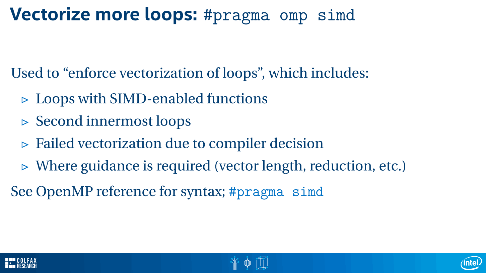

下面是使用pragma omp simd的一个例子。


这是我们在一个咨询项目中找到的代码的简化版本，由于内存优化的需要，我们必须决定向量化K循环。让我们看看为什么有必要这么做。假设这个pragma不在这里，编译器查看代码，默认情况下，它决定对i中最内层的循环进行向量化。i的取值范围是从0到t，其中t是4。所以如果你有一个16的向量长度，你将最终使用masking并且只使用向量宽度的一小部分。如果你向量化一个i，看看对数组B的内存访问发生了什么。**i增加1，内存中移动N个元素**。所以当编译器将i中的迭代集中在一起时，它将不得不从相隔很远的内存元素中收集，这并不理想。相反，当我们将`pragma omp simd`放入默认的k循环中时，编译器将用k向量化循环，这样更好。首先，因为k的取值范围从0到n，其中n是一个足够大的数来适应多个向量化，其次，因为k提供了单位步长访问。对C的访问不依赖于k，对A区域的访问可以对K进行访问，读B也可以，当您将16个K值组合在一起时，相应的内存访问将是一个**连续的内存读取**。

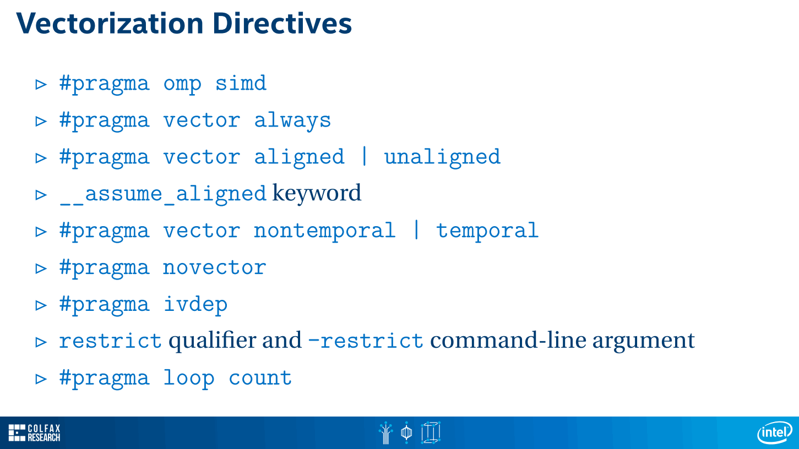

除了pragma omp simd，您还可以使用编译器指令，如pragma vector always、pragma novector和ivdep，其中许多指令我们将在本课程后面讨论。如果你现在想知道它们的意思，你可以点击这张幻灯片PDF版本中的任何链接，它会带你到编译器菜单，描述这些控件的功能。

简单地说，您可以向量化循环，即使它看起来没有什么好处，您也可以保证增量对齐和避免循环愈合，并在单个变量的级别上这样做。您可以强制向量存储流。你可以防止循环向量化，你可以保证降低向量独立性来覆盖假设的向量依赖，或者在单个变量的层次上这样做。你可以向编译器保证，在运行时，你至少，最多，或者平均会有很多次迭代。使用向量化指令或pragmas，您可以确切地告诉编译器他希望如何向量化您的代码。现在，我们将把这些知识应用到计算工作负载中。之后，我们将学习SIMD-enabled的函数。

# 2.5 SIMD-Enabled Functions
我们已经讨论了如何向量化代码，现在让我们学习如何使用`SIMD-Enabled`的函数向向量代码添加结构。`SIMD-Enabled`的函数是带有特殊声明`#pragma omp declare simd`的函数，它强制编译器生成该函数的多个实现，包括一个向量化的实现。您可以在循环中使用`SIMD-Enabled`的函数，该函数可能位于单独的源代码中。`SIMD-Enabled`的函数的一个明显的应用程序是库。如果您有一个特殊函数库，您可以将它们声明为`SIMD-Enabled`。在编译时，编译器将向量化，不是循环，而是函数本身。然后，您可以在没有访问原始源代码权限的用户应用程序中查看这个库。这将向代码添加结构。当编译器向量化`SIMD-Enabled`的函数时，函数将接受向量，而不是标量输入。函数体内部发生的每件事都会应用到输入和输出的每一个向量Lane。要将函数声明为`SIMD-Enabled`，可以使用`#pragma omp declare simd`。但并不是每个函数都可以这样声明。要求没有全局变量，也没有全局数据在这个函数的范围内修改。当您在带有标量语法的循环中使用这样一个函数时，您可能必须使用`#pragma omp simd`来对这个循环进行向量化。编译器将生成的三个版本: 
- 标量，当函数执行声明时; 
- 向量，当所有的函数参数都变成向量;
- 还有掩蔽向量。屏蔽向量版本允许您在循环中使用`SIMD-Enabled`的函数，其中循环中有一个`if()`。根据`if()`的结果，您可以将计算结果应用于输出，也可以不应用计算结果。

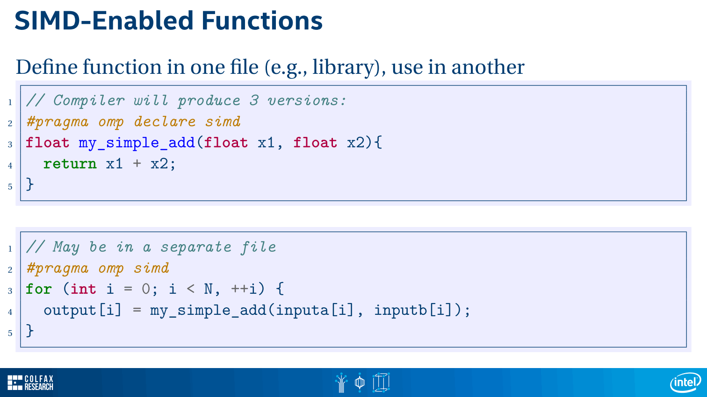


就像向量循环一样，`SIMD-Enabled`的函数不必是primitive。它们可能相当复杂。下面是一个声明为`SIMD-Enabled`的函数的示例。它接受标量输入并返回标量输出，使用解析近似计算误差函数。对于标量输入，你要做的是取绝对值然后声明一些常数，在这个表达式中使用它们，计算指数，计算多项式，然后做一个复制符号这就得到了误差函数。顺便说一下，`SIMD-Enabled`的函数调用另一个函数。指数，以2为底的解释，实际上是2的x次方这也是一个`SIMD-Enabled`的函数。所以你一直在使用simd的函数，如果你曾经使用过来自【听不清】的先验函数，即使你不知道。您没有访问这个函数的源代码，但是编译器已经有了向量化的版本，这些版本在您的向量循环中使用了先验函数。类似地，如果在数据并行循环中使用定制的`SIMD-Enabled`的函数，那么它将向量化。接下来，我们将研究`SIMD-Enabled`的实际函数。之后我们将讨论向量无关。


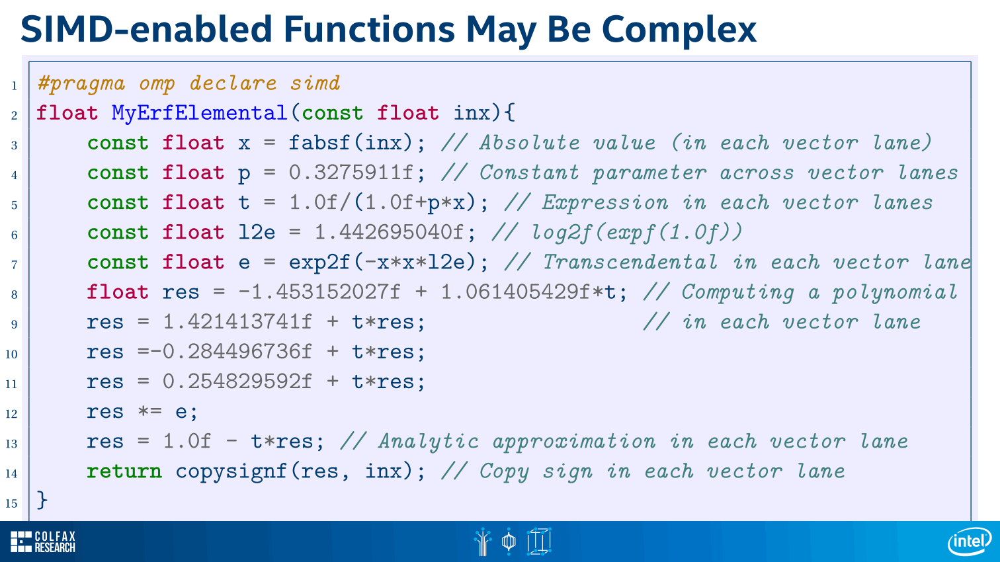

# 2.6 Vector Dependence
有时自动向量化会失败。这可能是因为向量依赖或编译器没有足够的信息。让我们看看在这些情况下你能做什么。

并不是每个循环都可以安全地向量化。您可能在循环迭代之间存在依赖关系，这使得向量化不安全。例如，这里，a[i]依赖于a[i-1]。所以，如果我按照索引递增的顺序，我必须知道a[i-1]才能计算a[i]。这使得向量化成为不可能。因为如果我一次计算16个元素，就会得到不正确的结果。相反，只要在循环中增加索引，这个表达式a[i] += a[i+1]实际上是安全的，因为它不依赖于前面的元素。你可以在一张纸上写下一些数字，然后检查并说服自己确实是这样的。可能有更复杂的情况，例如这里，a[i]依赖于a[i-16]。如果向量很短，用向量运算是安全的。但是如果你的向量超过16个元素，或者在向量化的形式下你有循环展开，那么你不能用向量来做这个，因为你会得到不正确的结果。


在某些情况下，可能没有足够的信息来确认或排除向量依赖关系。这些情况称为假定的向量相关。例如，在这个函数中，我似乎要将数组b复制到数组a中。但事实上，这个函数是模糊的，因为a和b是指针，它们可能指向完全不同的内存区域。换句话说，它们没有别名。然后，这是数组复制，向量化是安全的。但是，在某些情况下，这些指针可能有别名。它们指向一些相同的内存位置。那就更复杂了。如果b是>a，那么向量化是安全的。但是如果你有指针别名而b小于a，那么需要标量计算。例如，如果`b==a-1`，那么循环本质上就是`a[i] = a[i-1]`。这是真正的向量相关。


那么编译器如何处理假设的向量依赖关系呢?Intel编译器喜欢实现多版本控制。这是一个很棒的技巧。使用多版本控制，编译器将在编译时处理这两种情况。如果没有指针混叠，编译器将实现循环的向量版本。如果有指针混叠，然后编译器将为这种情况实现循环的标量版本。除了这两个版本之外，还有一个运行时检查。所以在运行时，在循环的开始，代码会检查，这些指针是否有别名，是否产生向量依赖关系。如果没有向量依赖，那么代码将采用向量路径。如果存在向量依赖关系，则代码将使用标量路径生成正确的结果。这使得代码通用，它可以处理不同的情况，这很好。但是这个运行时检查可能有计算开销。如果这个开销变得很大，您可能需要进行指针消歧。

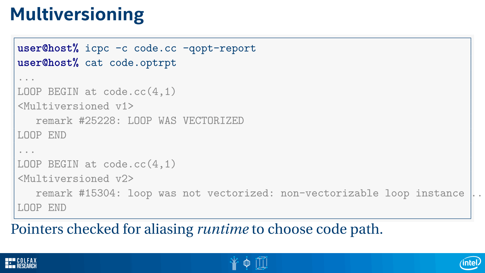

指针消除歧义是您向编译器做出的放弃多版本控制的承诺。可以使用`pragma ivdep`指令进行指针消歧。它代表忽略向量相关。使用这个指令，您可以告诉编译器指针没有别名，并且向量化是安全的。它适用于整个循环和其中的所有指针。它生成的是一个只有一个版本的循环。它可能跑得更快。但也有危险。如果函数的用户实际上提供了别名指针，代码不会崩溃，代码不会产生错误消息，它会悄悄地产生不正确的结果。所以这可能是危险的，你必须做出决定，你是否能做出这个前提。除了`pragma ivdep`之外，还可以使用关键字`restrict`消除指针的歧义。它只适用于一个指针，而且是一种更细粒度的指针消歧方法。当编译器没有足够的信息来理解向量化是否安全时，指针消除歧义会有所帮助。现在，我们将讨论当编译器在代码中没有看到向量化机会时，您可以做些什么。


# 2.7 Strip Mining
`Strip-mining`是一种编程技术，您可以使用它使编译器更容易地看到向量化的机会。`Strip-mining`是一种将一个循环变成两个嵌套循环的编程技术。这两个循环的外循环将迭代到一定的步长。内部循环将使用单位步长从外部循环索引迭代到下一个外部循环索引。这个步长称为`strip size`。如果迭代次数是`strip size`的整数倍，那么您只需从0迭代到原始循环上限。如果n不是`strip size`的倍数，那么您将计算`strip size`的倍数但不超过n的最大值，这样您就可以确保在最内层的循环中，您不会超出界限。然后您将编写一个余数循环，在最后处理几个迭代。`Strip-mining`通常用于允许向量化与线程共存。我们将在下周讨论多线程和OpenMP时看到这种技术的实际应用。

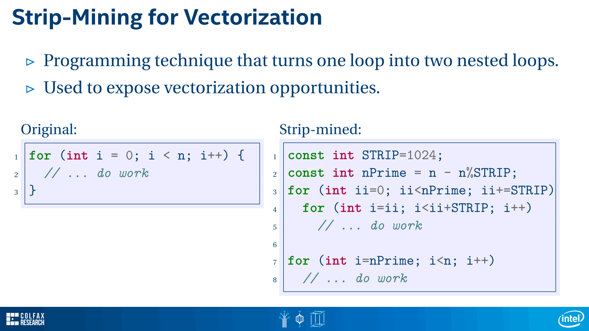

# 2.8 Example: Stencil Code

## 2.8.1 Stencil Introduction
在练习中，我们将使用模板代码。模板操作符将输入图像与模板内核进行卷积以生成输出图像。模板运算用于流体动力学中，你可以用它们来解流体运动的偏微分方程。你也可以在图像处理中找到模板这将是我们练习的一个有趣的例子。

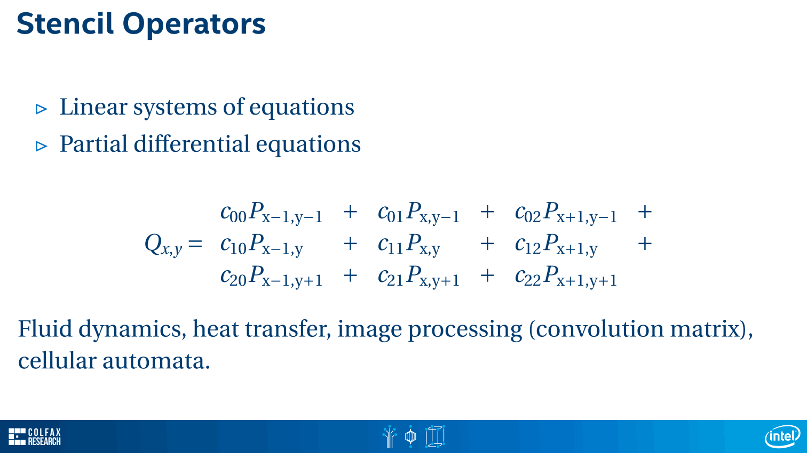

我们将使用在9个点的模板执行边缘检测。输入图像将是一个大3600万像素的图像。这个模板的结果是，如果在输入图像中有一个统一的区域，那么在输出图像中就会有一个黑色区域。如果你有一个清晰的边界你会在输出图像中有一条亮线。执行边缘检测。同时，这一运算的数学与流体动力学中使用的数学类似。所以我们会关注流体动力学中发生了什么。在基本实现中，我们将把输入和输出图像保存为浮点数数组。这是很明显的，这样我们就能比较流体力学工作量中会发生什么。

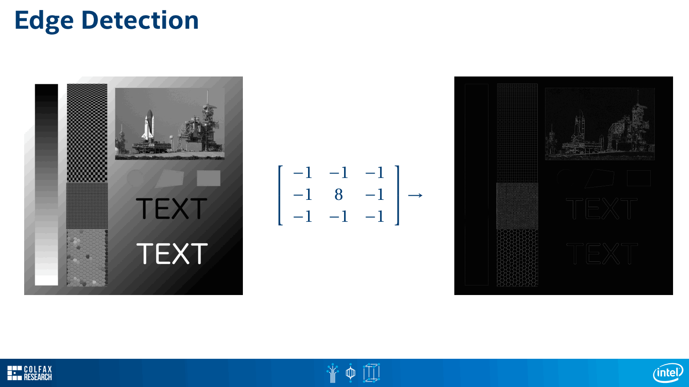

要应用模板，我们设置了两个数组，它们遍历图像中的所有像素，对于每个像素，我们取像素及其8个相邻像素，将它们乘以模板矩阵中的权重，然后将它们相加，这将生成输出图像值。对于图像处理任务，然后我们必须检查这个值是否在强度深度的范围内。具体来说，对于8位灰度图像，该亮度必须在0到255之间。这种检查对于计算流体力学工作负载来说是不必要的。这个初始实现正确地执行了任务，但就性能而言不是最优的。因此，在接下来的步骤中，我们将看到如何优化这段代码，以便在info体系结构上获得最佳性能。

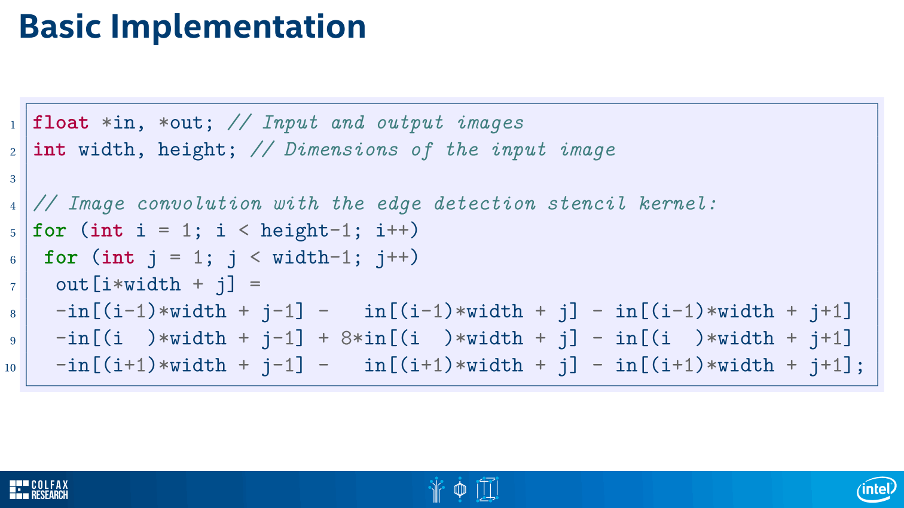

## 2.8.2

在这个实际的演示中，我们将向量化一个模板代码。这是我们在介绍视频中讨论的模板操作的初始实现。你可以看到我们有了输入图像和输出图像。我们遍历输入图像中的所有像素。将模板矩阵应用于输入图像，然后将结果写入输出。因为我们实际上是在做图像处理，我们在检查中间值，确保它在0到255之间，这样我们就生成了一个有效的8位灰度图像。与此同时，我们实现此函数的方法是使用c++模板，该模板允许我们使用此代码，无论图像包含单精度或双精度的整数或浮点数。这段代码中的实例化用于浮点类型，它是32位浮点数。现在，让我们看看这段代码的性能。我们编译。它生成一个可执行的模板。要在NVIDIA 5处理器上运行这个可执行文件，我们将把它提交到队列。要提交到队列中，我们将键入make queue，它将向集群提交一个作业。作业编号为8585，这是结果文件。性能主要集中在10个试验中，我们看到处理3600万像素的图像平均需要400毫秒。很多吗?我认为通过观察每秒处理多少数据来评估这种性能是有用的。看起来是0.7兆字节每秒。我们还可以检查每秒钟执行多少浮点运算。它很容易计算。只是像素的个数乘以9点乘以两个运算。我们每秒做十五亿个浮点运算，这对于英特尔Xeon处理器来说不算多。那么，为什么这种表现令人失望呢?这是因为这段代码没有向量化。它当然可以向量化，因为最内部的循环允许数据并行。您可以将几个j值合并在一起，对于这些j值，您可以从内存中加载输入的像素值，并同时对多个像素执行所有这些计算。然后，你会写出多个输出值。当这种情况发生时，编译器是否认识到这种机会?我们可以通过查看第13行优化报告来检查这一点。第13行是最内层循环的位置。让我们来看看11行，这里编译器说循环没有向量化。向量依赖阻止向量化。依赖关系似乎在数组out和数组in之间。所以编译器假设向量依赖因为没有足够的信息来更好地理解。作为程序员，我们知道输入和输出图像是不同的，但是编译器无法仅从这个文件中的代码猜测这一点。我们要做的是，我们要用编译器指令`pragma omp simd`覆盖向量依赖的假设。这个指令强制循环向量化。当我们重新编译代码时，我们应该看到循环现在是向量化的。好吧,让我们检查。
原因是编译器向量化了它。因此，我们可以重新运行应用程序。当它在计算的时候，我想向下滚动优化报告看看这个数字，估计潜在的速度。我们期望的速度，编译器期望从这段代码中得到的速度只有4倍左右，这是不够的。我们处理的是处理器上的单精度数学这个处理器有512位向量所以我们预计矢量化的速度在16左右。但是对于16，我们只看到4。我们看看有没有加速，是的。我们看到的速度大约是四倍。每次迭代需要140毫秒，相当于每秒处理2g的数据或每秒进行4.5千兆次浮点运算。它不是最优的，因为加速只有4。加速只有4，因为编译器无法知道我们的目标是Intel zero 5处理器。在编译时，我们没有使用任何特殊标志。因此，保守地说，编译器使用SSE指令实现了一个分支代码。无穷无尽的代码并不能给我们最好的速度。为了改变这种情况，我将编辑make文件，在make文件中我将使用参数`-xMIC-AVX512`。这是告诉编译器针对5个处理器的avx512指令集。现在，当我用这个编译器参数编译器将目标指向这个新的指令集，你可以在文档报告中看到，估计的加速将会更大。现在，估计的加速大约是16倍。它准确吗?让我们向队列提交。现在计算应该快了很多。事实上。不是140秒，而是每次操作花费38毫秒不好意思，这相当于每秒处理7.5 gb的数据或者每秒17千兆次浮点运算的性能。再一次，为了实现这一点，我们对代码做了两个修改，一个是循环没有向量化。我们用直接法强制它向量化。然后在make文件中，我们使用参数`-xMIC-AVX512`。其性能差异如图所示。我们一开始的性能大约是每秒2GHz，经过矢量化我们将性能提高到每秒17GHz。这是一个巨大的差异。但是如果你必须反复做这个转换，如果你必须做图像处理作为一个正在进行的经验的一部分，或者你可能必须做模板计算作为计算的一部分，通过动态工作负载。然后你会有兴趣使这个计算尽可能快。从图中的其他信息可以看出，进一步优化可以获得很多好处。下周，我们将看到如何进一步优化这个应用程序通过实现多线程，然后，我们将讨论如何实现内存优化并在集群中扩展它。


向量化优化后的解决方案

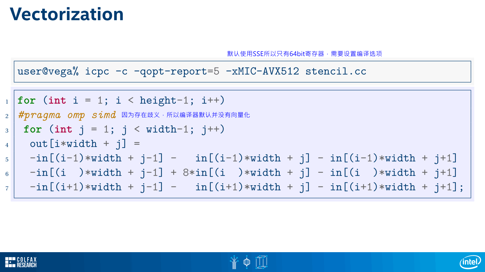

从Legacy Code到Vectorized还有很长的路要走

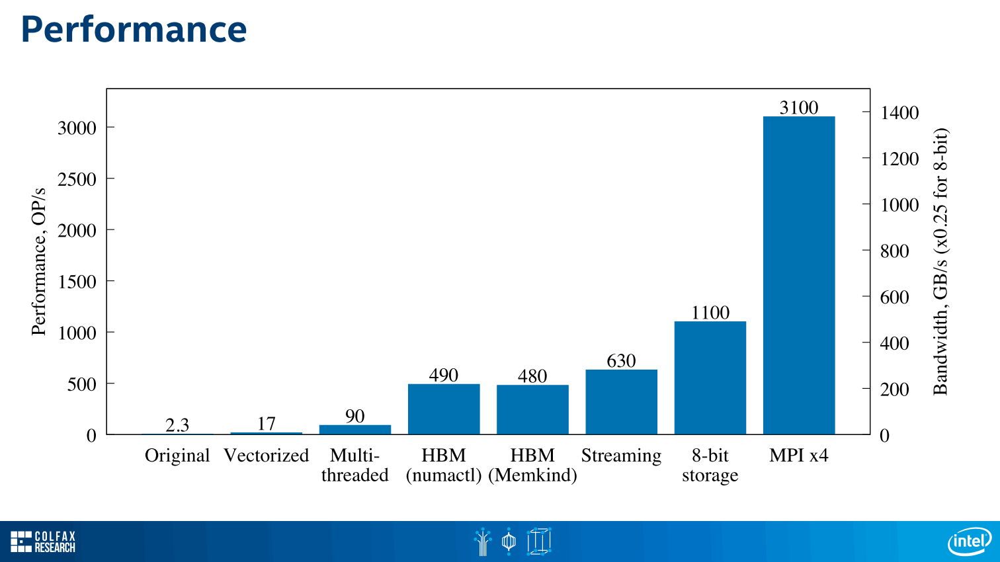

- Code:
```c++
#include "stencil.h"

template<typename P>
void ApplyStencil(ImageClass<P> & img_in, ImageClass<P> & img_out) {
  
  const int width  = img_in.width;
  const int height = img_in.height;

  P * in  = img_in.pixel;
  P * out = img_out.pixel;

  for (int i = 1; i < height-1; i++)
    for (int j = 1; j < width-1; j++) {
      P val = -in[(i-1)*width + j-1] -   in[(i-1)*width + j] - in[(i-1)*width + j+1] 
	-in[(i  )*width + j-1] + 8*in[(i  )*width + j] - in[(i  )*width + j+1] 
	-in[(i+1)*width + j-1] -   in[(i+1)*width + j] - in[(i+1)*width + j+1];

      val = (val < 0   ? 0   : val);
      val = (val > 255 ? 255 : val);

      out[i*width + j] = val;
    }
  
}

template void ApplyStencil<float>(ImageClass<float> & img_in, ImageClass<float> & img_out);
```

- Makefile:
```makefile
CXX=icpc
CXXFLAGS=-c -qopenmp
LDFLAGS=-qopenmp -lpng

OBJECTS=main.o image.o stencil.o

stencil: $(OBJECTS)
	$(CXX) $(LDFLAGS) -o stencil $(OBJECTS)

all:	stencil

run:	all
	./stencil test-image.png

queue:	all
	echo 'cd $$PBS_O_WORKDIR ; ./stencil test-image.png' | qsub -l nodes=1:flat -N edgedetection

clean:
	rm -f *.optrpt *.o stencil *output.png *~ edgedetection.*

```

- Case1: Legacy Code

```bash
# 编译
[u25693@c008 stencil]$ make
# 执行；因为Makefile里已经写了详细的步骤
[u25693@c008 stencil]$ make queue
88565.c008
# 或者这样执行
[u25693@c008 stencil]$ echo "cd stencil; ./stencil test-image.png" | qsub
88556.c008
# 查看结果
[u25693@c008 stencil]$ cat STDIN.o88556

########################################################################
# Colfax Cluster - https://colfaxresearch.com/
#      Date:           Sat Apr 20 02:31:52 PDT 2019
#    Job ID:           88556.c008
#      User:           u25693
# Resources:           neednodes=1:xeonphi,nodes=1:xeonphi,walltime=00:02:00
########################################################################


Edge detection with a 3x3 stencil

Image size: 6000 x 6000

 Step        Time, ms            GB/s         GFLOP/s
    1         600.265           0.480           1.080 *
    2         478.132           0.602           1.355 *
    3         478.897           0.601           1.353 *
    4         478.116           0.602           1.355
    5         478.217           0.602           1.355
    6         477.088           0.604           1.358
    7         476.235           0.605           1.361
    8         476.183           0.605           1.361
    9         476.436           0.604           1.360
   10         475.351           0.606           1.363
-----------------------------------------------------
Average performance:
              476.8+-1.0        0.6+-0.0        1.4+-0.0
-----------------------------------------------------
* - warm-up, not included in average


Output written into output.png

########################################################################
# Colfax Cluster
# End of output for job 88556.c008
# Date: Sat Apr 20 02:32:13 PDT 2019
########################################################################

```

- Case2: 

```diff
[u25693@c008 stencil]$ git diff
diff --git a/stencil.cc b/stencil.cc
index 074ecd6..2c08c5e 100644
--- a/stencil.cc
+++ b/stencil.cc
@@ -10,6 +10,7 @@ void ApplyStencil(ImageClass<P> & img_in, ImageClass<P> & img_out) {
   P * out = img_out.pixel;

   for (int i = 1; i < height-1; i++)
+#pragma omp simd
     for (int j = 1; j < width-1; j++) {
       P val = -in[(i-1)*width + j-1] -   in[(i-1)*width + j] - in[(i-1)*width + j+1]
        -in[(i  )*width + j-1] + 8*in[(i  )*width + j] - in[(i  )*width + j+1]

```

```bash
[u25693@c008 stencil]$ make queue
echo 'cd $PBS_O_WORKDIR ; ./stencil test-image.png' | qsub -l nodes=1:flat -N edgedetection
88568.c008

[u25693@c008 stencil]$ cat edgedetection.o88568

########################################################################
# Colfax Cluster - https://colfaxresearch.com/
#      Date:           Sat Apr 20 03:10:22 PDT 2019
#    Job ID:           88568.c008
#      User:           u25693
# Resources:           neednodes=1:flat,nodes=1:flat,walltime=00:02:00
########################################################################


Edge detection with a 3x3 stencil

Image size: 6000 x 6000
# 这里看到只增加了4倍，根据使用的处理器按理说应该增加16倍。
 Step        Time, ms            GB/s         GFLOP/s
    1         284.642           1.012           2.277 *
    2         158.678           1.815           4.084 *
    3         158.849           1.813           4.079 *
    4         160.055           1.799           4.049
    5         158.988           1.811           4.076
    6         159.117           1.810           4.072
    7         159.010           1.811           4.075
    8         158.991           1.811           4.076
    9         159.793           1.802           4.055
   10         158.662           1.815           4.084
-----------------------------------------------------
Average performance:
              159.2+-0.5        1.8+-0.0        4.1+-0.0
-----------------------------------------------------
* - warm-up, not included in average


Output written into output.png

########################################################################
# Colfax Cluster
# End of output for job 88568.c008
# Date: Sat Apr 20 03:10:39 PDT 2019
########################################################################

```
- Case3:

```diff
[u25693@c008 stencil]$ cp solutions/1-simd/Makefile ./
[u25693@c008 stencil]$ git diff
diff --git a/Makefile b/Makefile
index bde0073..bd21771 100644
--- a/Makefile
+++ b/Makefile
@@ -1,5 +1,5 @@
 CXX=icpc
-CXXFLAGS=-c -qopenmp
+CXXFLAGS=-c -qopenmp -qopt-report=5 -xMIC-AVX512
 LDFLAGS=-qopenmp -lpng

 OBJECTS=main.o image.o stencil.o
```

```bash
# 只修改Makefile并不会修改依赖，所以清除后再执行
[u25693@c008 stencil]$ make clean
rm -f *.optrpt *.o stencil *output.png *~ edgedetection.*
/bin/sh: warning: setlocale: LC_ALL: cannot change locale (C.UTF-8)
[u25693@c008 stencil]$ make
icpc -c -qopenmp -qopt-report=5 -xMIC-AVX512   -c -o main.o main.cc
icpc: remark #10397: optimization reports are generated in *.optrpt files in the output location
icpc -c -qopenmp -qopt-report=5 -xMIC-AVX512   -c -o image.o image.cc
icpc: remark #10397: optimization reports are generated in *.optrpt files in the output location
icpc -c -qopenmp -qopt-report=5 -xMIC-AVX512   -c -o stencil.o stencil.cc
icpc: remark #10397: optimization reports are generated in *.optrpt files in the output location
icpc -qopenmp -lpng -o stencil main.o image.o stencil.o
[u25693@c008 stencil]$ make queue
echo 'cd $PBS_O_WORKDIR ; ./stencil test-image.png' | qsub -l nodes=1:flat -N edgedetection
88571.c008
[u25693@c008 stencil]$ cat edgedetection.o88571

########################################################################
# Colfax Cluster - https://colfaxresearch.com/
#      Date:           Sat Apr 20 03:16:50 PDT 2019
#    Job ID:           88571.c008
#      User:           u25693
# Resources:           neednodes=1:flat,nodes=1:flat,walltime=00:02:00
########################################################################


Edge detection with a 3x3 stencil

Image size: 6000 x 6000
# 可以看到现在之前的大约4倍
 Step        Time, ms            GB/s         GFLOP/s
    1          72.855           3.953           8.894 *
    2          70.764           4.070           9.157 *
    3          60.633           4.750          10.687 *
    4          40.353           7.137          16.058
    5          40.336           7.140          16.065
    6          40.339           7.139          16.064
    7          40.380           7.132          16.048
    8          40.345           7.138          16.061
    9          40.589           7.096          15.965
   10          40.447           7.120          16.021
-----------------------------------------------------
Average performance:
               40.4+-0.1        7.1+-0.0       16.0+-0.0
-----------------------------------------------------
* - warm-up, not included in average


Output written into output.png

########################################################################
# Colfax Cluster
# End of output for job 88571.c008
# Date: Sat Apr 20 03:17:06 PDT 2019
########################################################################
```

- 向量化后的优化报告

```bash
[u25693@c008 1-simd]$ cat stencil.optrpt
Intel(R) Advisor can now assist with vectorization and show optimization
  report messages with your source code.
See "https://software.intel.com/en-us/intel-advisor-xe" for details.

Intel(R) C++ Intel(R) 64 Compiler for applications running on Intel(R) 64, Version 17.0.2.174 Build 20170213

Compiler options: -c -qopenmp -qopt-report=5 -xMIC-AVX512 -c -o stencil.o

    Report from: Interprocedural optimizations [ipo]

  WHOLE PROGRAM (SAFE) [EITHER METHOD]: false
  WHOLE PROGRAM (SEEN) [TABLE METHOD]: false
  WHOLE PROGRAM (READ) [OBJECT READER METHOD]: false

INLINING OPTION VALUES:
  -inline-factor: 100
  -inline-min-size: 30
  -inline-max-size: 230
  -inline-max-total-size: 2000
  -inline-max-per-routine: 10000
  -inline-max-per-compile: 500000

In the inlining report below:
   "sz" refers to the "size" of the routine. The smaller a routine's size,
      the more likely it is to be inlined.
   "isz" refers to the "inlined size" of the routine. This is the amount
      the calling routine will grow if the called routine is inlined into it.
      The compiler generally limits the amount a routine can grow by having
      routines inlined into it.

Begin optimization report for: ApplyStencil<float>(ImageClass<float> &, ImageClass<float> &)

    Report from: Interprocedural optimizations [ipo]

INLINE REPORT: (ApplyStencil<float>(ImageClass<float> &, ImageClass<float> &)) [1/1=100.0%] stencil.cc(4,68)


    Report from: Loop nest, Vector & Auto-parallelization optimizations [loop, vec, par]


LOOP BEGIN at stencil.cc(12,3)
   remark #15542: loop was not vectorized: inner loop was already vectorized

   LOOP BEGIN at stencil.cc(14,5)
   <Peeled loop for vectorization>
      remark #15389: vectorization support: reference out[i*width+j] has unaligned access   [ stencil.cc(22,7) ]
      remark #15389: vectorization support: reference in[(i-1)*width+j-1] has unaligned access   [ stencil.cc(15,16) ]
      remark #15389: vectorization support: reference in[(i-1)*width+j] has unaligned access   [ stencil.cc(15,42) ]
      remark #15389: vectorization support: reference in[(i-1)*width+j+1] has unaligned access   [ stencil.cc(15,64) ]
      remark #15389: vectorization support: reference in[i*width+j-1] has unaligned access   [ stencil.cc(16,3) ]
      remark #15389: vectorization support: reference in[i*width+j] has unaligned access   [ stencil.cc(16,29) ]
      remark #15389: vectorization support: reference in[i*width+j+1] has unaligned access   [ stencil.cc(16,51) ]
      remark #15389: vectorization support: reference in[(i+1)*width+j-1] has unaligned access   [ stencil.cc(17,3) ]
      remark #15389: vectorization support: reference in[(i+1)*width+j] has unaligned access   [ stencil.cc(17,29) ]
      remark #15389: vectorization support: reference in[(i+1)*width+j+1] has unaligned access   [ stencil.cc(17,51) ]
      remark #15381: vectorization support: unaligned access used inside loop body
      remark #15305: vectorization support: vector length 16
      remark #15309: vectorization support: normalized vectorization overhead 0.656
      remark #15301: PEEL LOOP WAS VECTORIZED
      remark #25015: Estimate of max trip count of loop=1
   LOOP END

   LOOP BEGIN at stencil.cc(14,5)
      remark #15389: vectorization support: reference out[i*width+j] has unaligned access   [ stencil.cc(22,7) ]
      remark #15389: vectorization support: reference in[(i-1)*width+j-1] has unaligned access   [ stencil.cc(15,16) ]
      remark #15389: vectorization support: reference in[(i-1)*width+j] has unaligned access   [ stencil.cc(15,42) ]
      remark #15389: vectorization support: reference in[(i-1)*width+j+1] has unaligned access   [ stencil.cc(15,64) ]
      remark #15389: vectorization support: reference in[i*width+j-1] has unaligned access   [ stencil.cc(16,3) ]
      remark #15389: vectorization support: reference in[i*width+j] has unaligned access   [ stencil.cc(16,29) ]
      remark #15389: vectorization support: reference in[i*width+j+1] has unaligned access   [ stencil.cc(16,51) ]
      remark #15389: vectorization support: reference in[(i+1)*width+j-1] has unaligned access   [ stencil.cc(17,3) ]
      remark #15389: vectorization support: reference in[(i+1)*width+j] has unaligned access   [ stencil.cc(17,29) ]
      remark #15389: vectorization support: reference in[(i+1)*width+j+1] has unaligned access   [ stencil.cc(17,51) ]
      remark #15381: vectorization support: unaligned access used inside loop body
      remark #15305: vectorization support: vector length 32
      remark #15309: vectorization support: normalized vectorization overhead 0.607
      remark #15301: OpenMP SIMD LOOP WAS VECTORIZED
      remark #15442: entire loop may be executed in remainder
      remark #15450: unmasked unaligned unit stride loads: 9
      remark #15451: unmasked unaligned unit stride stores: 1
      remark #15475: --- begin vector cost summary ---
      remark #15476: scalar cost: 42
      remark #15477: vector cost: 1.900
      # 这里描述了加速的倍数
      remark #15478: estimated potential speedup: 16.380
      remark #15488: --- end vector cost summary ---
   LOOP END

   LOOP BEGIN at stencil.cc(14,5)
   <Remainder loop for vectorization>
      remark #15389: vectorization support: reference out[i*width+j] has unaligned access   [ stencil.cc(22,7) ]
      remark #15389: vectorization support: reference in[(i-1)*width+j-1] has unaligned access   [ stencil.cc(15,16) ]
      remark #15389: vectorization support: reference in[(i-1)*width+j] has unaligned access   [ stencil.cc(15,42) ]
      remark #15389: vectorization support: reference in[(i-1)*width+j+1] has unaligned access   [ stencil.cc(15,64) ]
      remark #15389: vectorization support: reference in[i*width+j-1] has unaligned access   [ stencil.cc(16,3) ]
      remark #15389: vectorization support: reference in[i*width+j] has unaligned access   [ stencil.cc(16,29) ]
      remark #15389: vectorization support: reference in[i*width+j+1] has unaligned access   [ stencil.cc(16,51) ]
      remark #15389: vectorization support: reference in[(i+1)*width+j-1] has unaligned access   [ stencil.cc(17,3) ]
      remark #15389: vectorization support: reference in[(i+1)*width+j] has unaligned access   [ stencil.cc(17,29) ]
      remark #15389: vectorization support: reference in[(i+1)*width+j+1] has unaligned access   [ stencil.cc(17,51) ]
      remark #15381: vectorization support: unaligned access used inside loop body
      remark #15305: vectorization support: vector length 16
      remark #15309: vectorization support: normalized vectorization overhead 0.656
      remark #15301: REMAINDER LOOP WAS VECTORIZED
   LOOP END
LOOP END

    Report from: Code generation optimizations [cg]

stencil.cc(15,16):remark #34060: alignment of adjacent dense (unit-strided stencil) loads is (alignment, offset): (1, 0)
stencil.cc(15,16):remark #34050: optimization of adjacent dense (unit-strided stencil) loads seems unprofitable.
stencil.cc(15,16):remark #34055: adjacent dense (unit-strided stencil) loads are not optimized. Details: stride { 4 }, step { 4 }, types { F32-V512, F32-V512, F32-V512 }, number of elements { 16 }, select mask { 0x000000007 }.
stencil.cc(15,16):remark #34060: alignment of adjacent dense (unit-strided stencil) loads is (alignment, offset): (1, 0)
stencil.cc(15,16):remark #34050: optimization of adjacent dense (unit-strided stencil) loads seems unprofitable.
stencil.cc(15,16):remark #34055: adjacent dense (unit-strided stencil) loads are not optimized. Details: stride { 4 }, step { 4 }, types { F32-V512, F32-V512, F32-V512 }, number of elements { 16 }, select mask { 0x000000007 }.
stencil.cc(16,3):remark #34060: alignment of adjacent dense (unit-strided stencil) loads is (alignment, offset): (1, 0)
stencil.cc(16,3):remark #34050: optimization of adjacent dense (unit-strided stencil) loads seems unprofitable.
stencil.cc(16,3):remark #34055: adjacent dense (unit-strided stencil) loads are not optimized. Details: stride { 4 }, step { 4 }, types { F32-V512, F32-V512, F32-V512 }, number of elements { 16 }, select mask { 0x000000007 }.
stencil.cc(16,3):remark #34060: alignment of adjacent dense (unit-strided stencil) loads is (alignment, offset): (1, 0)
stencil.cc(16,3):remark #34050: optimization of adjacent dense (unit-strided stencil) loads seems unprofitable.
stencil.cc(16,3):remark #34055: adjacent dense (unit-strided stencil) loads are not optimized. Details: stride { 4 }, step { 4 }, types { F32-V512, F32-V512, F32-V512 }, number of elements { 16 }, select mask { 0x000000007 }.
stencil.cc(17,3):remark #34060: alignment of adjacent dense (unit-strided stencil) loads is (alignment, offset): (1, 0)
stencil.cc(17,3):remark #34050: optimization of adjacent dense (unit-strided stencil) loads seems unprofitable.
stencil.cc(17,3):remark #34055: adjacent dense (unit-strided stencil) loads are not optimized. Details: stride { 4 }, step { 4 }, types { F32-V512, F32-V512, F32-V512 }, number of elements { 16 }, select mask { 0x000000007 }.
stencil.cc(17,3):remark #34060: alignment of adjacent dense (unit-strided stencil) loads is (alignment, offset): (1, 0)
stencil.cc(17,3):remark #34050: optimization of adjacent dense (unit-strided stencil) loads seems unprofitable.
stencil.cc(17,3):remark #34055: adjacent dense (unit-strided stencil) loads are not optimized. Details: stride { 4 }, step { 4 }, types { F32-V512, F32-V512, F32-V512 }, number of elements { 16 }, select mask { 0x000000007 }.
stencil.cc(4,68):remark #34051: REGISTER ALLOCATION : [_Z12ApplyStencilIfEvR10ImageClassIT_ES3_] stencil.cc:4

    Hardware registers
        Reserved     :    2[ rsp rip]
        Available    :   63[ rax rdx rcx rbx rbp rsi rdi r8-r15 mm0-mm7 zmm0-zmm31 k0-k7]
        Callee-save  :    6[ rbx rbp r12-r15]
        Assigned     :   46[ rax rdx rcx rbx rsi rdi r8-r15 zmm0-zmm30 k1]

    Routine temporaries
        Total         :     149
            Global    :      56
            Local     :      93
        Regenerable   :       6
        Spilled       :      28

    Routine stack
        Variables     :       0 bytes*
            Reads     :       0 [0.00e+00 ~ 0.0%]
            Writes    :       0 [0.00e+00 ~ 0.0%]
        Spills        :     208 bytes*
            Reads     :      35 [1.34e+02 ~ 5.0%]
            Writes    :      29 [8.43e+01 ~ 3.1%]

    Notes

        *Non-overlapping variables and spills may share stack space,
         so the total stack size might be less than this.


===========================================================================

```

# 2.9 Example: Numerical Integration
# 2.9.1 Numerical Integration Introduction

本课程的实作练习之一是数值积分。数值积分是数值分析的基本方法之一。它将函数在一定范围内的定积分近似为在较小区间内的有限和。从图像上看，如果我们有一个函数，f (x)像这样，我们的目标是求这个函数从0-a到x的积分，我们试着求曲线下的面积。

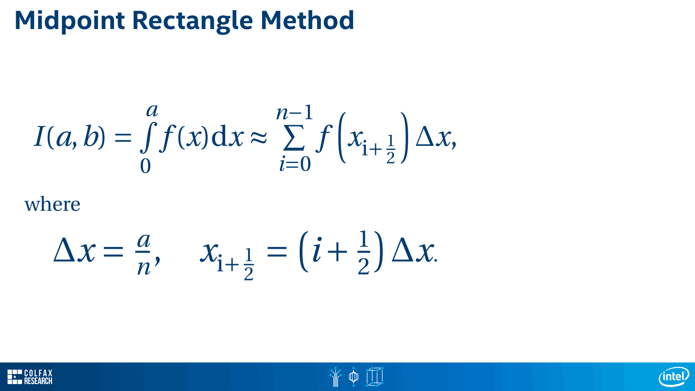

数值积分的中点矩形法通过将积分区间分割成若干块来逼近该区域。对于每一块，我会找到中点，计算这个函数在这个中点的值，然后画一个和这个函数值一样高的矩形。然后，我要声明这个区间内曲线下面积的近似值实际上是这个矩形的面积。下一个区间的高度是这样的，下一个区间的高度是这样的，以此类推。这是一种二阶精度的方法。为了计算中点，我们将使用公式(i+1/2)∆x，其中∆x是每个区间的宽度。我们称这个点为X_i+1/2。在代码中，要执行这个数值积分，我必须建立一个循环，遍历所有积分区间，计算中点，用这个中点计算函数的值和积分的增量，然后再增加运行的和。在循环的最后，这个运行的和将近似等于我们要找的定积分的值。这个实现不是最优的，在后面的视频中，我们将看到如何优化这个应用程序的性能。

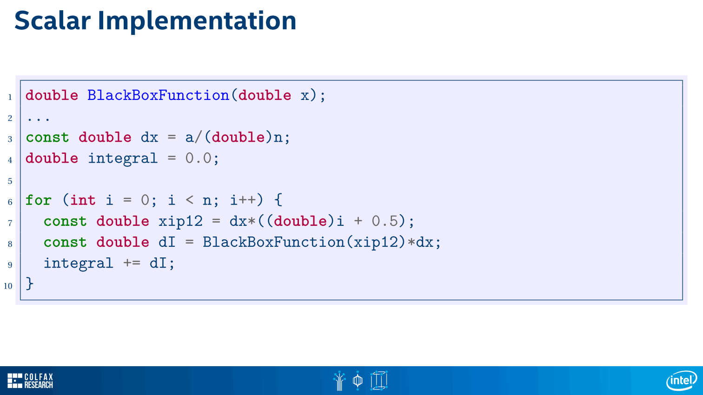


# 2.9.2 Integral Vectorization

这是一个实际的演示。我们将使用数值积分来实验SIMD-enabled的函数。这就是引言中讨论的数值积分函数。如你所见，它接受用户输入的步骤数，以及a和b的值，在引言中我们假设a是0，但一般来说a可以是非0的。这个函数是在main例程中调用的，作为一个参考点，我想给你们展示n的值，我们处理的是十亿。这个黑盒函数位于头文件库中，接受一个标量输入，返回一个标量输出。它是1除以平方根。事实上，我们知道如何解析地对其中一个平方根积分所以我们不需要做数值积分，但它允许我们验证用逆导数得到的结果。所以我正在编译这个应用程序，提交给队列，让我们看看它在基线版本中的执行速度有多快。计算时间太长了，我不得不停止录音，三分钟后才继续。三分钟后，结果出来了。这个积分的每次测试都需要83.5秒。它产生良好的准确性。这个数字接近于零，但即使出于实际原因，这个时间也太长了。为了看看我们能做些什么来提高性能，我们可以问编译器。询问编译器的最佳方法是请求向量化报告。我甚至会要求最详细的报告。现在我们要重新编译。编译完成后，我们将得到优化报告文件。例如，这些优化报告文件只是文本文件，我们可以查看它们。对于work.cc，可以查看work.optrpt。如果我们向下滚动，我们会找到关于这个循环的信息。这是我们应该关注的，循环从worker.cc第8行开始并没有向量化。因为它有一个函数调用，并且它不被认为是优化候选项。我们知道这个函数实际上是可向量化的。如果我们可以计算平方根，对于一个数我们可以计算平方根，对于多个数用一个短向量的平方根的倒数。但是当编译器在worker.cc上工作时。它只看到函数调用这是一个外部函数所以它不知道如何向量化。正如我们所知，这正是SIMD-enabled的函数应该提供帮助的地方。我们必须使用SIMD-enabled函数。这里我们要做的就是`pragma omp declare simd`。当我们这样做时，我们可以重新编译代码.我们将在library.c的优化报告中看到一些有趣的东西。这里我们有BlackBoxFunction，现在我们有这个函数的多种实现。一个是非掩模向量。它是矢量化。还有一个带掩码的矢量化，还有一个只带标量语法。就是这样，我们做了。为了告诉编译器我们正在调用SIMD-enabled函数，我们还必须在头文件中更改它的签名。我们来看看这是否有用。更改头文件并不强制重新编译，因此我将强制重新编译。让我们再检查一下，worker.cc的优化报告中有什么。worker.cc的优化报告也有关于这个循环向量化的坏消息。它不是向量化的，但现在，不是因为我们在调用一个函数，而是因为一个向量相关。是I和I之间的依赖关系。这里发生的是，当编译器将多个迭代集中在i中，多个向量路径将不得不写入相同的标量I。我们知道这实际上不是向量相关的。这是向量redection，编译器知道如何处理它，我们只需要给它一个指令。指令是pragma omp simd，然后是变量I上的运算符+的reduction。现在我们可以重新编译，让我们看看它是如何工作的。提交到队列并等待结果出来。再一次，我不得不暂停视频。在我看到结果之前，现在的计算时间要短得多。只有16秒。获得5倍的加速。精度还不错，但还不实用。我们需要做的最后一步是认识到，在XEON Phi处理器上，一个因子5不是一个很好的双精度加速。我们期望加速因子是8，因为8是向量的宽度。这个计算中缺少的是正确的指令集，我们必须告诉编译器我们的目标是针对Intel XEON PHI处理器的AVX512指令集。然后我们应该得到一个更有效的代码。第三次提交到队列，让我们看看会发生什么。一分钟后结果出来了。现在，每次迭代的时间是6秒。总结一下，我们对代码所做的更改如下。在库代码中，我们将函数声明为SIMD-enable，然后将此声明镜像到头文件中。然后，在work文件内部，我们使用pragma omp simd with reduction。最后在make文件中，我们使用xMIC-AVX512。这使我们的速度提高了12倍。这是我们所取得成就的一个例子。这是以每秒数十亿步为单位的代码性能。多亏了矢量化，我们从这个性能变成了那个性能。


正如您所看到的，从多线程和集群计算中可以获得很多好处，我们将在接下来的会话中对此进行研究。

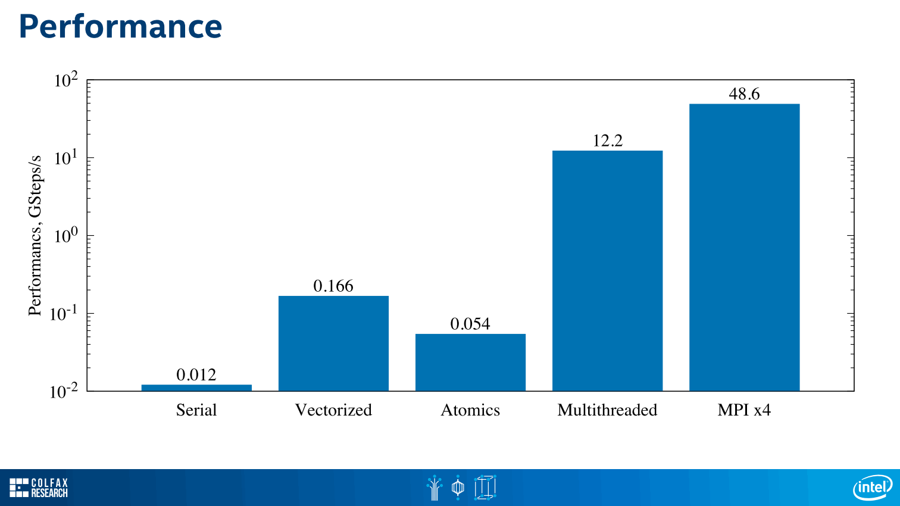

## Code

```cc
// worker.cc
#include "library.h"

double ComputeIntegral(const int n, const double a, const double b) {

  const double dx = (b - a)/n;
  double I = 0.0;

  for (int i = 0; i < n; i++) {

    const double xip12 = a + dx*(double(i) + 0.5);
    const double yip12 = BlackBoxFunction(xip12);
    const double dI = yip12*dx;
    I += dI;

  }

  return I;
}

// library.cc
#include <cmath>

double BlackBoxFunction(const double x) {
  return 1.0/sqrt(x);
}

double InverseDerivative(const double x) {
  return 2.0*sqrt(x);
}


// library.h
#ifndef __INCLUDED_LIBRARY_H__
#define __INCLUDED_LIBRARY_H__

double BlackBoxFunction(const double x);

double InverseDerivative(const double x);

#endif
```


## Makefile
```makefile
CXX=icpc
CXXFLAGS=-c -qopenmp
LDFLAGS=-qopenmp

OBJECTS=main.o library.o worker.o

integral: $(OBJECTS)
	$(CXX) $(LDFLAGS) -o integral $(OBJECTS)

all:	integral

run:	all
	./integral

queue:	all
	echo 'cd $$PBS_O_WORKDIR ; ./integral' | qsub -l nodes=1:flat -l walltime=00:03:00 -N numintegr

clean:
	rm -f *.optrpt *.o integral *~ numintegr.*
```


## Case1: Original

- 编译原始文件，查看结果
```bash
[u25693@c008 integral]$ cat numintegr.o88864

########################################################################
# Colfax Cluster - https://colfaxresearch.com/
#      Date:           Sat Apr 20 21:45:54 PDT 2019
#    Job ID:           88864.c008
#      User:           u25693
# Resources:           neednodes=1:flat,nodes=1:flat,walltime=00:03:00
########################################################################


Numerical integration with n=1000000000
 Step        Time, ms        GSteps/s        Accuracy
    1       95530.258           0.010       2.287e-11*
    2       95535.881           0.010       1.032e-28*

########################################################################
# Colfax Cluster
# End of output for job 88864.c008
# Date: Sat Apr 20 21:49:38 PDT 2019
########################################################################

```

- 修改Makefile, 打开优化报告
```diff
[u25693@c008 integral]$ git diff
diff --git a/Makefile b/Makefile
index 796c428..1a752fd 100644
--- a/Makefile
+++ b/Makefile
@@ -1,5 +1,5 @@
 CXX=icpc
-CXXFLAGS=-c -qopenmp
+CXXFLAGS=-c -qopenmp -qopt-report=5
 LDFLAGS=-qopenmp

 OBJECTS=main.o library.o worker.o

```

- 可以看到优化报告里显示并没有优化循环，原因是调用了未向量化的函数
```bash
LOOP BEGIN at worker.cc(8,3)
   remark #15543: loop was not vectorized: loop with function call not considered an optimization candidate.
LOOP END
```

## Case2: 代码中添加优化选项

- 修改library.cc/library.h
```diff
[u25693@c008 integral]$ git diff
diff --git a/Makefile b/Makefile
index 796c428..1a752fd 100644
--- a/Makefile
+++ b/Makefile
@@ -1,5 +1,5 @@
 CXX=icpc
-CXXFLAGS=-c -qopenmp
+CXXFLAGS=-c -qopenmp -qopt-report=5
 LDFLAGS=-qopenmp

 OBJECTS=main.o library.o worker.o
diff --git a/library.cc b/library.cc
index e07e956..74a9822 100644
--- a/library.cc
+++ b/library.cc
@@ -1,5 +1,6 @@
 #include <cmath>

+#pragma omp declare simd
 double BlackBoxFunction(const double x) {
   return 1.0/sqrt(x);
 }
diff --git a/library.h b/library.h
index fc6a9de..cde13e3 100644
--- a/library.h
+++ b/library.h
@@ -1,6 +1,7 @@
 #ifndef __INCLUDED_LIBRARY_H__
 #define __INCLUDED_LIBRARY_H__

+#pragma omp declare simd
 double BlackBoxFunction(const double x);

 double InverseDerivative(const double x);

```

- 查看library优化报告，生成了3个版本
```optrpt
[u25693@c008 integral]$ cat library.optrpt
Intel(R) Advisor can now assist with vectorization and show optimization
  report messages with your source code.
See "https://software.intel.com/en-us/intel-advisor-xe" for details.

Intel(R) C++ Intel(R) 64 Compiler for applications running on Intel(R) 64, Version 17.0.2.174 Build 20170213

Compiler options: -c -qopenmp -qopt-report=5 -c -o library.o

    Report from: Interprocedural optimizations [ipo]

  WHOLE PROGRAM (SAFE) [EITHER METHOD]: false
  WHOLE PROGRAM (SEEN) [TABLE METHOD]: false
  WHOLE PROGRAM (READ) [OBJECT READER METHOD]: false

INLINING OPTION VALUES:
  -inline-factor: 100
  -inline-min-size: 30
  -inline-max-size: 230
  -inline-max-total-size: 2000
  -inline-max-per-routine: 10000
  -inline-max-per-compile: 500000

In the inlining report below:
   "sz" refers to the "size" of the routine. The smaller a routine's size,
      the more likely it is to be inlined.
   "isz" refers to the "inlined size" of the routine. This is the amount
      the calling routine will grow if the called routine is inlined into it.
      The compiler generally limits the amount a routine can grow by having
      routines inlined into it.
# 第一种
Begin optimization report for: BlackBoxFunction..xN2v(double)

    Report from: Interprocedural optimizations [ipo]

INLINE REPORT: (BlackBoxFunction..xN2v(double)) [1/2=50.0%] library.cc(4,41)


    Report from: Loop nest, Vector & Auto-parallelization optimizations [loop, vec, par]

remark #15347: FUNCTION WAS VECTORIZED with xmm, simdlen=2, unmasked, formal parameter types: (vector)
remark #15305: vectorization support: vector length 2

    Report from: Code generation optimizations [cg]

library.cc(4,41):remark #34051: REGISTER ALLOCATION : [_ZGVxN2v__Z16BlackBoxFunctiond] library.cc:4

    Hardware registers
        Reserved     :    2[ rsp rip]
        Available    :   39[ rax rdx rcx rbx rbp rsi rdi r8-r15 mm0-mm7 zmm0-zmm15]
        Callee-save  :   14[ rbx rbp r12-r15 xmm8-xmm15]
        Assigned     :    2[ zmm0-zmm1]

    Routine temporaries
        Total         :      20
            Global    :       0
            Local     :      20
        Regenerable   :       1
        Spilled       :       0

    Routine stack
        Variables     :       0 bytes*
            Reads     :       0 [0.00e+00 ~ 0.0%]
            Writes    :       0 [0.00e+00 ~ 0.0%]
        Spills        :       0 bytes*
            Reads     :       0 [0.00e+00 ~ 0.0%]
            Writes    :       0 [0.00e+00 ~ 0.0%]

    Notes

        *Non-overlapping variables and spills may share stack space,
         so the total stack size might be less than this.


===========================================================================
# 第二种
Begin optimization report for: BlackBoxFunction..xM2v(double)

    Report from: Interprocedural optimizations [ipo]

INLINE REPORT: (BlackBoxFunction..xM2v(double)) [1/2=50.0%] library.cc(4,41)


    Report from: Loop nest, Vector & Auto-parallelization optimizations [loop, vec, par]

remark #15347: FUNCTION WAS VECTORIZED with xmm, simdlen=2, masked, formal parameter types: (vector)
remark #15305: vectorization support: vector length 2

    Report from: Code generation optimizations [cg]

library.cc(4,41):remark #34051: REGISTER ALLOCATION : [_ZGVxM2v__Z16BlackBoxFunctiond] library.cc:4

    Hardware registers
        Reserved     :    2[ rsp rip]
        Available    :   39[ rax rdx rcx rbx rbp rsi rdi r8-r15 mm0-mm7 zmm0-zmm15]
        Callee-save  :   14[ rbx rbp r12-r15 xmm8-xmm15]
        Assigned     :    4[ rax zmm0-zmm2]

    Routine temporaries
        Total         :      27
            Global    :      17
            Local     :      10
        Regenerable   :       2
        Spilled       :       0

    Routine stack
        Variables     :       0 bytes*
            Reads     :       0 [0.00e+00 ~ 0.0%]
            Writes    :       0 [0.00e+00 ~ 0.0%]
        Spills        :       0 bytes*
            Reads     :       0 [0.00e+00 ~ 0.0%]
            Writes    :       0 [0.00e+00 ~ 0.0%]

    Notes

        *Non-overlapping variables and spills may share stack space,
         so the total stack size might be less than this.


===========================================================================
# 第三种
Begin optimization report for: BlackBoxFunction(double)

    Report from: Interprocedural optimizations [ipo]

INLINE REPORT: (BlackBoxFunction(double)) [1/2=50.0%] library.cc(4,41)


    Report from: Code generation optimizations [cg]

library.cc(4,41):remark #34051: REGISTER ALLOCATION : [_Z16BlackBoxFunctiond] library.cc:4

    Hardware registers
        Reserved     :    2[ rsp rip]
        Available    :   39[ rax rdx rcx rbx rbp rsi rdi r8-r15 mm0-mm7 zmm0-zmm15]
        Callee-save  :    6[ rbx rbp r12-r15]
        Assigned     :    2[ zmm0-zmm1]

    Routine temporaries
        Total         :      12
            Global    :       0
            Local     :      12
        Regenerable   :       1
        Spilled       :       0

    Routine stack
        Variables     :       0 bytes*
            Reads     :       0 [0.00e+00 ~ 0.0%]
            Writes    :       0 [0.00e+00 ~ 0.0%]
        Spills        :       0 bytes*
            Reads     :       0 [0.00e+00 ~ 0.0%]
            Writes    :       0 [0.00e+00 ~ 0.0%]

    Notes

        *Non-overlapping variables and spills may share stack space,
         so the total stack size might be less than this.


===========================================================================

Begin optimization report for: InverseDerivative(double)

    Report from: Interprocedural optimizations [ipo]

INLINE REPORT: (InverseDerivative(double)) [2/2=100.0%] library.cc(8,42)


    Report from: Code generation optimizations [cg]

library.cc(8,42):remark #34051: REGISTER ALLOCATION : [_Z17InverseDerivatived] library.cc:8

    Hardware registers
        Reserved     :    2[ rsp rip]
        Available    :   39[ rax rdx rcx rbx rbp rsi rdi r8-r15 mm0-mm7 zmm0-zmm15]
        Callee-save  :    6[ rbx rbp r12-r15]
        Assigned     :    1[ zmm0]

    Routine temporaries
        Total         :      11
            Global    :       0
            Local     :      11
        Regenerable   :       0
        Spilled       :       0

    Routine stack
        Variables     :       0 bytes*
            Reads     :       0 [0.00e+00 ~ 0.0%]
            Writes    :       0 [0.00e+00 ~ 0.0%]
        Spills        :       0 bytes*
            Reads     :       0 [0.00e+00 ~ 0.0%]
            Writes    :       0 [0.00e+00 ~ 0.0%]

    Notes

        *Non-overlapping variables and spills may share stack space,
         so the total stack size might be less than this.


===========================================================================

```

- 但是worker.cc并没有向量化，提示向量依赖组织了向量化

```bash

LOOP BEGIN at worker.cc(8,3)
   remark #15344: loop was not vectorized: vector dependence prevents vectorization
   remark #15346: vector dependence: assumed ANTI dependence between I (13:5) and I (13:5)
   remark #15346: vector dependence: assumed FLOW dependence between I (13:5) and I (13:5)
LOOP END

```

- 所以修改worker.cc
```diff
diff --git a/worker.cc b/worker.cc
index bf8f84f..6d053c3 100644
--- a/worker.cc
+++ b/worker.cc
@@ -5,6 +5,7 @@ double ComputeIntegral(const int n, const double a, const double b) {
   const double dx = (b - a)/n;
   double I = 0.0;

+#pragma omp simd reduction(+: I)
   for (int i = 0; i < n; i++) {

     const double xip12 = a + dx*(double(i) + 0.5);

```

- 现在向量化了，查看报告
```bash
LOOP BEGIN at worker.cc(9,3)
<Remainder loop for vectorization>
   remark #15305: vectorization support: vector length 2
   remark #15309: vectorization support: normalized vectorization overhead 0.308
   remark #15301: REMAINDER LOOP WAS VECTORIZED
LOOP END

LOOP BEGIN at worker.cc(9,3)
<Remainder loop for vectorization>
LOOP END

```

- 接下来运行，查看结果
```bash
[u25693@c008 integral]$ cat numintegr.o88871

########################################################################
# Colfax Cluster - https://colfaxresearch.com/
#      Date:           Sat Apr 20 22:10:03 PDT 2019
#    Job ID:           88871.c008
#      User:           u25693
# Resources:           neednodes=1:flat,nodes=1:flat,walltime=00:03:00
########################################################################


Numerical integration with n=1000000000
 Step        Time, ms        GSteps/s        Accuracy
    1       18836.602           0.053       2.287e-11*
    2       18833.587           0.053       6.647e-30*
    3       18831.201           0.053       1.437e-31*
    4       18833.765           0.053       1.363e-28
    5       18832.692           0.053       2.698e-28
    6       18832.413           0.053       3.718e-29
    7       18837.799           0.053       6.851e-29
    8       18835.379           0.053       7.978e-29
    9       18838.614           0.053       3.345e-30
   10       18837.275           0.053       1.230e-31
-----------------------------------------------------
Average performance:
            18835.4+-2.3        0.1+-0.0
-----------------------------------------------------
* - warm-up, not included in average


########################################################################
# Colfax Cluster
# End of output for job 88871.c008
# Date: Sat Apr 20 22:13:12 PDT 2019
########################################################################

```

- 但是效果只提升了5倍，我们期望的是16倍


## Case3: 修改指令集

- 修改Makefile，添加特定指令集参数
``` diff
diff --git a/Makefile b/Makefile
index 796c428..b5b0c5d 100644
--- a/Makefile
+++ b/Makefile
@@ -1,5 +1,5 @@
 CXX=icpc
-CXXFLAGS=-c -qopenmp
+CXXFLAGS=-c -qopenmp -qopt-report=5 -xMIC-AVX512
 LDFLAGS=-qopenmp

 OBJECTS=main.o library.o worker.o
@@ -13,7 +13,7 @@ run:  all
        ./integral

 queue: all
-       echo 'cd $$PBS_O_WORKDIR ; ./integral' | qsub -l nodes=1:flat -l walltime=00:03:00 -N numintegr
+       echo 'cd $$PBS_O_WORKDIR ; ./integral' | qsub -l nodes=1:flat -N numintegr

 clean:
        rm -f *.optrpt *.o integral *~ numintegr.*

```

- 查看worker.optptr可以看到vector length: 8
```bash

LOOP BEGIN at worker.cc(9,3)
   remark #15305: vectorization support: vector length 8
   remark #15399: vectorization support: unroll factor set to 2
   remark #15309: vectorization support: normalized vectorization overhead 0.036
   remark #15301: OpenMP SIMD LOOP WAS VECTORIZED
   remark #15475: --- begin vector cost summary ---
   remark #15476: scalar cost: 115
   remark #15477: vector cost: 52.250
   remark #15478: estimated potential speedup: 2.050
   remark #15484: vector function calls: 1
   remark #15487: type converts: 1
   remark #15488: --- end vector cost summary ---
   remark #15489: --- begin vector function matching report ---
   remark #15490: Function call: BlackBoxFunction(double) with simdlen=8, actual parameter types: (vector)   [ worker.cc(12,26) ]
   remark #15492: A suitable vector variant was found (out of 2) with xmm, simdlen=2, unmasked, formal parameter types: (vector)
   remark #15493: --- end vector function matching report ---
LOOP END

LOOP BEGIN at worker.cc(9,3)
<Remainder loop for vectorization>
   remark #15305: vectorization support: vector length 8
   remark #15309: vectorization support: normalized vectorization overhead 0.098
   remark #15301: REMAINDER LOOP WAS VECTORIZED
LOOP END

```

- 查看最后运行结果，效果提升
```bash

[u25693@c008 integral]$ cat numintegr.o88873

########################################################################
# Colfax Cluster - https://colfaxresearch.com/
#      Date:           Sat Apr 20 22:18:19 PDT 2019
#    Job ID:           88873.c008
#      User:           u25693
# Resources:           neednodes=1:flat,nodes=1:flat,walltime=00:02:00
########################################################################


Numerical integration with n=1000000000
 Step        Time, ms        GSteps/s        Accuracy
    1        6887.852           0.145       2.287e-11*
    2        6886.092           0.145       3.589e-29*
    3        6883.134           0.145       6.071e-30*
    4        6885.561           0.145       2.378e-30
    5        6885.489           0.145       3.813e-31
    6        6883.418           0.145       2.938e-31
    7        6884.511           0.145       1.395e-29
    8        6886.161           0.145       6.640e-29
    9        6884.977           0.145       7.078e-30
   10        6883.906           0.145       3.553e-29
-----------------------------------------------------
Average performance:
             6884.9+-0.9        0.1+-0.0
-----------------------------------------------------
* - warm-up, not included in average


########################################################################
# Colfax Cluster
# End of output for job 88873.c008
# Date: Sat Apr 20 22:19:29 PDT 2019
########################################################################

```

# 2.10 Learn More
这周我们讨论了矢量化。希望我已经说服了你们，使用向量指令对于释放现代处理器的性能潜力是至关重要的。我希望已经使您确信，自动向量化是最可移植、最有效和最实用的方法。在优化课程中，我们将进一步学习这方面的知识，并学习如何通过微调数据容器和使用编译器指令从向量代码中提取更多的性能。

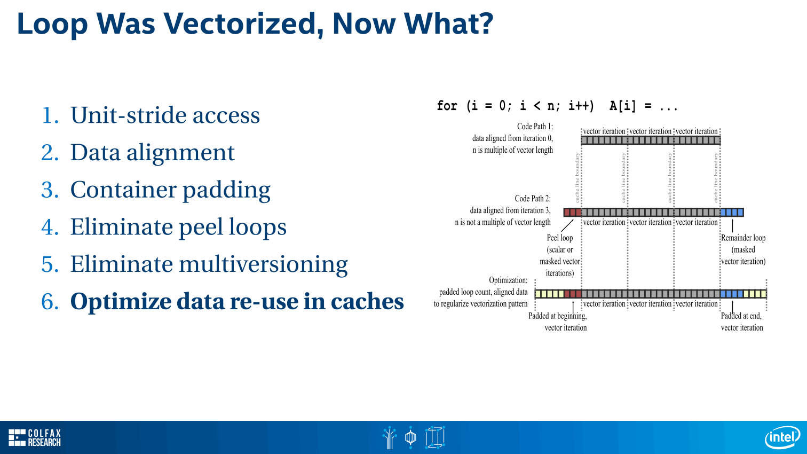

在本课程的后面，我们将学习向量化和内存访问之间的联系。在现代处理器中，向量数学是如此高效，以至于您可以认为浮点运算与内存访问相比是廉价的。这意味着您可以编写出色的向量代码，但是如果您的大部分数据来自主内存而不是缓存，那么您将无法体验到完整的向量浮点性能。在第四周，我们将讨论如何优化你的内存流量。下周我们将讨论Intel架构中的下一层并行性，即多核，以及如何在OpenMP中使用多线程处理它们。

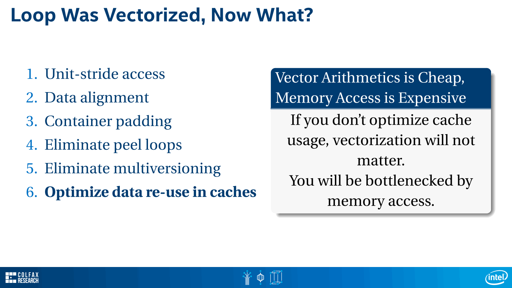