# 3.1 Cores and Threads
欢迎回来。我们开始讨论OpenMP的多线程。当然，这个主题的核心是概念，以及进程和线程的相关主题。正如您所知，就在十多年前，大多数处理器还是单核的。而且它们只能有效地运行一条指令流。当然，您仍然可以在操作系统中进行多任务处理，但是多个指令流将共享同一个核心。


今天，如果你看数据中心，你会发现多核处理器和许多核心处理器以及协处理器，比如Xeon和Xeon Phi协处理器。当然，在这两类处理器中，都有几十个核。例如，第二代英特尔的Xeon Phi协处理器最多有72个执行核心。

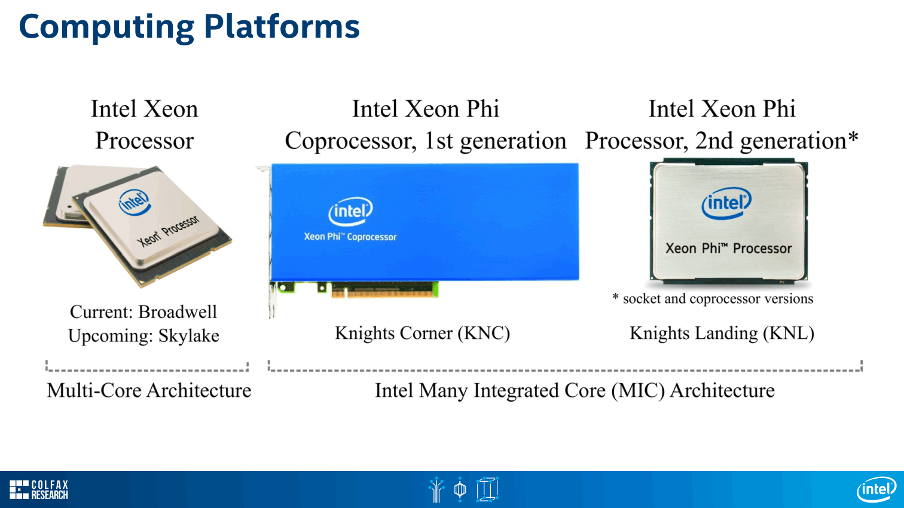


应用程序必须了解体系结构的多核。如果您的应用程序对多核一无所知，那么它只有一个指令流，该指令流将只占用一个处理器核心。

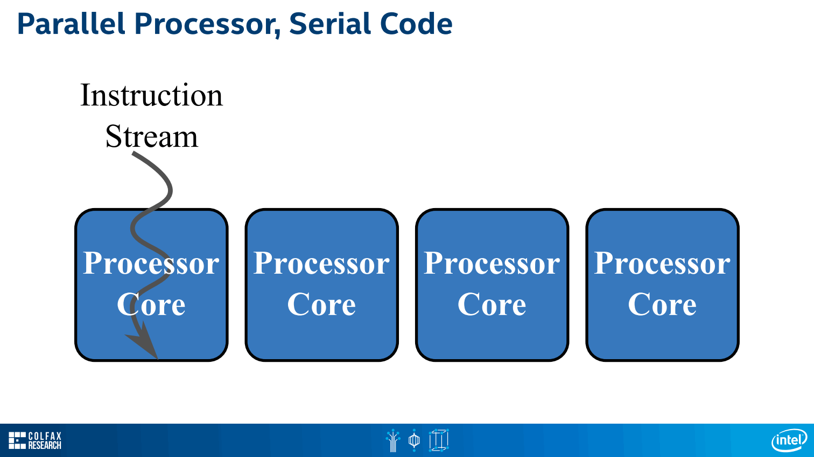


而且大多数核心没有使用。


作为程序员，您必须支持多核，为此，您必须运行多个指令流。有两种方法可以做到这一点。一种方法是多进程。另一个是多线程。Linux中的进程是指令流，每个进程都有自己的内存地址空间。相反，线程是具有公共内存地址空间的独立指令流。所以在设计线程和进程并行程序的方式上将会有所不同。第二节课我们将讨论多线程，第五节课我们将讨论多处理和消息传递。

关键的区别在于，如果希望在进程之间交换一些数据，就必须传递消息，最常见的是跨通信结构传递消息。使用线程，您不需要这样做。如果一个线程负责一半的模拟域，而另一个线程负责另一半，那么线程1可以透明地读取分配给线程2的数据。


与多进程相比，多线程在线程之间共享内存方面具有明显的优势。如果您有一个大型数据结构，特别是一个仅用于读取的数据结构，那么在处理多进程的情况下，您必须在每个进程的内存中保存该数据结构的副本。当然，这是假设每个进程都需要整个数据结构，而不是其中的一部分。对于线程，您不需要这样做，您可以只保留一个副本供多个线程并发读取。我们将在下一集视频中讨论创建线程并为它们分配工作。

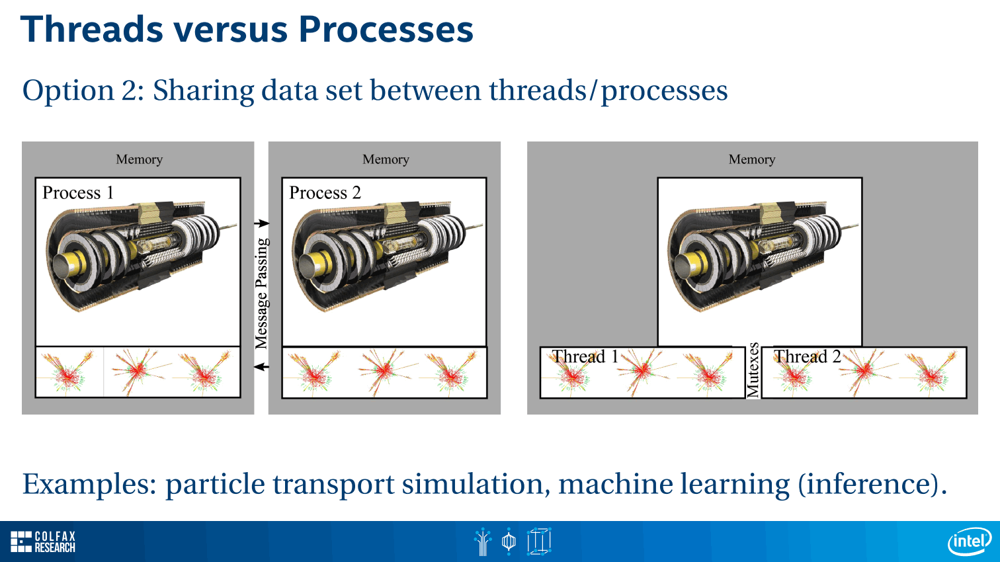

## 3.1.1 DEMO
- Code
```c++
// fork-process.c
#include <stdio.h>
#include <unistd.h>


char msg[100] = "uninitialized";

void Child_Process() {
  printf("In child  process at %p: '%s'\n", &msg, msg);
  sleep(2);
  printf("In child  process at %p: '%s'\n", &msg, msg);
}

void Parent_Process() {
  sleep(1);
  strcpy(msg, "I'm a little teapot, short and stout");
  printf("In parent process at %p: '%s'\n", &msg, msg);
}

int main() {
  int pid, stat;

  pid = fork(); // Make a copy of myself and keep running

  if (pid != 0) {
    Child_Process();
  } else {
    Parent_Process();
  }

  wait(&stat);
}

// fork-thread.c
#include <stdio.h>
#include <unistd.h>
#include <pthread.h>

char msg[100] = "uninitialized";

void *Child_Thread(void *tid) {
  printf("In child  thread at %p: '%s':\n", &msg, msg);
  sleep(2);
  printf("In child  thread at %p: '%s':\n", &msg, msg);
}

void Parent_Thread() {
  sleep(1);
  strcpy(msg, "I'm a little teapot, short and stout");
  printf("In parent thread at %p: '%s':\n", &msg, msg);
}

int main() {
  pthread_t thr;

  pthread_create(&thr, NULL, Child_Thread, NULL); // Spawn thread

  Parent_Thread();

  pthread_exit(NULL);
}

```

```bash
[u25693@c008 forks]$ ls
Makefile  fork-process.c  fork-thread.c
[u25693@c008 forks]$ cat Makefile
all:
        icc -o multithreading fork-thread.c -pthread
        icc -o multiprocessing fork-process.c

clean:
        rm -f multithreading multiprocessing *~
[u25693@c008 forks]$ make
icc -o multithreading fork-thread.c -pthread
icc -o multiprocessing fork-process.c
# 多线程共享内存
[u25693@c008 forks]$ ./multithreading
In child  thread at 0x6040e0: 'uninitialized':
In parent thread at 0x6040e0: 'I'm a little teapot, short and stout':
In child  thread at 0x6040e0: 'I'm a little teapot, short and stout':
# 多进程不共享内存
[u25693@c008 forks]$ ./multiprocessing
In child  process at 0x6040e0: 'uninitialized'
In parent process at 0x6040e0: 'I'm a little teapot, short and stout'
In child  process at 0x6040e0: 'uninitialized'
```

# 3.2 Creating Threads
现在我们要使用线程来占用多个核心。我们怎么做呢?您必须使用一个多线程框架。对于最流行的高性能计算语言C、c++和Fortran，有大量的框架选择。c++ 11对线程有本机支持。Linux中还有一个名为P-threads或POSIX threads的库，还有一些专门为计算而设计的框架，比如Cilk Plus、Threading Building Blocks和OpenMP。在本课程中，我们将关注OpenMP。这个框架非常完善，它支持非常常见的高性能计算模式，比如并行循环、循环调度和并行缩减。OpenMP在C、c++和Fortran语言中受支持。除了线程，OpenMP标准的最新修订还定义了SIMD和卸载功能。因此，您可以使用相同的框架进行向量化和异构处理。OpenMP代表开放多处理。这是C、c++和Fortran中支持多线程的伪指令的标准。OpenMP有多种实现。我们将主要关注通用OpenMP功能。

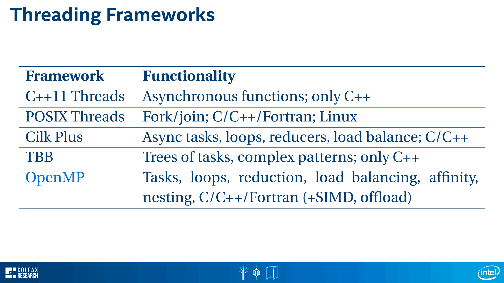

在本课程提供的集群中，我们使用了OpenMP的Intel实现。在这个清单中，您可以看到“Hello World”OpenMP程序。如您所见，我们包含了头文件omp.h来访问OpenMP支持函数。在Fortran语言中也可以使用omp.h。在OpenMP中，执行从一个线程开始，这个线程称为应用程序的初始线程。在这个线程中，查询OpenMP在启动线程时将使用多少线程。当您在代码中包含一个指令时，并行处理就开始了，这个指令在C和c++中看起来像pragma omp Parallel。Fortran也有类似的语句，但语法略有不同。这个指令的作用域用大括号表示，这些大括号之间的所有内容都将与多个线程并行执行。这是每个线程要执行的指令流。当然，通常情况下，您不希望每个线程都运行相同的程序。你想把它们区分开来。最基本的方法是查询执行线程的数量。您可以使用openMP函数omp_get_thread_num()来实现这一点。它只返回一个整数0 1 2 3。

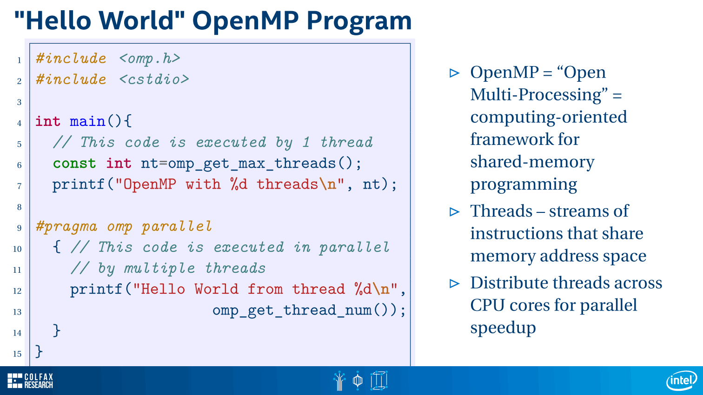

要编译OpenMP应用程序，必须使用一个标志，这是一个支持OpenMP指令的编译器参数。使用Intel编译器的标志是qopenmp。要设置应用程序的线程数，您可以调用OpenMP支持函数，或者在代码中定义线程数，或者设置环境变量OMP_NUM_THREADS。无论你把它设置成什么，它都是线程计数。当您在应用程序上时，您可以看到“Hello World”被多次打印。线程id是无序的，因为所有这些指令流都是并行执行的，并且它们按照请求有五个线程。如果我们不指定线程的数量，默认值是处理器中逻辑cpu的数量。在下一个视频中，我们将讨论在OpenMP线程之间共享内存和变量。

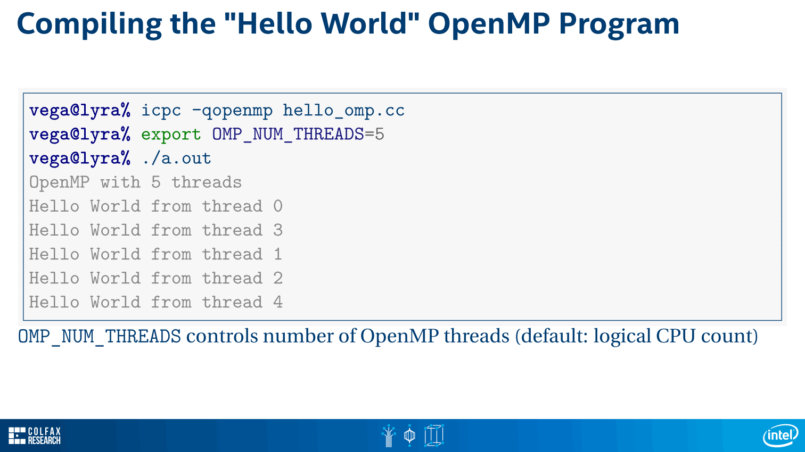

```c++
#include <omp.h>
#include <cstdio>

int main(){
  // This code is executed by 1 thread
  const int nt=omp_get_max_threads();
  printf("OpenMP with %d threads\n", nt);

  #pragma omp parallel
  { // This code is executed in parallel
  // by multiple threads
  printf("Hello World from thread %d\n",
  omp_get_thread_num());
  }
}

```

# 3.3 Variable Sharing

此时，我们知道了如何创建线程，并且知道线程是共享内存的指令流。有时候，这种内存共享是您想要利用的。其他时候，你可能想要绕过它。让我来说明它在OpenMP中是如何工作的。如果在并行区域之前声明了任何变量，然后在并行区域内，默认情况下，当您访问这些变量时，每个线程将访问相同的内存地址。但是您可以改变这种行为，例如，您可以声明一个omp子句，一个变量是私有的。这样的变量将跨线程复制。当你在并行区域内，当你说A，它意味着每个线程有不同的内存地址。这种方法通过指定子句在C和c++以及Fortran中工作。还有一种方法可以实现同样的功能，它只适用于C和c++，即使用变量共享。如果在并行区域内声明新变量，它们将自动成为每个线程的私有变量，这意味着当您说A时，它代表每个线程中的不同内存地址。

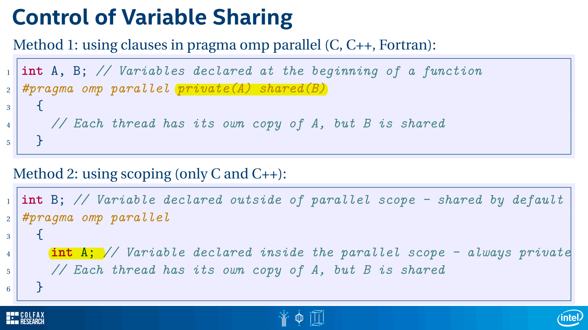

# 3.4 Parallel Loops
现在我们知道了如何创建线程，以及如何控制它们之间的变量共享。现在是学习如何利用线程，在多个内核之间分配工作负载的时候了。for循环可能是计算中最常见的模式，OpenMP内置了对循环的支持。使用并行循环，您可以使用较长的迭代空间，并且可以将此迭代空间的不同部分分配给不同的线程。这本质上加快了具有独立迭代的循环的处理。当然，只有当您的迭代是独立的或者几乎彼此独立的时候，这样做才是安全的。

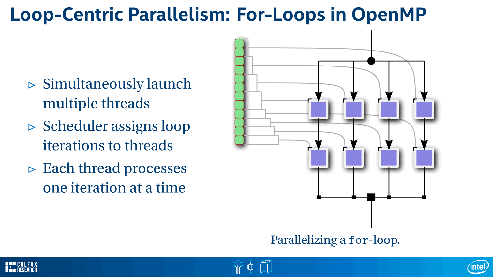

要创建并行循环，或者更确切地说，要将串行循环转换为并行循环，您可以发出指令`pragma omp parallel for`。这是一个组合指令，它创建线程，然后与这些线程一起并行处理这个迭代空间，因此`i`的不同值将分配给不同的线程。


如果不想同时发出parallel 和For指令，可以将它们拆分。在某些情况下，这可能很有用，例如，您可以启动并行区域，当您在由每个线程执行的区域时，您可以创建和初始化线程私有存储。然后，当执行循环处理时，在插入伪指令pragma omp for。注意，这个指令中没有关键字parallel。这里将要发生的是到达这一行的多个线程将被联合起来并行处理这个迭代空间。在For循环的末尾，您将有一个隐式屏障，这意味着线程将在进入并行区域之前彼此等待。

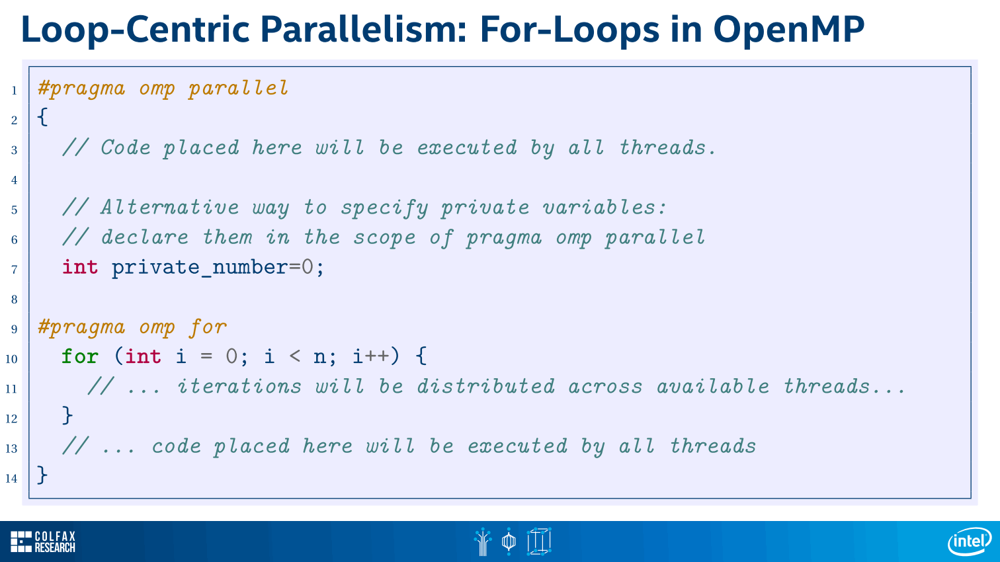

OpenMP的美妙之处在于，使用并行循环可以很容易地更改调度模式。调度模式是将迭代分配给线程的算法。您所要做的就是添加子句schedule，并在括号中指定模式。或者，您可以使用环境变量设置调度模式。支持的调度模式有静态、动态和引导调度。
- 静态调度是最简单的算法。在这种模式下，OpenMP决定哪些迭代在循环开始时进入哪个线程，并且在运行时不更改该决定。因此，您的开销非常低，但是这里要付出的代价是，如果某些迭代比其他迭代花费更长的时间，您将以负载不平衡告终。
- 动态模式则相反。它只给每个线程分配几个迭代，然后调度程序等待其中一个线程可用。无论哪个线程先完成它的工作，都会得到下一个工作块。因此，您可以获得很好的负载平衡，但是您可能会经历很高的调度开销。
- 还有引导Guided模式，它试图找到静态和动态模式中最好的。它还动态地将迭代分配给线程，但是它首先分配大量的线程来最小化调度开销，然后是大量的迭代，最后，这些线程块会变得越来越小。

除了模式之外，还可以指定块大小。这是一个整数控制算法的行为。在调度中，块大小是在转到下一个线程之前分配给一个线程的迭代次数。当您离开线程，但没有离开迭代时，您将进行循环。最后，在引导模式下，块大小是在计算结束前分配给每个线程的最小迭代次数。使用并行循环和OpenMP，您可以访问非常强大的功能，但是正如我所提到的，迭代必须是独立的，或者几乎是相互独立的。以及如何控制迭代以某种方式相互依赖的情况，这将在下一集视频中讨论。

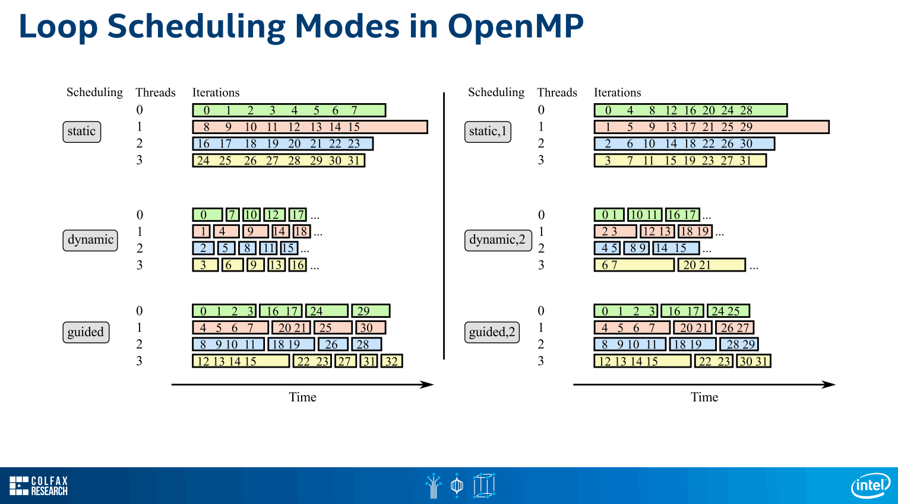

# 3.5 Example: Stencil Code
## 3.5.1 Stencil Introduction
在练习中，我们将使用模板代码。模板操作符将输入图像与模板内核进行卷积以生成输出图像。模板运算符用于流体动力学中，你可以用它们来解流体运动的偏微分方程。你也可以在图像处理中找到模板这将是我们练习的一个激励例子。我们将使用在9点模板执行边缘检测。输入图像将是一个大3600万像素的图像。这个模板的结果是，如果在输入图像中有一个统一的区域，那么在输出图像中就会有一个黑色区域。如果你有一个清晰的边界你会在输出图像中有一条亮线。执行边缘检测。

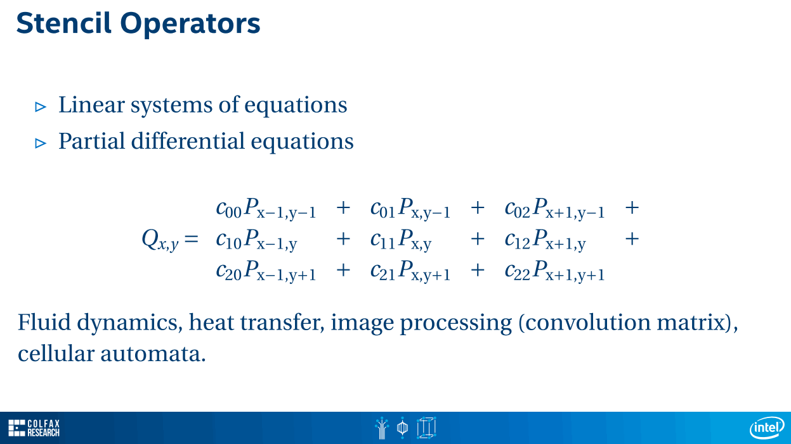

同时，这一运算的数学与流体动力学中使用的数学类似。所以我们会关注流体动力学中发生了什么。在基本实现中，我们将把输入和输出图像保存为浮点数数组。这是很明显的，这样我们就能比较流体力学工作量中会发生什么。要应用模板，我们设置了两个数组，它们遍历图像中的所有像素，对于每个像素，我们取像素及其8个相邻像素，将它们乘以模板矩阵中的权重，然后将它们相加，这将生成输出图像值。对于图像处理任务，然后我们必须检查这个值是否在强度深度的范围内。具体来说，对于8位灰度图像，该亮度必须在0到255之间。这种检查对于计算流体力学工作负载来说是不必要的。这个初始实现正确地执行了任务，但就性能而言不是最优的。因此，在接下来的步骤中，我们将看到如何优化这段代码，以便在该体系结构上获得最佳性能。

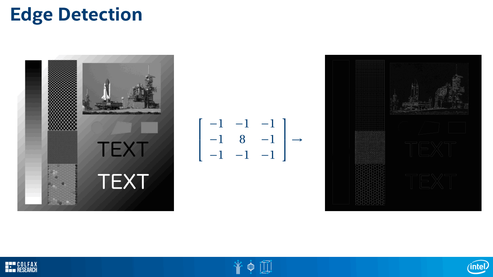

## 3.5.2 Stencil Demonstration
让我们回顾一下上周向量化的模板计算。我们最后的性能测量是37毫秒，将边缘检测模板应用于3600万像素的图像。当然,37个毫秒不是很长一段等待时间,但是如果你等待多次,例如,如果你正在做这个计算物理实验的一部分,或者在现实中这不是一个图像处理的任务,但由于流体元素的工作负载。然后你可能想要尽可能地减少这个。显然，这个应用程序的编写方法只使用一个线程，这就解释了为什么我们每秒处理的数据量仅为7gb / s，而每秒的浮点运算数仅为17。我们在这个计算中可以做的是在多个线程中并行化它。有两个循环我们可能会并行，i中的循环和j中的循环。j中的循环已经向量化了，但没有什么能阻止我们进行并行化。如果我们这样做，看看我们的性能会发生什么。**性能实际上下降了**，处理时间上升到80毫秒，相应的带宽是3.5，性能是每秒8GFLOPS浮点运算。所以即使我们使用多线程，我们也没有有效地完成它。实际情况是，我们的并行循环在计算过程中必须启动和停止多次，这是一个很大的开销。让我们回到刚才的地方，我们将在最内层的循环中使用`pragma omp simd`，但是我们将尝试在外部循环之间并行化。`pragma omp parallel`将创建线程，然后将这些线程组合起来处理i的不同值。我们需要担心数据竞争吗?我认为不是因为不同的值我将进入不同的线程，而每个线程将尝试只内存到它自己的行。编译，提交到队列。这样好多了。从40毫秒降到了7毫秒，现在我们每秒处理40gb的数据。就运算性能而言，这相当于每秒90GFLOPS浮点运算。


这仍然不是最优的，但是比我们之前所做的要好得多，我们对这段代码所做的惟一更改是插入指令`pragma omp parallel for`。当然，我们做得很简单，因为我们的应用程序中有很多并行性。我们还将在另一个实验室中尝试更复杂的计算。但现在，让我们看看我们的性能结果是什么样的图形化。我们每秒做大约90GFLOPS浮点运算，这比我们开始的时候好多了。但是您可以看到仍然有优化的空间，所以我们将在下周讨论内存优化时重新讨论模板计算。

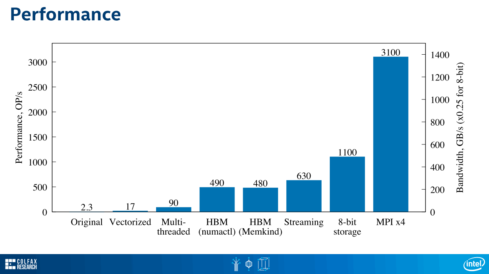

### Case1: 并行化内部循环
- Change Code
```diff
[u25693@c008 stencil]$ git diff
diff --git a/stencil.cc b/stencil.cc
index 2c08c5e..97cfafb 100644
--- a/stencil.cc
+++ b/stencil.cc
@@ -10,7 +10,7 @@ void ApplyStencil(ImageClass<P> & img_in, ImageClass<P> & img_out) {
   P * out = img_out.pixel;

   for (int i = 1; i < height-1; i++)
-#pragma omp simd
+#pragma omp parallel for simd
     for (int j = 1; j < width-1; j++) {
       P val = -in[(i-1)*width + j-1] -   in[(i-1)*width + j] - in[(i-1)*width + j+1]
        -in[(i  )*width + j-1] + 8*in[(i  )*width + j] - in[(i  )*width + j+1]
```

- Output，性能下降了
```bash
[u25693@c008 stencil]$ cat edgedetection.o89922

########################################################################
# Colfax Cluster - https://colfaxresearch.com/
#      Date:           Wed Apr 24 06:54:15 PDT 2019
#    Job ID:           89922.c008
#      User:           u25693
# Resources:           neednodes=1:flat,nodes=1:flat,walltime=00:02:00
########################################################################


Edge detection with a 3x3 stencil

Image size: 6000 x 6000

 Step        Time, ms            GB/s         GFLOP/s
    1          86.716           3.321           7.473 *
    2          86.165           3.342           7.520 *
    3          86.329           3.336           7.506 *
    4          85.906           3.353           7.543
    5          85.927           3.352           7.541
    6          88.012           3.272           7.363
    7          85.745           3.359           7.557
    8          85.948           3.351           7.539
    9          87.371           3.296           7.417
   10          85.966           3.350           7.538
-----------------------------------------------------
Average performance:
               86.4+-0.8        3.3+-0.0        7.5+-0.1
-----------------------------------------------------
* - warm-up, not included in average


Output written into output.png

########################################################################
# Colfax Cluster
# End of output for job 89922.c008
# Date: Wed Apr 24 06:54:32 PDT 2019
########################################################################

```

### Case2: 并行化外部循环
- Change Code
```diff
[u25693@c008 stencil]$ git diff
diff --git a/stencil.cc b/stencil.cc
index 97cfafb..f2eaffe 100644
--- a/stencil.cc
+++ b/stencil.cc
@@ -8,9 +8,9 @@ void ApplyStencil(ImageClass<P> & img_in, ImageClass<P> & img_out) {

   P * in  = img_in.pixel;
   P * out = img_out.pixel;
-
+#pragma omp parallel for
   for (int i = 1; i < height-1; i++)
-#pragma omp parallel for simd
+#pragma omp simd
     for (int j = 1; j < width-1; j++) {
       P val = -in[(i-1)*width + j-1] -   in[(i-1)*width + j] - in[(i-1)*width + j+1]
        -in[(i  )*width + j-1] + 8*in[(i  )*width + j] - in[(i  )*width + j+1]

```

- Output: 性能明显提高
```bash
[u25693@c008 stencil]$ cat edgedetection.o89923

########################################################################
# Colfax Cluster - https://colfaxresearch.com/
#      Date:           Wed Apr 24 06:57:46 PDT 2019
#    Job ID:           89923.c008
#      User:           u25693
# Resources:           neednodes=1:flat,nodes=1:flat,walltime=00:02:00
########################################################################


Edge detection with a 3x3 stencil

Image size: 6000 x 6000

 Step        Time, ms            GB/s         GFLOP/s
    1           7.498          38.410          86.423 *
    2           7.226          39.856          89.676 *
    3           7.260          39.669          89.255 *
    4           7.198          40.012          90.027
    5           7.199          40.005          90.012
    6           7.244          39.758          89.455
    7           7.208          39.956          89.902
    8           7.278          39.570          89.033
    9           7.259          39.674          89.267
   10           7.222          39.878          89.727
-----------------------------------------------------
Average performance:
                7.2+-0.0       39.8+-0.2       89.6+-0.4
-----------------------------------------------------
* - warm-up, not included in average


Output written into output.png

########################################################################
# Colfax Cluster
# End of output for job 89923.c008
# Date: Wed Apr 24 06:58:02 PDT 2019
########################################################################

```

# 3.6 Data Races Mutexes
到目前为止，学习OpenMP是很容易的，因为我们只讨论了让事物并行运行。现在我们进入并行编程的复杂部分，我们必须控制多线程的运行情况。我们将讨论数据竞争和互斥。数据竞争也称为竞争条件，即两个或多个线程访问相同的内存地址，其中至少有一个访问是用于写的。竞态条件的结果是您的计算变得不可预测，而且经常会产生错误的结果。这里有一个例子。我在一个并行区域之前声明了一个变量total。在这个并行循环的并行区域，我增加了共享变量的值。

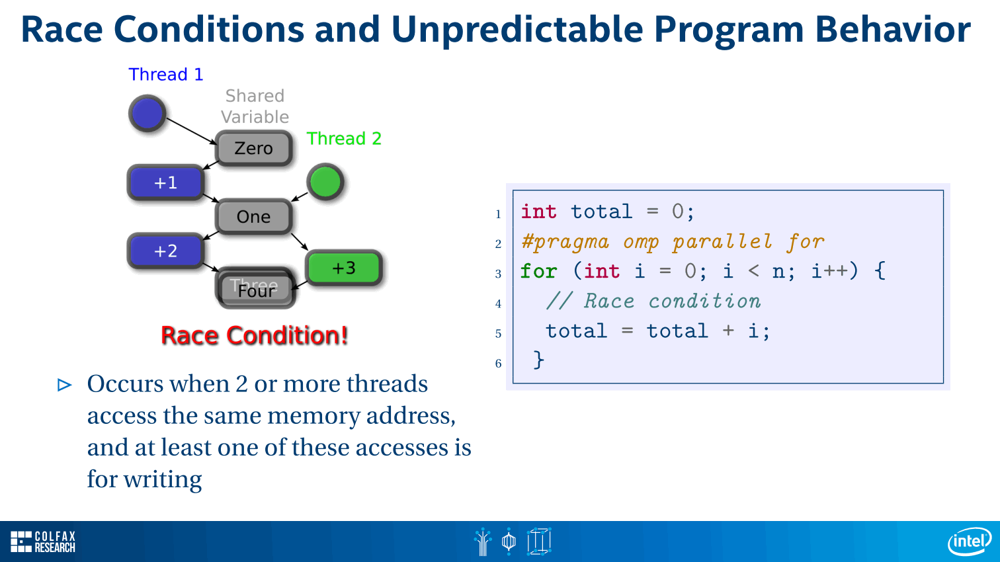

如果我运行这段代码，我将发现它会产生不正确的结果，这些结果也是不一致的。一次又一次，我得到了不同的结果。这是因为增量不是原子操作，我必须执行三个步骤，从内存中读取数据，然后增量，然后写回内存。有时，我可能很幸运，一个线程可以完成所有这三个步骤，而不会受到其他线程的干扰，但有时，我们会遇到这样的情况:两个或多个线程读取了相同的过期值，然后我丢失了信息。我还可能遇到这样的情况，当多个线程写到相同的内存地址时，最慢的线程赢得了竞争，因为超过更快线程的结果将被丢弃。


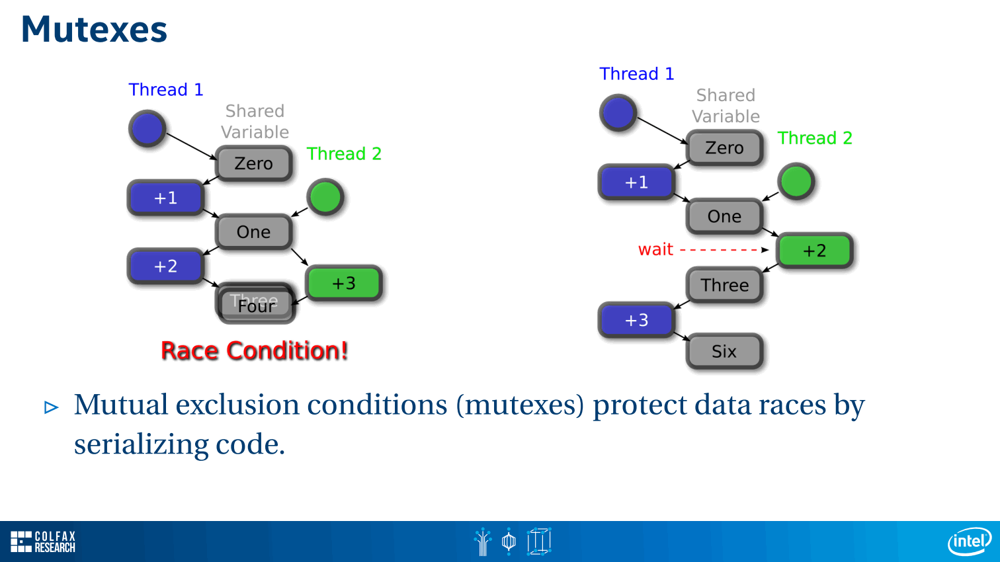

为了控制数据竞争，OpenMP提供互斥。互斥体是并行编程中的基础，它保护代码或内存不受并发执行的影响。互斥量是互斥条件的缩写，它们序列化代码。例如，如果我使用互斥锁来保护这个增量操作，那么在两个线程试图访问同一个变量的情况下。其中一个线程必须等待另一个线程完成它的工作。这样，我的结果将变得正确，但是我可能会因为序列化我的应用程序而失去性能。在OpenMP中有两个非常容易使用的互斥对象。临界区和原子操作。使用临界区，在并行区域内，编写pragma omp critical，然后就可以表示该区域的范围。垂直部分保护范围内的代码不被并发执行。因此，如果多个线程到达临界区域的开始，OpenMP将允许其中一个线程进入、执行工作并退出。只有在此之后，其他线程中的一个才会进入并执行工作，然后退出。这是一个重量级的互斥对象，但是非常灵活，因为它允许您保护大量代码。使用原子结构，您只能保护在标量变量上执行硬件支持的原子操作之一的一行代码。它比临界区更轻量级，性能损失更小。但它只适用于特定的数据类型和特定的操作符。互斥锁在并行编程中肯定有自己的位置，您可能会在应用程序中使用互斥锁。但我要提醒大家，好的并行应用程序必须尽量减少互斥锁的使用。特别是互斥对象必须移出最内部的循环。

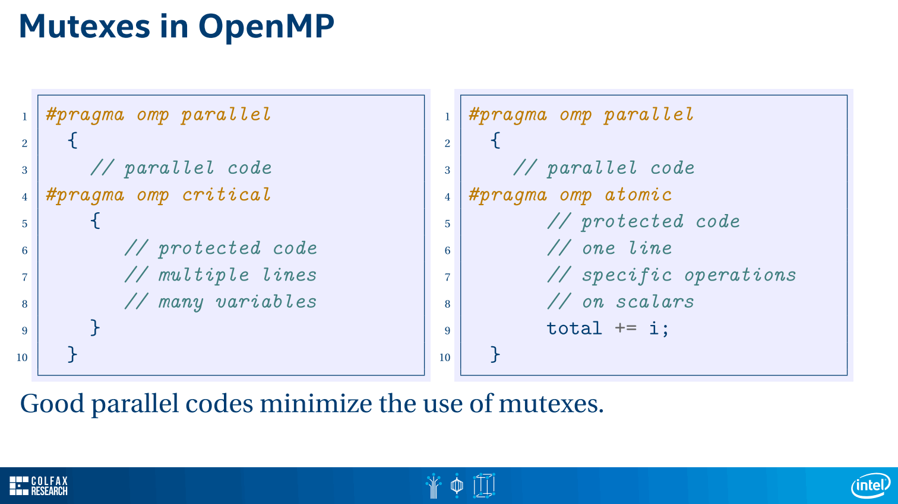

# 3.7 Parallel Reduction
有效地使用互斥锁并不容易，它们会部分地序列化您的计算，因此您可能最终会减慢计算而不是加速。如果您过于频繁地使用互斥对象。所以你必须想出一个好的并行算法来最小化线程间的同步。幸运的是，在OpenMP中内置了对并行编程中最常见模式之一的支持，该模式就是reduce。Parallel reduction是关联运算符的应用，例如对变量的加法。查看这个算法中的变量total是如何在所有线程之间共享的，但是这些线程修改这个变量的唯一方法是向它添加一个整数。OpenMP有一个名为reduce的子句，它允许您指定reduce操作符和变量。这个子句告诉OpenMP，尽管total是一个共享变量，但是要修改它的唯一方法是增加它。因此OpenMP将生成高度并行且具有相同可预测性的代码。

考虑一下，如果没有访问这个reduce子句，您将会做什么。如果不使用reduce子句，就会出现数据争用，多个线程同时修改变量total，因此会得到不可预测的结果。如果您试图在互斥锁中保护这个操作，那么您将从各个方向序列化您的计算，您可以尝试这样做。它实际上减缓了这种特殊的计算。使用reduce子句，性能良好且正确。实际条款在许多实际案例中都适用。您可以使用它来将其简化为标量，或者作为OpenMP版本，对于这五个版本，您可以使用此术语表将其简化为数组。


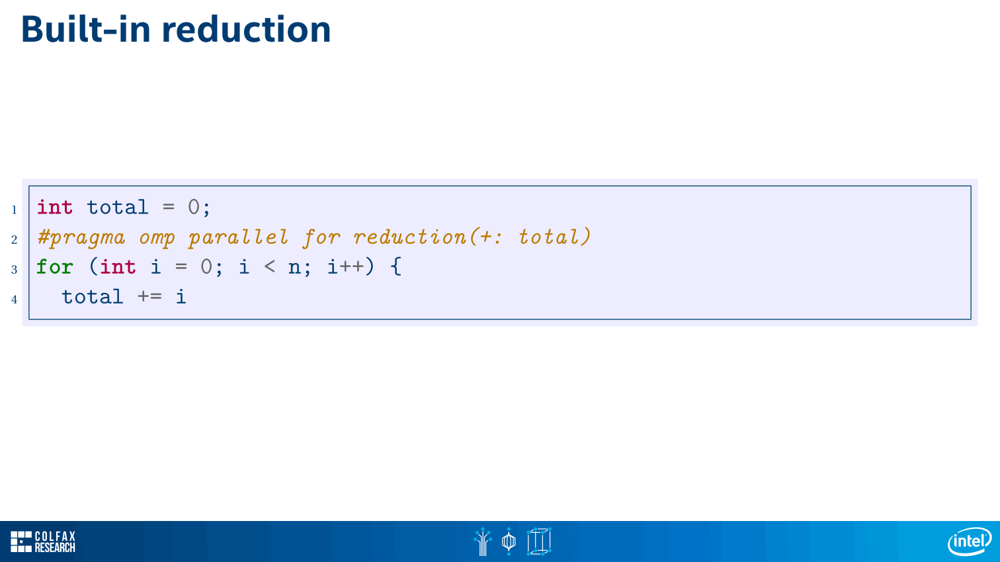

但是有时候reduce子句是不够的，因为例如，OpenMP不知道变量的类型或操作符的性质。因此，了解如何在幕后实现reduction是很有用的。通常，它是使用线程私有存储来实现的。如果我的目标是通过多个线程增加变量total，那么我将在每个线程中创建一个临时变量，在其中运行和计算。最后,我最终会与多个部分的结果,和我的目标将会减少或聚合这些部分和total和,我通过添加部分和共享变量z做它,而这一次合理使用原子构造或临界区保护这些数据。这个图有变量名x0 x1 x2等等。当然，这对于使用OpenMP编写具有不同变量名的程序来说是不实用的。相反，您将使用线程私有变量，如下面的代码清单所示。可以看到变量total是共享的，但是在内核区域中声明的total_thr是线程私有的。对于部分和，我使用了total_thr，循环结束后，我将部分和减少到total容器中。请记住，每个线程都将运行这一行代码，我使用原子结构进行保护，因为这是一个数据竞争。这个数据竞争最小的同步来解决，因为我只有和线程一样多的同步事件。进一步改进reduction算法是可能的。例如，您可以执行tree reduction，其中只有log线程数，而不是线程数目与线程数目相同的互斥锁。但是，只要大部分计算花费的时间比后处理要长得多，那么线性算法就会做得很好。

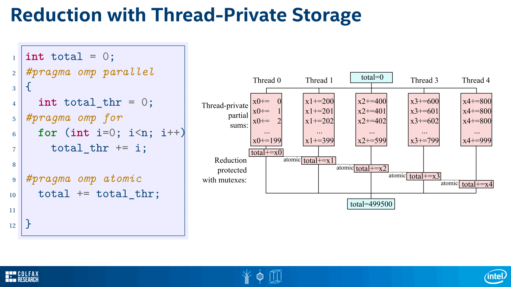

# 3.9 Learn More
我们已经介绍了OpenMP的基本功能。我们学习了如何创建线程以及如何控制线程之间的数据共享。我们学习了如何将这些线程组合起来处理循环、迭代空间。我们还讨论了互斥体和内建约简。OpenMP有很多功能可以帮助您处理更复杂的情况。例如，异步任务、显式屏障和任务同步点、用于在单个线程中执行的代码块、用于内存一致性和部分循环序列化的更复杂的控件。除了指令之外，OpenMP还可以使用特定的环境变量和支持函数进行控制。如果你得到这些幻灯片的电子拷贝，幻灯片中的链接是可点击的，当你点击其中一个链接时，你就会被带到一个非正式的OpenMP引用，该引用来自劳伦斯利弗莫尔国家实验室，解释它的功能。除了参考资料，您还可以在OpenMP.org上阅读完整的OpenMP规范。

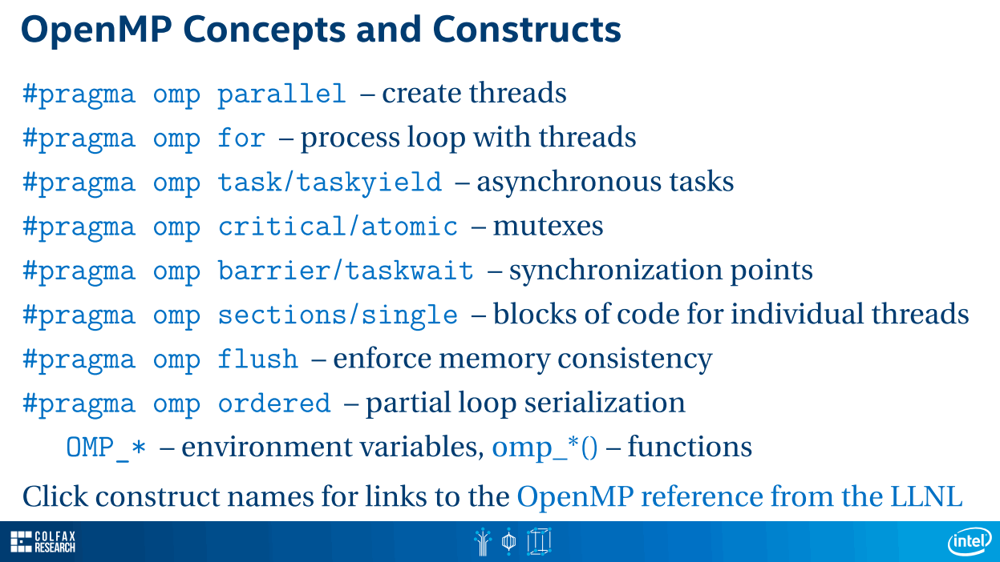