# 4.1 Cheap Flops

We are starting a discussion of memory traffic optimization, and first, I would like to explain why memory traffic is so important for performance. Earlier in the course we talked about vectorization. If you see that your loops are vectorized. This is a part of the success. Later, we will learn that you can push the performance of your vector calculations even further by making sure that your data containers, and loop order give unit-stride access, by doing data alignment, and possibly container padding and eliminating peel loops and multiversioning. 


But ultimately, you will need to start worrying about data re-use in caches, if you want vectorization to matter. And that is, because **vector arithmetics in modern computers is cheap, and it is memory access that is expensive**. So, if you don't optimize cache usage to minimize memory access then vectorization will not matter. You will be bottle neck by memory access. This is shift required in your thinking compared to programming processors of 20, or 30 years ago, **it is cheap to do mathematics, it is expensive to go to memory**. 


So, let's attach a number to that claim. How cheap are floating point operations per second? For an Intel Xeon Phi processor 7250, you have 68 cores working per well. They are clocked at 1.2 GHz, slightly lower if you do vector math, but this is close enough. Every instruction processes eight double numbers at once in 512 bit rate of if you are doing the fuse multiply add operation, then each instruction is actually two operations, addition and multiplication. And, because you have two vector processing units, you can actually issue 2 IPC per second. The product of these numbers is the theoretical peak performance of 2.6 TFLOP/s. So, this processor has the ability to perform 2.6 trillion floating point numbers, floating point operations every second. Which, by the way, is close to the theoretical performance of the fastest super computer on the planet 20 years ago. How much data is there in 2.6 trillion TFLOP numbers? Well, multiplied by 8 bytes, you get around 21 terabytes. So, your CPU wants to consume 21 terabytes of data every second. If this data is coming from the own package memory, MCDRAM, then the bandwidth that you can expect is at best half a terabyte per second. If you take the ratio of these 2 numbers, you will find that the CPU wants to consume around 50 times more data per second than the memory can deliver. This break point is a convenient number that can tell you whether your application is compute-bound, limited by the arithmetic throughput of your processor, or bandwidth-bound, limited by the memory bandwidth. If you do more than 50 floating point operations for every memory access, you're compute-bound. Fewer than 50, bandwidth-bound. 

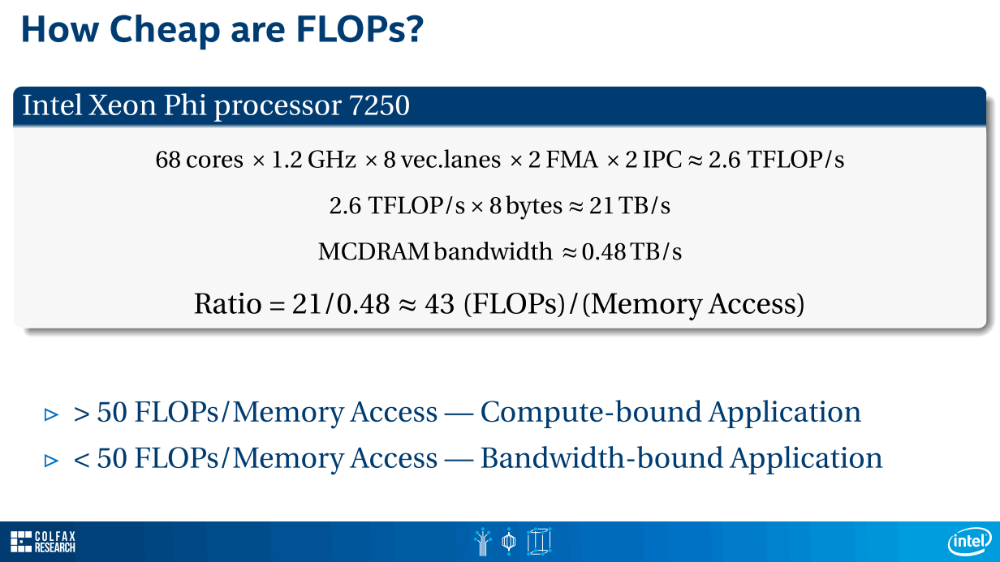

You can sophisticate this analysis a little more and draw our roofline diagram. The roofline diagram predicts the maximum performance that you can achieve. For a particular arithmetic intensity. If the arithmetic intensity is infinite, you only do compute, you never go to memory, then of course you are limited by the theoretical performance of your processor. If your arithmetic intensity is one, therefore every memory access you do one operation, and you will be bottlenecked by that half a terabyte per second that they showed on the previous slide. If you connect this asemtope to the single data point, using unit slope line, you will get something that looks like a roof. And the value of the slopes is it's predictive power. If you can estimate with paper and pencil, or by measurements the arithmetic intensity of your algorithm. Then, there are two possibilities, maybe your arithmetic intensity is here and your hitting the sloping part of the roof, then you know, that then you are been with bound. And you can improve your performance using techniques that increase arithmetic intensity. So, that you move up the roofline diagram, and this will be your performance gain. At the same time, if your arithmetic intensity is high enough and you are hitting the flat part of the roof. Then it doesn't make sense to use techniques for improving the arithmetic intensity, because you are now compute note. And of course the exact shape of the roofline diagram depends on the type of operations that you are assuming, Fuse Multiply Add have a higher ceiling Exponentials and reciprocals will have a lower ceiling. It also depends on the type of memory that you are dealing with. You can draw the roof line for the high bandwidth memory, for the on platform memory. And depending on what you draw the break point will be different. You can also draw roof line models for caches. And apply your analysis to say, cache misses as opposed to going to memory.

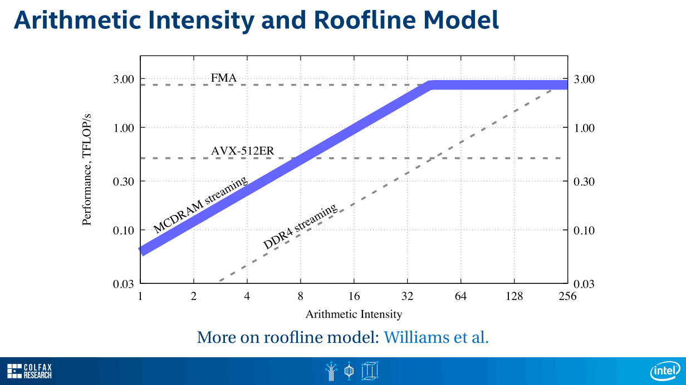

# 4.2 Memory Hierarchy
如果您知道处理器的内存是如何组织的，则可以在内存流量优化方面做出更好的决策。如果您正在与Knights Landing处理器打交道，Knights Land就是这种架构的类型，而英特尔至强处理器就是其品牌名称。您有一个具有多个内核的处理器，并且内核可以立即操作的数据必须位于其寄存器文件中。如果数据尚未存在于寄存器中，则核心将访问以向内存发出请求。理想情况下，这个请求将由其中一个缓存提供。1级缓存很小但速度很快。如果此缓存具有请求的内存地址，则核心将从缓存中获取数据。如果数据不在此处，则表示缓存未命中。并且请求被转发到2级缓存，它更大但更慢。原则上，内核可以共享来自其他内核的2级缓存的数据，并且仍然很快。如果在那里找不到数据，则转到存储数据的主存储器。在Xeon Phi上有两种类型的内存，on-package内存和platform memory。package内存存在于芯片内部。它基于MCDRAM技术，大小为16千兆字节，访问延迟大约为100个周期。并且，STREAM基准测试中Triad测试的最大测量内存带宽接近每秒0.5TB。另一种类型的内存是platform memory。它位于系统板上的芯片旁边。您可以添加或删除这些内存模块。它基于DDR4技术，可以比MCDRAM更大，但带宽更低。在第二代Intel Xeon Phi中，MCDRAM和DDR4具有几乎相同的延迟。您在这里看到的是缓存层次结构，1级缓存，2级缓存和两种类型的内存。您还可以将Xeon Phi处理器配置为使用MCDRAM启动，而不是处于平面模式但是处于缓存模式。在这种情况下，操作系统看不到封装内RAM。相反，它可以作为Level 2和platform memory之间的缓存。Knights Landing处理器针对算术性能和高带宽而非延迟进行了优化。

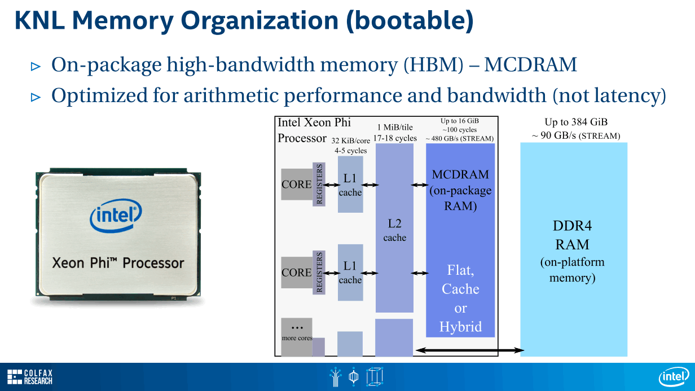

按照存储的价格序列，您作为程序员需要尽一切努力在缓存中包含尽可能多的流量。如果你必须访问内存，理想情况下你应该从内存中传输连续的数据。与具有延迟限制的随机访问相反。其他型号的英特尔处理器可能具有略微不同的内存组织，但它仍然是分层的。您将拥有希望处理寄存器内存中数据的内核，如果数据不在寄存器中，则会询问1级缓存。如果1级缓存没有它，它将询问较大但较慢的2级缓存。并且这种高速缓存层次结构还可以包括第三层，即last level cache。每个package可以是几十兆字节的数量级，具有更短的访问延迟platform memory。它也在多个核心之间共享。在last level cache后面的内存位于处理器旁边的platform上。同样，它通常是DDR4技术。您拥有大量此内存，访问延迟大约为200个周期，每个package的带宽约为60GB。那么什么是package，英特尔至强处理器可以采用one way，two way或four way形式。two way是最常见的，它意味着您在同一平台上有两个CPU芯片。每个芯片都有自己的cores，它控制自己的内存。但它们通过形成NUMA架构的快速路径互连连接在一起。NUMA代表(non-uniform memory access)非统一内存访问。NUMA所做的是它允许两个CPU在同一平台上共存，就好像它们是一个CPU一样。对非本地内存访问有一些性能损失。因此，此上下文中的每个CPU都称为package。如果您的程序在此核心上运行，并且要求存储在本地内存中的数据，那么它将只是本地内存访问。如果此内核需要存储在由另一个CPU控制的内存中的数据，则不必执行任何特殊操作。QPI对程序员来说是透明的。因此，您的核心将从通过QPI发送的其他CPU获取数据，而程序员则无需执行此操作。但是你可以做的就是通过编程最小化这些远程内存访问，因为它们比本地访问更昂贵。

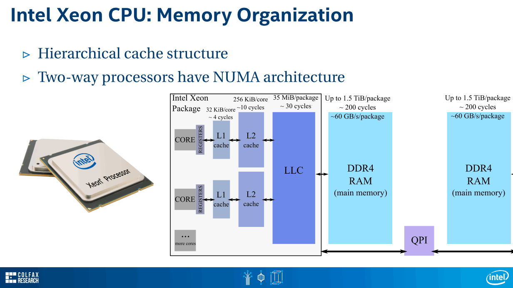

最后，您可能遇到的另一种类型的英特尔架构是协处理器。协处理器是PCI Express附加卡，它不在系统板上。它有一个PCI Express连接器，将其连接到主机系统，主机系统通常由常规Xeon CPU驱动。但在芯片内部有另一个处理器，它的内核并行工作。他们喜欢处理数据寄存器，如果数据不在那里，他们会请求芯片内部的1级缓存。他们还可以询问2级缓存或平台或板载内存，这些内存也存在于协处理器卡内。层次结构的最后一级存储器是协处理器的终点。它限制为16GB字节，是一个高带宽内存。但它不与主机系统的内存共享内存地址空间。协处理器和主机之间唯一的互连是PCI Express卡，它不透明。没有这样的指令从主机存储器加载到这个core数据中。相反，您作为程序员必须使用旧流模型或使用消息传递接口专门启动PCI Express总线上的数据流量。

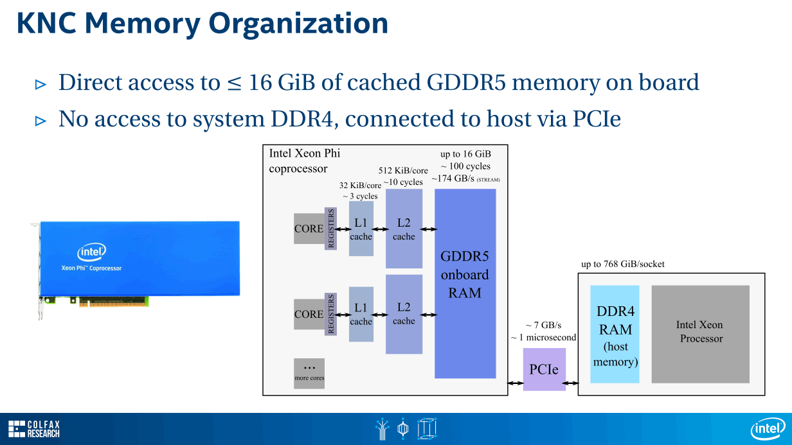

# 4.3 High Bandwidth Memory

所以我们知道内存流量很昂贵。稍后，如果您可以在缓存中包含流量，我们将讨论如何避免不必要的内存访问。但首先，让我们讨论一种简单的方法来提高内存访问，如果你必须在英特尔至强处理器上进行内存访问的话。如果您可以使用英特尔至强5处理器，那么最好使用该处理器中提供的高带宽内存而不是platform memory。当您使用intel Xeon 5处理器时，您可以在三种模式之一中配置它。Flat模式，缓存或混合。
- 在Flat模式下，基于MCDRAM技术的高带宽存储器被视为单独的NUMA节点。因此，在操作系统中，您将看到包含CPU和Platform标准内存的NUMA节点以及没有CPU的单独节点。但它拥有全部高带宽内存供您使用。所以你可以控制进入那段Memory的东西。
- 在高速缓存模式下，操作系统看不到MCDRAM，因为它静静地位于CPU内核和platform memory之间作为缓存，并缓存来自DDR的数据。
- 在混合模式下，您将高带宽内存分成两部分，并将一部分用作缓存，另一部分对操作系统可见。作为程序员，您可以将数据放入其中。

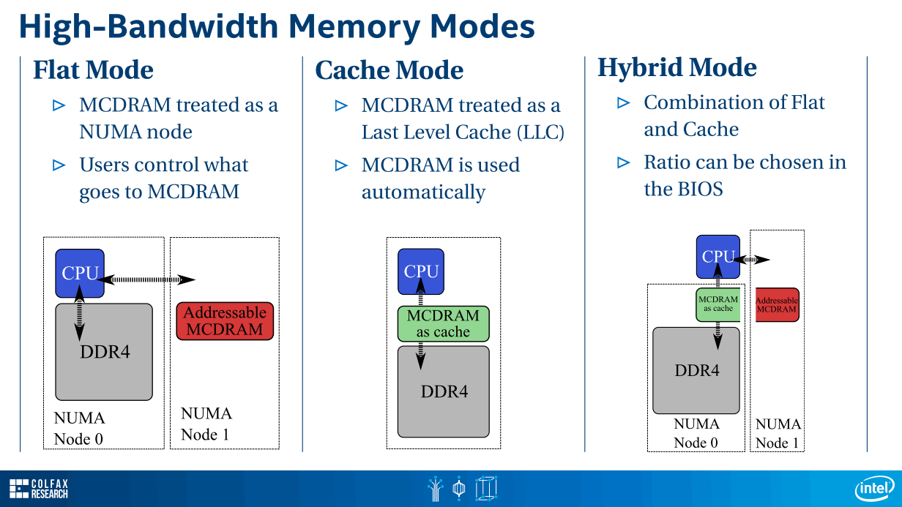 
 
顾名思义，高带宽内存只有在您的应用程序确实受带宽限制而不是延迟限制时才能正常工作。如果是，那么可能有一种非常便宜的方式来使用高带宽内存。它仅适用于您的应用程序需要少于16 GB的数据。如果是这种情况，那么在不修改代码的情况下，您只需使用工具numactl在高带宽内存中运行整个程序即可。无需修改代码。好吧，如果你需要超过16 GB的RAM，那么你需要决定是否要手动控制高带宽内存中的内容。或者，您希望芯片能够处理它。如果要隔离需要高带宽的数据容器，可以使用Memkind库。主要是，您将在高带宽内存上分配特定容器。这将要求您更改代码并更改完成过程。如果您想让芯片来做，可以将其启动到缓存模式。即使您需要超过16 GB，也可以在不修改代码的情况下开始使用高带宽内存。

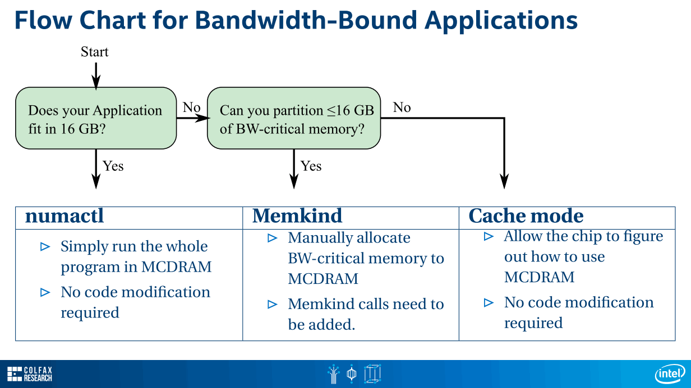

要确定芯片的模式，可以使用命令numactl -H。numactl是库libnuma的一部分，在此格式中，它列出了可用的NUMA节点。所以有两个节点，0和1.节点0包含所有CPU和96 GB内存，这是你的DDR4platform memory。另一个节点不包含CPU和15 GB的MCDRAM。如果你想在MCDRAM中运行整个应用程序，你只需要numactl，membind 1，意味着将所有内存分配绑定到节点1.然后，你的可执行文件的名称。现在，您正在以高带宽运行

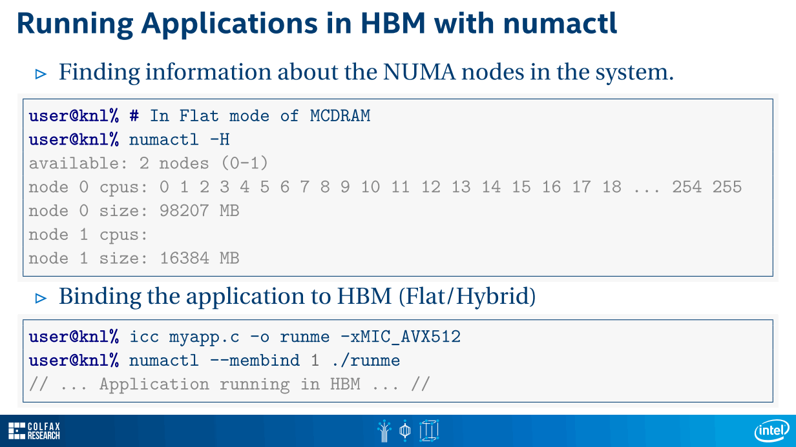

## Demo: Stencil with numactl
我们可以利用我们关于高带宽内存的新知识来优化我们两周前开始优化的模板计算。对于带有9点模板的3600万像素图像，我们的最后一个结果是每次应用我们的模板7毫秒。这相当于每秒处理40 GB的数据。我们表示图像的数据是四字节浮点数。每秒40 GB接近平台内存的峰值性能。常规的平台内存DDR4可以给我们每秒100GB，我们看到40GB。所以我们可以尝试通过将我们的应用程序放在高带宽内存中来实现这个限制。在我们进入之前，让我们对此算法进行快速的屋顶线分析。我们有输入图像，输出图像，如果我们在Cache中有很好的数据重用，那么我们应该读取输入图像中的每个像素一次，并且只在输出图像中写入输出像素一次。因此，对于每两个访问，每个像素两次内存访问，我们将做多少个浮点操作，我有九个邻居，对于每个邻居，我们做两个浮点运算，一个乘法和一个加法。因此，我们可以将算术强度估计为操作次数除以访问次数9，这小于我们在屋顶线分析中估计的每秒50次操作阈值。因为它较少，我们知道我们的应用程序是带宽限制的。因此，此计算性能的限制因素是此内存带宽而不是此算术性能。

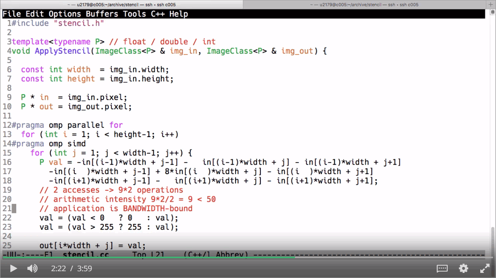

好的，我们的位置不会占用太多内存。我们的图像是3600万像素，由4个字节的浮点数表示。因此我们使用数百兆字节的数据。这很容易适应16 GB的空RAM。我们将使用最简单的方法将应用程序放入RAM中。numactl工具，而不是运行可执行文件，我们将说numactl -m 1然后是可执行文件名。这将所有内存分配绑定到numanode one，numanode one是高带宽内存。好吧，让我们看看它是如何工作的。正如您所看到的，作业已提交到队列，因为它是numactl。结果文件看起来好多了。处理时间现在只有1.3毫秒，而这个数量每秒需要220GB的数据处理。当然，仅仅使用平台上的DDR4内存就不可能实现这一点。因为它每秒只能给我们100GB。我们正在观察这种性能只是因为我们在系统中有一个带MCDRAM的信息处理器。

### Change Code

```diff
[u25693@c008 stencil]$ git diff
diff --git a/Makefile b/Makefile
index bd21771..77bab07 100644
--- a/Makefile
+++ b/Makefile
@@ -13,7 +13,7 @@ run:  all
        ./stencil test-image.png

 queue: all
-       echo 'cd $$PBS_O_WORKDIR ; ./stencil test-image.png' | qsub -l nodes=1:flat -N edgedetection
+       echo 'cd $$PBS_O_WORKDIR ; numactl -m 1 ./stencil test-image.png' | qsub -l nodes=1:flat -N edgedetection

 clean:
        rm -f *.optrpt *.o stencil *output.png *~ edgedetection.*
```

### Output

```bash

[u25693@c008 stencil]$ cat edgedetection.o89959

########################################################################
# Colfax Cluster - https://colfaxresearch.com/
#      Date:           Fri Apr 26 20:27:31 PDT 2019
#    Job ID:           89959.c008
#      User:           u25693
# Resources:           neednodes=1:flat,nodes=1:flat,walltime=00:02:00
########################################################################


Edge detection with a 3x3 stencil

Image size: 6000 x 6000

 Step        Time, ms            GB/s         GFLOP/s
    1           1.317         218.675         492.018 *
    2           1.262         228.218         513.491 *
    3           1.311         219.669         494.255 *
    4           1.246         231.100         519.975
    5           1.339         215.093         483.958
    6           1.249         230.571         518.784
    7           1.248         230.747         519.180
    8           1.306         220.511         496.150
    9           1.251         230.219         517.993
   10           1.360         211.737         476.408
-----------------------------------------------------
Average performance:
                1.3+-0.0      224.3+-7.7      504.6+-17.4
-----------------------------------------------------
* - warm-up, not included in average


Output written into output.png

########################################################################
# Colfax Cluster
# End of output for job 89959.c008
# Date: Fri Apr 26 20:27:48 PDT 2019
########################################################################

```

# 4.4 Memory Allocation

如果要对数据进入高带宽内存进行精确控制，可以使用库memkind。memkind库是一个开源工具，实际上它与更新版本的受支持操作系统捆绑在一起。它有一个简化的接口叫做hbwmalloc。您可以通过包含头文件hbwmalloc.h来访问此接口，它会为您提供一个特殊的分配器hbw_malloc。此分配器将尝试将您的内存缓冲区放入高带宽内存中。如果你想要对齐的分配器，你有hbw_posix_memalign。这些分配器必须与相应的高带宽解除分配器hbw_free配对。


当您编译使用memkind库的应用程序时，无论您使用的是英特尔编译器还是gcc，都必须为其提供链接参数lmemkind。有一篇关于使用memkind库以及使用其他高带宽内存选项的论文，你可以在这个URL找到它。

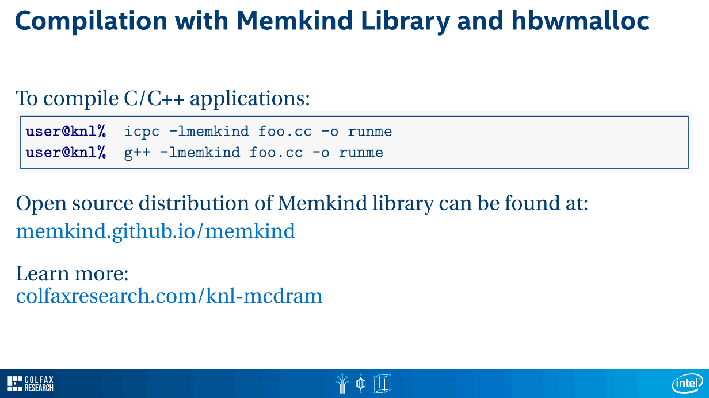

## Demo: Stencil with Memkind

我们能够通过将整个应用程序放在高带宽内存中来优化模板计算。这是可能的，因为我们需要不到16GB的RAM。如果您需要超过16GB，那么您可能需要查看memkind库，它允许您有选择地将一些缓冲区放入高带宽内存中。因此，对于我们的实验，我们将回滚我们对Makefile所做的更改。而转到image.cc，这是我们分配内存缓冲区来存储图像数据的地方。你可以在第一个分配器中看到我们正在使用mm_malloc来分配基于指针的数组像素。我们使用高带宽分配器hpw_posix_memalign而不是这一行。它的语法要求第一个参数是您尝试分配的指针的内存地址。第二个参数是对齐值，64个字节，第三个元素是缓冲区的大小。如果仔细搜索_mm_，你会发现还有另一个构造函数也使用了一个分配器，我们将在第二个构造函数中进行相同的替换。如果我们再次搜索_mm_，我们将找到一个释放器。我们必须使用相应的高带宽内存释放器。这里。那么让我们看看它是否正确。我们试着编译。当我们尝试编译时，我们得到一个编译错误。识别hbw_posix_mmalign是未定义的，因为我们未能包含具有该功能签名的图像文件。

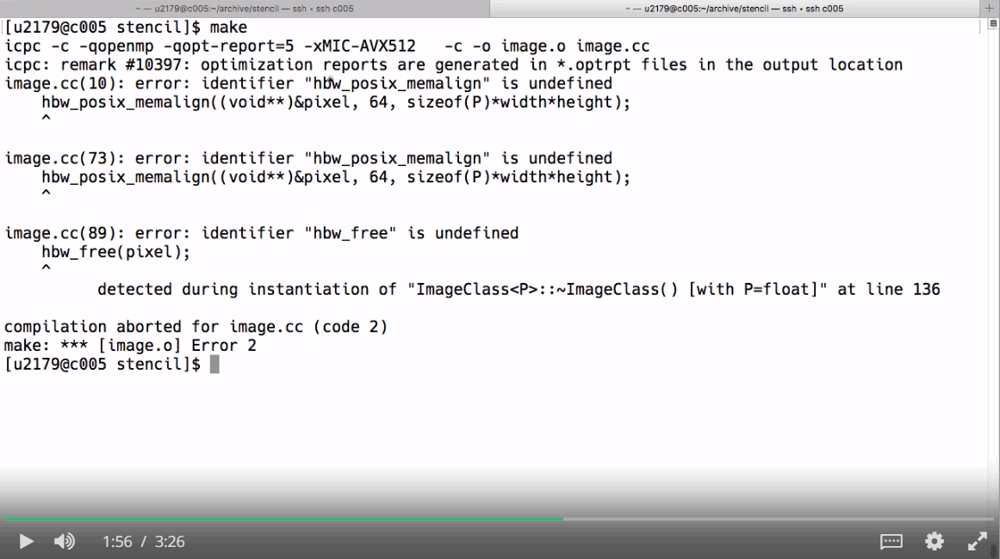

包含hbwmalloc应解决此问题。它现在有效吗？仍然是一个错误，但不同的错误。

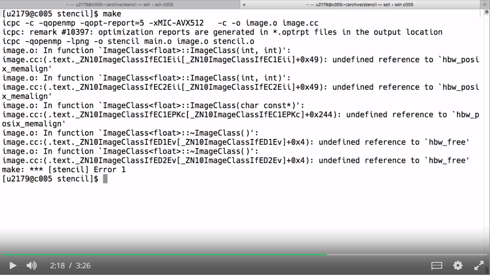

对hpw_posix_mmalig的未定义引用，这是因为在链接时我们没有告诉链接器搜索memkind库。要解决这个问题，我们必须再次编辑Makefile。在链接行中，除了链接png库之外，还将链接memkind。就是这样。现在编译和链接成功了，让我们提交作业执行。那么结果现在看起来怎么样？现在，我们也观察到近220GB/s的带宽。这意味着我们的缓冲区成功进入高带宽内存。但是我们不必将整个应用程序放入我们只分配包含带宽关键数据的缓冲区。

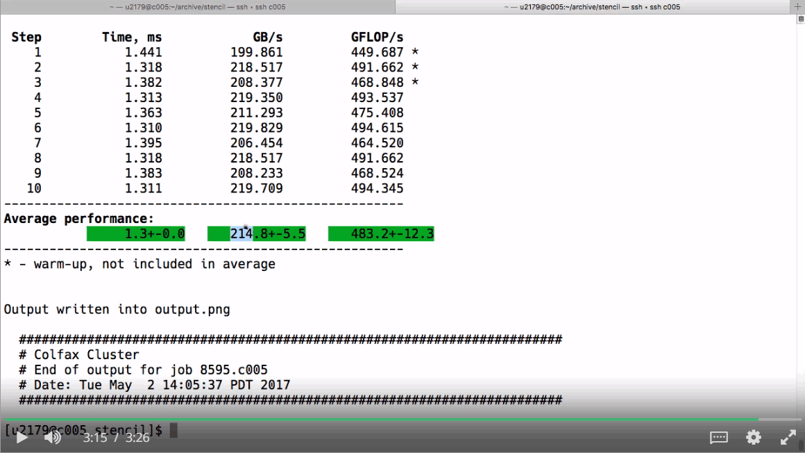

### Change
```diff
[u25693@c008 stencil]$ git diff
diff --git a/Makefile b/Makefile
index 77bab07..b97390f 100644
--- a/Makefile
+++ b/Makefile
@@ -1,6 +1,6 @@
 CXX=icpc
 CXXFLAGS=-c -qopenmp -qopt-report=5 -xMIC-AVX512
-LDFLAGS=-qopenmp -lpng
+LDFLAGS=-qopenmp -lpng -lmemkind

 OBJECTS=main.o image.o stencil.o

@@ -13,7 +13,7 @@ run:  all
        ./stencil test-image.png

 queue: all
-       echo 'cd $$PBS_O_WORKDIR ; numactl -m 1 ./stencil test-image.png' | qsub -l nodes=1:flat -N edgedetection
+       echo 'cd $$PBS_O_WORKDIR ; ./stencil test-image.png' | qsub -l nodes=1:flat -N edgedetection

 clean:
        rm -f *.optrpt *.o stencil *output.png *~ edgedetection.*
diff --git a/image.cc b/image.cc
index ff815d5..542574c 100644
--- a/image.cc
+++ b/image.cc
@@ -6,7 +6,7 @@ ImageClass<P>::ImageClass(int const _width, int const _height)

   // Initialize a blank image

-  pixel = (P*)_mm_malloc(sizeof(P)*width*height, 64);
+  hbw_posix_memalign((void**)&pixel, 64, sizeof(P)*width*height);
 #pragma omp parallel for
   for (int i = 0; i < height; i++)
     for (int j = 0; j < width; j++)
@@ -68,7 +68,7 @@ ImageClass<P>::ImageClass(char const * file_name) {
   fclose(fp);

   // Convert from png_bytep to P
-  pixel = (P*)_mm_malloc(sizeof(P)*width*height, 64);
+  hbw_posix_memalign((void**)&pixel, 64, sizeof(P)*width*height);

 #pragma omp parallel for
   for(int i = 0; i < height; i++)
@@ -83,7 +83,7 @@ ImageClass<P>::ImageClass(char const * file_name) {
 template<typename P>
 ImageClass<P>::~ImageClass() {
   // Deallocate image
-  _mm_free(pixel);
+  hbw_free(pixel);
 }


diff --git a/image.h b/image.h
index 89ec88b..a848c1a 100644
--- a/image.h
+++ b/image.h
@@ -3,6 +3,7 @@

 #include <png.h>
 #include <omp.h>
+#include <hbwmalloc.h>

 template <typename P>
 class ImageClass {
```

### Output

```bash
[u25693@c008 stencil]$ cat edgedetection.o89960

########################################################################
# Colfax Cluster - https://colfaxresearch.com/
#      Date:           Fri Apr 26 20:48:50 PDT 2019
#    Job ID:           89960.c008
#      User:           u25693
# Resources:           neednodes=1:flat,nodes=1:flat,walltime=00:02:00
########################################################################


Edge detection with a 3x3 stencil

Image size: 6000 x 6000

 Step        Time, ms            GB/s         GFLOP/s
    1           1.275         225.871         508.210 *
    2           1.214         237.227         533.761 *
    3           1.276         225.702         507.831 *
    4           1.208         238.397         536.394
    5           1.211         237.834         535.127
    6           1.261         228.391         513.880
    7           1.204         239.200         538.200
    8           1.198         240.390         540.877
    9           1.217         236.623         532.401
   10           1.201         239.770         539.482
-----------------------------------------------------
Average performance:
                1.2+-0.0      237.2+-3.8      533.8+-8.5
-----------------------------------------------------
* - warm-up, not included in average


Output written into output.png

########################################################################
# Colfax Cluster
# End of output for job 89960.c008
# Date: Fri Apr 26 20:49:06 PDT 2019
########################################################################

```

# 4.5 Bypassing Caches

通常，依赖缓存是有意义的。如果将数据放在缓存中并在以后重复使用，则可以更快地获取数据。但是，有一种情况是，避免在缓存中存储数据并将其直接放入内存是有意义的。这是streaming store的案例。通常，当您的程序在您的核心上运行并且它将一段数据写入内存时，物理上这种内存访问将粘在一级缓存或二级缓存中，直到需要驱逐这些数据。如果您打算在不久的将来重用这一数据，这很好。但是，如果您不打算重用它，绕过缓存并将数据直接推送到内存（这是流式存储的一个示例）可能更有意义。为什么会有益？当然，对于这种操作，将它粘贴在缓存中会更快，但总的来说，您的应用程序可能会从流式存储中受益，因为您将避免使用未重用的数据污染缓存，并且您将为可能的数据节省更多的缓存空间重用。模板操作是streaming store users的一个值得注意的例子。这样做的另一个原因是英特尔架构，特别是Xeon Phi，支持一种可用于line数据的特殊stores。它专为流媒体设计，比通用store更好用。如果您有一个循环，您可以使用指令`pragma vector nontemporal`使编译器在该循环中实现流存储，或者您可以告诉编译器使用参数`-qopt-streaming-stores=always`在整个存储库中实现流存储。这些链接是可单击的，您可以单击它们以在编译器文档中阅读有关流存储的更多信息。

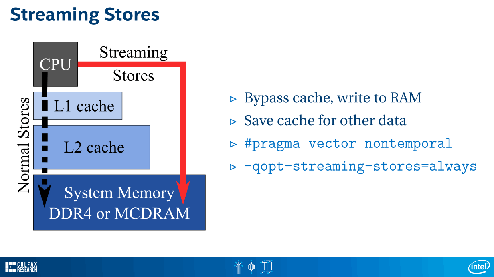

## DEMO: Stencil Demonstration-Nontemporal

我们正在优化模板代码，在MCDRAM的帮助下，我们能够将数据处理速率提高到每秒220千兆字节。这很好，但这仍然比流基准测试达到的要少。流基准测试可以达到每秒490千兆字节。那么，我们可以做些什么来进一步推动这些代码的性能呢？此代码是streaming store的理想选择，原因有两个。流式存储将允许我们利用outbound内存访问的对齐特性。第二个原因是通过制作stores streaming，我们将避免缓存污染，并为输入数据中的数据重用保留更多缓存。我们所要做的就是强制存储nontemporal或streaming通过插入vector nontemporal指令。然后重新编译并重新运行。让我们看一下结果。性能要好得多。我们现在看到的是630GFLOPS，相对于每秒288GB的内存带宽。内存优化允许这显着改善范围的性能。从多线程版本开始，我们将性能提高了七倍，现在我们就在这里。在下一个视频中，我们将再发现一次内存流量分类的机会。

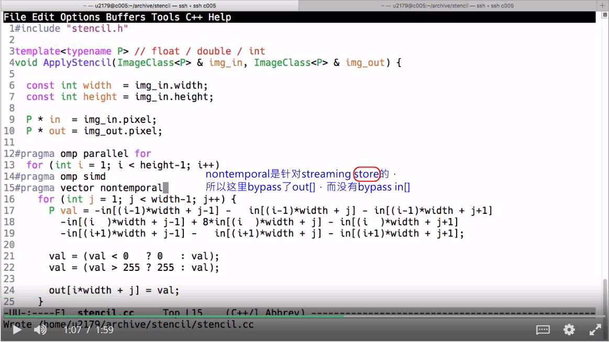

### Change

```diff
[u25693@c008 stencil]$ git diff
diff --git a/stencil.cc b/stencil.cc
index f2eaffe..f01dc60 100644
--- a/stencil.cc
+++ b/stencil.cc
@@ -8,9 +8,11 @@ void ApplyStencil(ImageClass<P> & img_in, ImageClass<P> & img_out) {

   P * in  = img_in.pixel;
   P * out = img_out.pixel;
 #pragma omp parallel for
   for (int i = 1; i < height-1; i++)
 #pragma omp simd
+#pragma vector nontemporal
     for (int j = 1; j < width-1; j++) {
       P val = -in[(i-1)*width + j-1] -   in[(i-1)*width + j] - in[(i-1)*width + j+1]
        -in[(i  )*width + j-1] + 8*in[(i  )*width + j] - in[(i  )*width + j+1]

```

### Output

```bash
[u25693@c008 stencil]$ cat edgedetection.o89961

########################################################################
# Colfax Cluster - https://colfaxresearch.com/
#      Date:           Fri Apr 26 21:42:17 PDT 2019
#    Job ID:           89961.c008
#      User:           u25693
# Resources:           neednodes=1:flat,nodes=1:flat,walltime=00:02:00
########################################################################


Edge detection with a 3x3 stencil

Image size: 6000 x 6000

 Step        Time, ms            GB/s         GFLOP/s
    1           1.036         278.011         625.526 *
    2           0.919         313.349         705.035 *
    3           0.920         313.024         704.304 *
    4           0.914         315.147         709.081
    5           0.922         312.376         702.847
    6           0.922         312.376         702.847
    7           0.936         307.760         692.461
    8           0.916         314.409         707.420
    9           0.918         313.674         705.767
   10           0.913         315.394         709.637
-----------------------------------------------------
Average performance:
                0.9+-0.0      313.0+-2.4      704.3+-5.4
-----------------------------------------------------
* - warm-up, not included in average


Output written into output.png

########################################################################
# Colfax Cluster
# End of output for job 89961.c008
# Date: Fri Apr 26 21:42:33 PDT 2019
########################################################################

```

## DEMO: Stencil Demonstration-Char

到目前为止，我们的模板计算使用的是包含浮点数的图像。这允许我们将功能应用于图像处理。或者将相同的函数应用于例如计算流动力学内核。我们也知道我们的性能受到内存带宽的限制。我们所做的每秒浮点操作次数不是我们芯片的限制。因此，我们可以进一步优化此代码，以便我们减少内存，并进行更多的数学运算。所以我们要把自己推到车顶线的倾斜部分。好吧，如果我们利用我们实际上正在处理图像的事实。并且图像包含具有八位强度深度的像素。通过将图像存储为图像或键入png_bytes，我们可以节省内存流量。这是一种8位数据类型。同样在这里。为了使其工作，我们还必须重新定义image.cc中的模板类。最后，我们必须使用png_byte创建一个图像类的实例。回到这个模板代码，我们必须认识到，在这里尝试在png_byte中进行所有数学运算可能不是一个好主意，因为我们实际上可能会超出界限并遇到整数问题。所以我实际上将它称为整数，将要发生的是我的数据将作为png_ bite，8位值从内存中读取。这些值将转换为整数，有符号整数。然后我将用整数进行数学计算。当我写出来时，我会将整数写回png_byte。这看起来像很多数学，但我们可以负担得起。我们确实受到内存性能的限制，我们每秒的浮点运算次数只占芯片容量的一小部分。让我们看看我们做了什么就足够了。在main.cc里面我们需要确保p是png_byte。那现在看起来怎么样？提交到队列并等待结果。我们现在看到的是，从1毫秒到0.6毫秒，时间量确实下降了很多。我们比之前使用的内存少，但我们正在执行的操作数量增多了。现在，它们并非完全浮点操作，而是整数运算，几乎翻了一番。从图形上看，这个图表说明了我们的位置，我们从每秒630次操作到每秒1,100亿次操作。因此，这种数据转换使我们能够减少内存带宽的压力，并在更短的时间内实现相同的数值结果。

### Change
```diff
[u25693@c008 stencil]$ git diff
diff --git a/image.cc b/image.cc
index 542574c..32dbc1c 100644
--- a/image.cc
+++ b/image.cc
@@ -131,3 +131,4 @@ void ImageClass<P>::WriteToFile(char const * file_name) {


 template class ImageClass<float>;
+template class ImageClass<png_byte>;
diff --git a/main.cc b/main.cc
index 280025f..41b867d 100644
--- a/main.cc
+++ b/main.cc
@@ -3,7 +3,7 @@
 #include "image.h"
 #include "stencil.h"

-#define P float
+#define P png_byte

 const int nTrials = 10;
 const int skipTrials = 3; // Skip first iteration as warm-up
diff --git a/stencil.cc b/stencil.cc
index f01dc60..6dfac2a 100644
--- a/stencil.cc
+++ b/stencil.cc
@@ -14,7 +14,7 @@ void ApplyStencil(ImageClass<P> & img_in, ImageClass<P> & img_out) {
 #pragma omp simd
 #pragma vector nontemporal
     for (int j = 1; j < width-1; j++) {
-      P val = -in[(i-1)*width + j-1] -   in[(i-1)*width + j] - in[(i-1)*width + j+1]
+      int val = -in[(i-1)*width + j-1] -   in[(i-1)*width + j] - in[(i-1)*width + j+1]
        -in[(i  )*width + j-1] + 8*in[(i  )*width + j] - in[(i  )*width + j+1]
        -in[(i+1)*width + j-1] -   in[(i+1)*width + j] - in[(i+1)*width + j+1];

@@ -27,3 +27,4 @@ void ApplyStencil(ImageClass<P> & img_in, ImageClass<P> & img_out) {
 }

 template void ApplyStencil<float>(ImageClass<float> & img_in, ImageClass<float> & img_out);
+template void ApplyStencil<png_byte>(ImageClass<png_byte> & img_in, ImageClass<png_byte> & img_out);
```

### Output

```bash
[u25693@c008 stencil]$ cat edgedetection.o89962

########################################################################
# Colfax Cluster - https://colfaxresearch.com/
#      Date:           Fri Apr 26 21:58:01 PDT 2019
#    Job ID:           89962.c008
#      User:           u25693
# Resources:           neednodes=1:flat,nodes=1:flat,walltime=00:02:00
########################################################################


Edge detection with a 3x3 stencil

Image size: 6016 x 6000

 Step        Time, ms            GB/s         GFLOP/s
    1           0.660         109.391         984.522 *
    2           0.665         108.568         977.109 *
    3           0.672         107.412         966.710 *
    4           0.587         122.987        1106.887
    5           0.654         110.388         993.495
    6           0.667         108.218         973.966
    7           0.672         107.412         966.710
    8           0.586         123.188        1108.689
    9           0.588         122.738        1104.644
   10           0.657         109.908         989.168
-----------------------------------------------------
Average performance:
                0.6+-0.0      115.0+-7.0     1034.8+-62.9
-----------------------------------------------------
* - warm-up, not included in average


Output written into output.png

########################################################################
# Colfax Cluster
# End of output for job 89962.c008
# Date: Fri Apr 26 21:58:17 PDT 2019
########################################################################

```

# 4.6 Locality in Space
如果你想在不需要时避免使用内存，则必须依赖缓存，**但与缓存的交互对程序员来说并不透明**。您应该尝试使用两个概念进行编程，而不是直接与缓存交互：**内存访问空间局部性和内存访问时间局部性**。您已经知道处理器具有两级并行性：多核和向量指令支持。**内存子系统也是以并行性构建的**。**无论何时从内存或缓存中请求单个浮点数，您都会获得此数字并且并行获取此数字的多个邻居，因为可以在内存和缓存之间传输的最小数据块长度为64个字节**。这些块称为`cache line`，它们在英特尔架构中的64字节边界上对齐，并且内存以这种方式组织的**原因**是您的应用程序应该具有单位步幅，并且如果它具有单位步幅，则一次内存访问的成本或一次内存访问的延迟，您可以在双精度的情况下免费获得七次访问，或者在单精度的情况下对于一次内存访问，您可以免费获得15次访问。

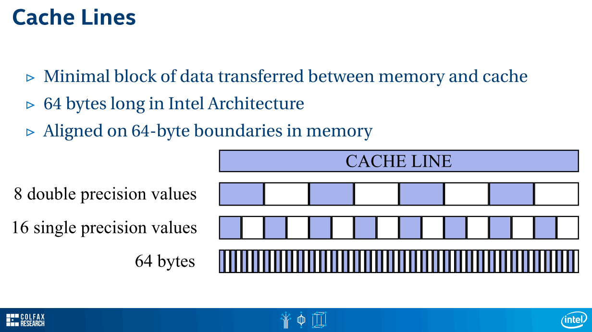

由于这种存储器组织，保持存储器访问的空间局部性是重要的，并且对于程序员来说，转换为存储器中的单位跨步访问。**单位步幅**访问意味着如果你有一个循环，那么你正在访问内存中背靠背的元素。然后，对于一次内存访问，您将获得一个延迟和15或7个免费访问。有时，您需要查看循环嵌套的顺序，并**确保顺序是最内层循环具有单位步幅**。例如，如果您有二维容器的row-major布局，那么您应首**先遍历此容器列，然后遍历行**，以便您请求`cache line`，然后使用此缓存行中的所有元素。并且您不应该进行跨步访问，首先是行，然后是列，因为在这种情况下，您将获得一个元素，内存会自动向您提供七个邻居，但您只使用其中一个邻居然后继续前进到下一个`cache line`。您最终将在内存中使用这些元素，但您必须重新访问它们并可能承受另一个内存访问的延迟。


以下是两个代码片段，说明了循环排列在实践中如何起作用。我在这里展示的是矩阵-矩阵乘法。我有矩阵A和B，我正在计算矩阵A，因此C_ij是相对于A_ik B_kj的k的和。您可能从基本线性代数中知道这个公式，并且我显示了两个代码来执行此操作。一个代码具有循环i-j-k的顺序，另一个代码具有i-k-j。我的主张是，右边比左边好，而且很容易理解为什么。左边相对于k的循环在左边有一个标量，在左边有一个常数，所以这将导致vector reduction。根据循环的长度，这可能是也可能不是问题，但让我们看看其他内存访问。当我访问A时，很好，这是k中的单位步幅。它是单位步幅，因为当k增加一个值时，我在内存中移动到下一个立即元素。通过这种方式，我通过使用整个缓存行来利用内存架构中的并行性。但这是一个问题。在这里，当我将k递增1时，我在**内存中移动n个元素，因此这是跨步访问**。当你有一个内存的跨步访问时，它被称为**gather操作**，它的效率远低于单位步幅。嗯，双精度，可能效率低八倍。相比之下，右边的循环，它的左侧有单位步幅，它在这里有一个常数用于A中的访问记忆，不依赖于j，而对于B，也有单位步幅。因此，这是一种更有效的矩阵乘法运算方法。

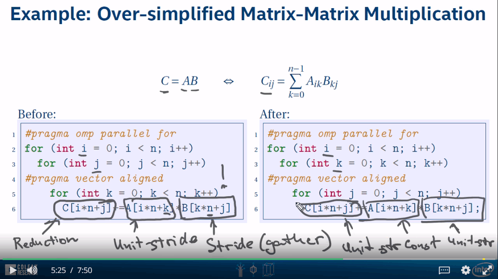

现在我想做一个免责声明。右边的代码实际上是矩阵乘法的bad代码，左边的代码even worse。右边的代码缺少的是时间局部性。有通过循环平铺来改进此代码的方法，但实际上，如果您有一个在BLAS或LAPACK库中找到的标准数学运算，请不要写循环。您应该使用此功能的高度优化的实现，例如，从英特尔数学核心库，MKL。它可能比你可能写的任何循环更有效。

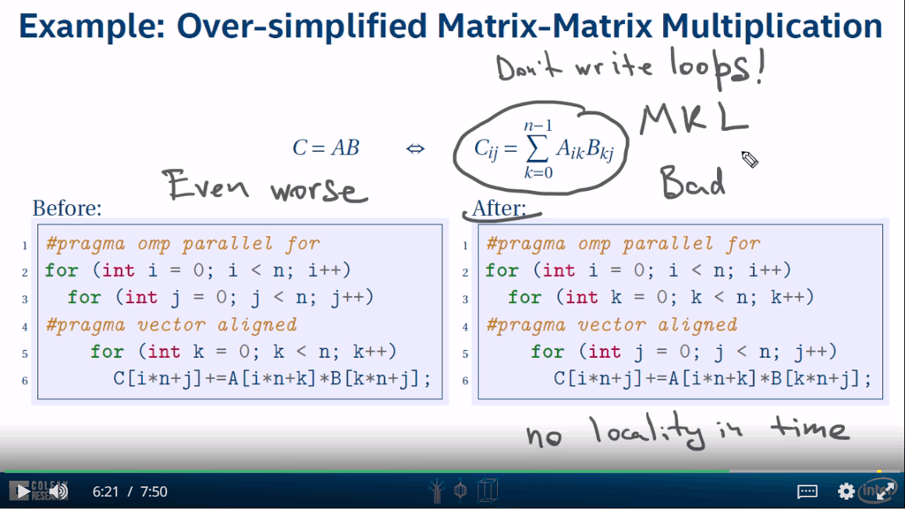

与此同时，我所说明的是如何通过置换循环来改善空间中的局部性。有时，您可以通过**更改数据容器**来改善空间中的位置。最常见的是，当arrays of structures转换为structures of arrays时，您会看到它。你将拥有坐标为x，y，z的particles，我试图对一个遍历这些particles的循环进行向量化并对它们进行一些计算。然后当我将数据加载到向量寄存器中时，我将不得不以3的步幅前进。所以，平均来说，我会在缓存行中丢弃内存给我的三分之二的数据。这比更改数据容器效率低得多，因此您可以使用particle x of i而不是particle of either x。然后你访问一个元素，内存就为你提供整个缓存行，你可以免费使用整个缓存行将数据加载到向量寄存器中。这就是通过维持单元步长来利用内存子系统内置的并行性的方法。


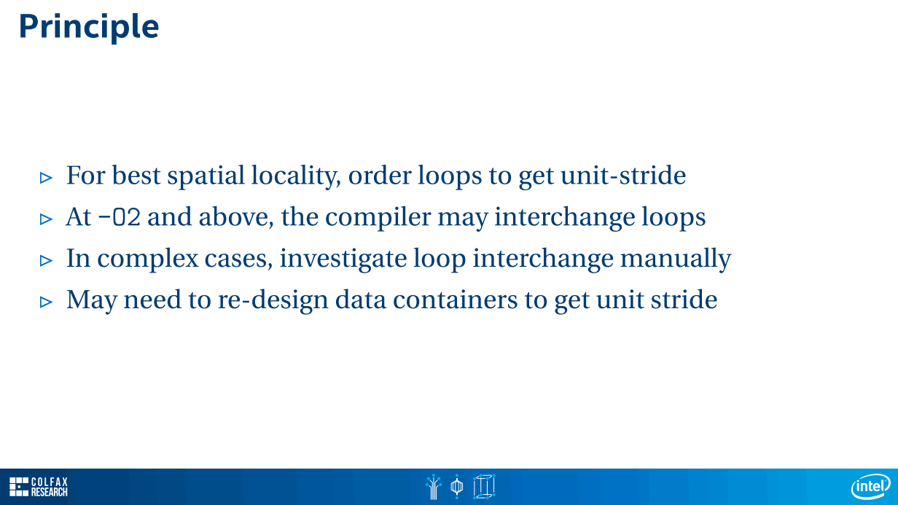

# 4.7 Locality in Time

当您的应用程序重用数据并且您希望确保从缓存而不是从内存中重用此数据时，您需要考虑数据访问时间局部性。这将允许您增加命中缓存的机会，而不是访问内存。如果算法具有数据重用，则需要优化该访问的位置时间局部性。这是一个例子，正如你所看到的，我正在使用一个抽象的数据容器b[j]。它可能包含数字，它可能包含更复杂的对象..但我肯定有数据重用，因为我总共返回这个b[j] m次。如果我正确地播放我的卡片，那么我将只从内存中读取一次数据，然后重复使用多次。但是，如果我不采取任何措施，我可能会遇到算法有数据重用的情况，但实时，我实际上必须多次进入内存。假设这个数组b太长而不适合系统中最大的缓存，那么i = 0，j = 0。我有什么？我第一次去读b[0]。我绘制一个红色方块，表示缓存未命中，因此这是一个长延迟操作。然后，我继续j = 1并读取下一个元素，它也是一个缓存未命中，因为这是我第一次看到它。但是前面的元素现在被缓存了，有多方便。通过这种方式，我继续读取这个数组，直到某个时候我用数据填充满缓存。因此，当我读取下一个元素时，我必须将一些数据踢出去。通常，缓存有一些LRU驱逐策略的变化。LRU代表最近最少使用的，所以你最近最少使用的元素必须先行，所以这个元素被淘汰了。通过这种方式，当我继续读取数组时，我将只有内存中的最后几个元素。所以j循环已经完成，我现在将j重置为0并将i递增到1.所以现在是时候重用我的数据了，我转到b[0]。但它已经从缓存中消失了，因为我已经用完了缓存空间，现在我必须再次回到内存中。如你所见，这里的所有方块都是红色，表示我每次都缺少缓存，而且我正在多次从内存中读取。如果我以这样的方式重构这个代码，以便我更快地回到b的这些缓存值，那么我有更好的内存访问位置时间局部性，那么我可以利用缓存。我在这里做的是循环平铺。使用循环平铺，我执行两个步骤，我将其中一个循环剥离，然后我置换。所以我们在向量化讨论中遇到了步幅挖掘，我们在本课程的前面讨论过排列。但它们实际上一起改变了操作的顺序，使得它们具有更好的数据局部性。我在这里做同样的操作，但顺序不同。我只读了b中的四个元素。然后我将j重置为0并递增i，而不是进一步递增j。所以现在我绘制黄色矩形，表示快速内存访问，因为这是一个缓存命中，我得到我的缓存数据而不是内存。你可以在这里计算红色和黄色方块，并通过平铺看到，我的缓存命中率为50％。实际的缓存命中率，你将取决于问题的大小，数据的大小，以及你如何平铺循环的决定。但是你需要知道它是如何完成的。

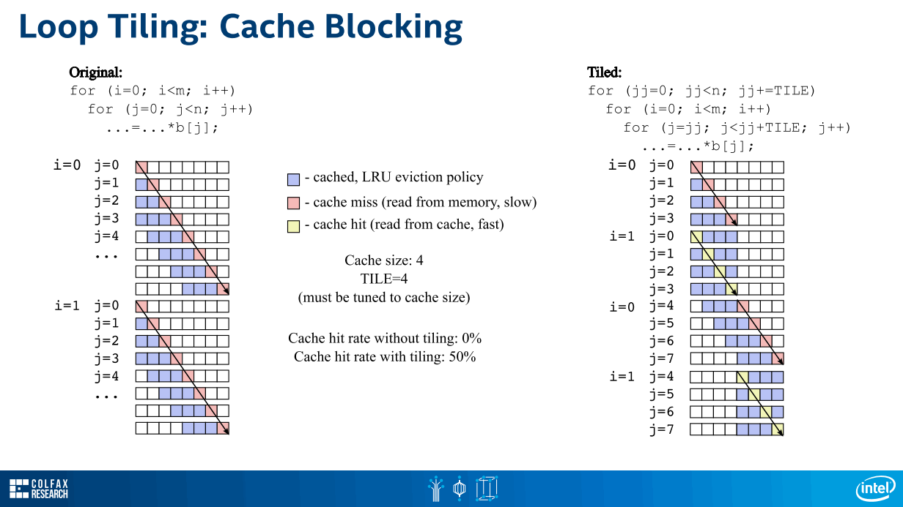

过程是，您采用两个嵌套循环，如果您检测到其中一个数据容器正在重用，但其重用是非本地的。然后你去掉m访问该数据容器的循环，然后你置换外部的两个循环，所以现在jj在外面，m在里面。以不同的顺序进行相同的操作，m将尽快回到b[j]。当然，你必须在这里非常小心。
如果n不是TILE的倍数，则可能必须运行余数循环。如果更改操作顺序，则必须生成正确的结果。如果你有非完美的循环嵌套，如果你在其间声明一些变量，可能很难做到这一点。这就是编译器不会总是为你做的原因，编译器知道循环平铺，它会尝试这样做。但有时候如果你的代码过于复杂，那就不可能了，这就是你必须手动循环平铺的地方。

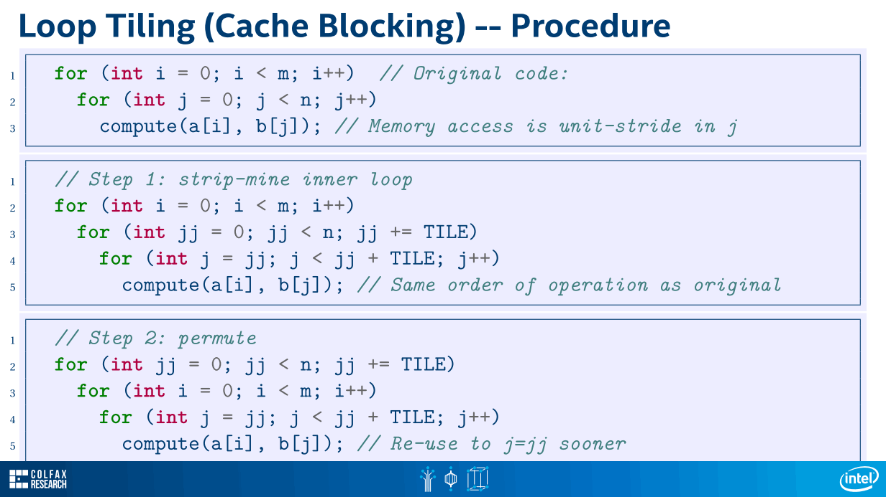

除了对内环进行步幅挖掘外，您还可以去除外环。在剥离外部循环后，您将置换内部的两个循环，它也会以不同的方式更改数据访问的位置。在这里，我将j设置为0，我将通过i的多个值。所以在这里，正如您所看到的，缓存命中率是75％，然后我将j设置为1,1缓存未命中，然后为此特定示例设置3个缓存命中。

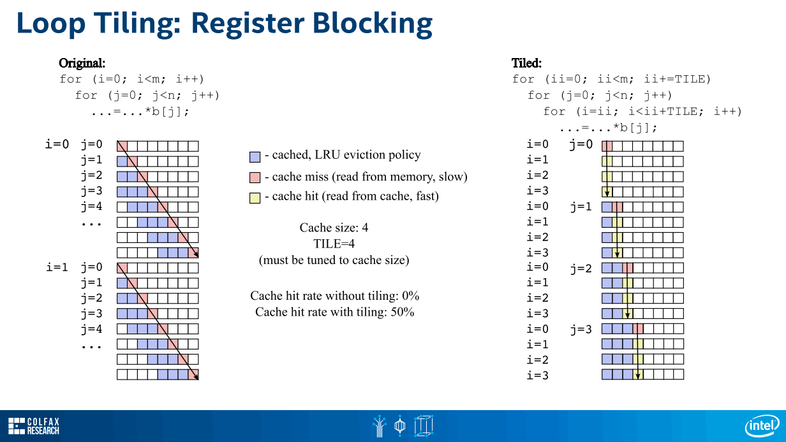

这称为阻止寄存器重用，有时也称为Unroll-and-Jam。这就是修改过程。你接受两个嵌套循环，剥离m的外循环，然后你置换内部两个循环。有时如果你想保留单元步长并在最内层循环中保留向量化，你需要使用指令pragma simd或pragma omp simd来告诉编译器向量化中间循环而不是最内层循环。

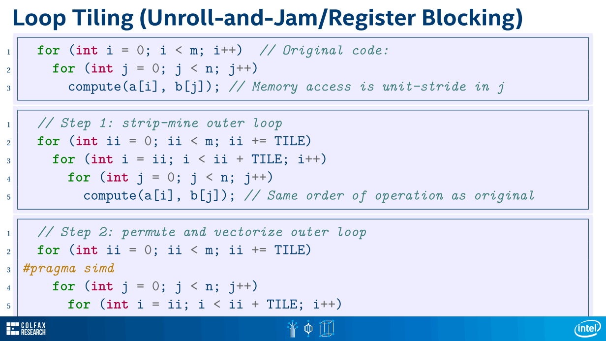

循环平铺并不容易，我们将在优化过程中重新审视它。还有另一种技术可以用于理解，它还可以改善数据重用。这种技术是循环融合，融合循环通常效果更好。如果循环融合保留了你的结果，你应该这样做。考虑一些抽象的数据容器数组。假设您有一个初始化所有数据元素的管道。然后你把它们放到处理阶段一，然后你把它们放到第二阶段处理。如果您在三个不同的循环中执行此操作，则可能会遇到与早期幻灯片相同的情况。您将数据放入缓存中，但是当您到达此循环结束时，您已经缓存了太多数据，以至于开始被逐出。因此，当您重新访问数据时，您必须再次访问内存。如果不同阶段和不同元素的处理是独立的，则可能将这三个循环融合为一个。它改变了操作的顺序。现在，我将一个数据元素放在多个管道阶段，同时它仍在缓存中。这给了我数据重用，也许你可以将它与本周讨论算术强度的第一个视频联系起来。它们都是屋顶图。我在这里做的是通过重复使用从内存中提取的数据多次来提高算术强度。

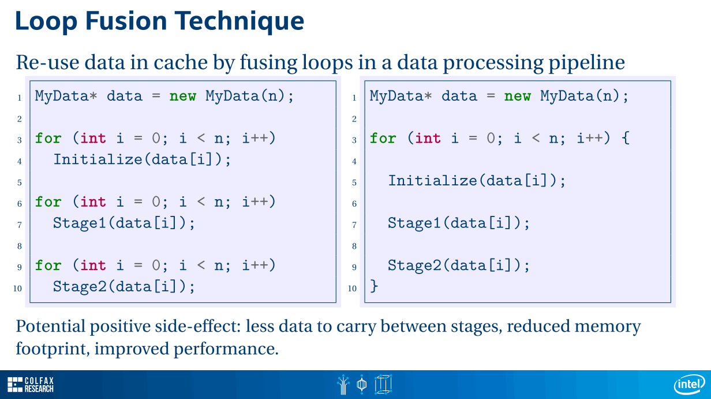
